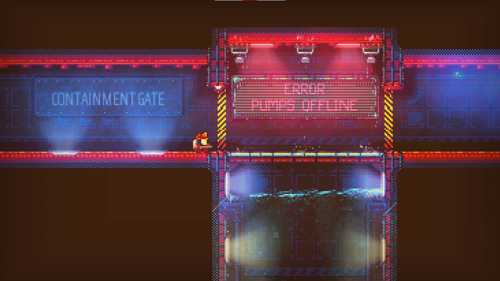

Da due anni a questa parte sto tenendo traccia dei videogiochi che compro, di quanto spendo e di quanti ne finisco: mi piace farlo perchè mi rende più consapevole del tempo e del costo che ha una delle mie principali passioni.

Uno dei motivi che mi ha spinto ad aprire questo blog è anche quello di avere un posto in cui parlarne. Perchè quindi non iniziare facendo un recap di cosa ho giocato nell'ultimo anno? Credevo che il 2023 mi avesse regalato le mie migliori esperienze videoludiche recenti, ma ci sono stati dei picchi quest'anno che quasi mi stavo dimenticando.

Non saranno delle vere e proprie recensioni: non sapendo che avrei aperto un blog, quello che scriverò saranno solo le mie impressioni *a freddo*, ma ci tengo comunque a metterle nero su bianco.

Bando alle ciance, cominciamo! Ecco quali giochi ho finito quest'anno, in rigoroso ordine di completamento.

## Nuclear Blaze

Piattaforma: *Steam Deck*

[Nuclear Blaze](https://store.steampowered.com/app/1662480/Nuclear_Blaze/) è un gioco che ho acquistato "a scatola chiusa", non avevo idea di cosa fosse prima che Steam me lo proponesse durante i saldi tra i suggeriti: e devo dire che è stato un buon consiglio.

*Nuclear* è un mix tra un gioco d'azione e un puzzle game. È un gioco *dritto*, senza biforcazioni o senza possibilità di ripercorrere vecchie stanze, si va semplicemente dal punto A al punto B per passare alla stanza successiva: i due punti però sono ostacolati da incendi e noi, nei panni di un pompiere particolarmente ligio al lavoro, avremo il compito di spegnerli, magari salvando più gattini in pericolo possibile: lo definisco puzzle perchè il nostro (quasi) unico nemico è il fuoco, e riuscire a spegnerlo prima che l'incendio si propaghi dovendo al tempo stesso gestire la quantità d'acqua che abbiamo con noi fa davvero lavorare le nostre cellule grigie più di quanto ci si potrebbe aspettare.

Dal punto di vista grafico, Nuclear Blaze è davvero appagante: tante particelle, gestione delle luci fantastica, inquadrature e scene di intermezzo con un taglio spiccatamente cinematografico... Non ho davvero nulla di negativo da dire in merito.

Il gioco è abbastanza breve (circa 2 ore di gioco), ma ha una New Game Plus davvero bella e ben studiata: gli ambienti che andremo ad affrontare saranno gli stessi di prima, con alcune stanze impossibili da aprire nella prima run ora esplorabili che regaleranno qualche enigma in più e qualche chiarimento alla trama del gioco.

Ecco, la trama: come dicevo prima riguardo al taglio cinematografico, la storia è raccontata bene e mi aveva davvero coinvolto... peccato solo che il mistero di fondo che permea tutta la questione sia un po' banale.

Ultima nota positiva: il gioco presenta una grande attenzione sull'accessibilità, riuscendo a rendere il gioco più o meno difficile cambiando pochi parametri dalle opzioni direttamente mentre si gioca.

## New Super Lucky's Tale

Piattaforma: *Steam Deck*

È difficile trovare un buon platform 3d al di fuori del classico Mario. Anzi, potrei addirittura dire che è difficile trovare platform 3d in generale.
[New Super Lucky's Tale](https://store.steampowered.com/app/1038300/New_Super_Luckys_Tale/) fortunatamente è un platform 3d davvero davvero carino: controlliamo una volpe che viaggia tra mondi tramite un libro magico alla ricerca della propria famiglia, separata dal cattivo di turno. Si, la trama non è il suo forte, e nemmeno la difficoltà: se escludiamo il mondo post-game (quello davvero eccezionale, oserei dire), il resto del gioco  è discretamente facile. L'ho comunque apprezzato perchè è molto vario nelle situazioni proposte, è coloratissimo e simpatico, proprio un gioco che ti mette di buon umore mentre lo stai provando.
Non aspettatevi comunque un capolavoro: è un collectaton abbastanza classico, e la sola meccanica del potersi muovere anche sottoterra a mo' di talpa non ve lo farà acquistare se non vi piace il genere.

## Froggo's Adventure: Verdant Venture

Piattaforma: *Steam Deck*

Visto per caso su X, quando il gioco è uscito e ho visto il suo prezzo irrisorio di meno di 1€ o deciso di prenderlo al volo.
[Froggo's Adventure: Verdant Venture](https://store.steampowered.com/app/2854780/Froggos_Adventure_Verdant_Venture/) è un gioco che sembra uscito direttamente dal NES, ed ha una cura pazzesca nel farlo: non è solo la palette a ricordarlo, è proprio una sensazione che riesce a trasmetterti "pad alla mano". Ho giocato a molti giochi indie dal prezzo irrisorio, ma mai con una cura simile.
Non l'ho detto, ma Froggo's è un platform vecchia scuola, con il personaggio principale che ha una meccanica *alla Yoshi*, nel senso che può usare la sua lingua per catturare e lanciare i nemici, ma anche usarla per attivare interruttori o colpire blocchi da distruggere.

È un platform intrinsecamente vecchio, ma davvero ben fatto: se siete nel target lo capirete anche solo guardando gli screenshot.

## Metroid: Zero Mission

Piattaforma: *Miyoo Mini Plus*

Quando ho comprato il mio Miyoo Mini Plus ho deciso di non riempirlo completamente di giochi, ma di installare solo quello che volevo davvero provare. Metroid: Zero Mission è stato uno dei prescelti e, appena ho fatto partire la ROM per vedere se tutto funzionasse alla perfezione, non sono più riuscito a staccarmene.

Zero Mission è il remake del primo gioco della serie MetroidVania per eccellenza, adattato non solo per renderlo più appetibile ai palati moderni, ma anche per essere giocato comodamente in mobilità.
Infatti:

- è sempre chiaro il nostro obiettivo, che ci verrà segnalato sulla mappa: il backtracking incentrato sulla scoperta c'è sempre, ma è legato più che altro al ritrovamente di potenziamenti opzionali
- i punti di salvataggio sono numerosi, così da non dover rifare sezioni molto lunghe in caso di dipartita della protagonista
- i power up sono presenti in gran numero, ed è difficile non trovarne nessuno in una run
- il senso di progressione è davvero percepibile, e andando avanti sentiremo che la protagonista sta diventando una *macchina da guerra*. Per me questo tra l'altro è un punto che deve essere fondamentale quando gioco ad un MetroidVania

I punti elencati sopra non sono dei pro in generale, ma in un gioco pensato per essere giocato in mobilità e per brevi sessioni trovo che le scelte siano davvero tutte azzeccate.

Se poi consideriamo che lo stile grafico scelto, per me, tocca su GBA l'apice dell'intera serie... Si, questo è stato uno dei miei giochi preferiti dell'anno.

## Luigi's Mansion 3

Piattaforma: *Nintendo Switch*

Non ho mai capito l'entusiasmo dietro questa saga: l'immaginario mi sembrava carino, ma lato gameplay mi è sempre sembrato un po'... monotono?
Così, quando ho trovato in sconto il terzo capitolo della saga, definito dalle testate online il migliore dei 3, non ci ho pensato due volte per prenderlo e toccare con mano il titolo. Ma devo dire che, nonostante l'entusiasmo iniziale, continuo a non avere una risposta alla mia domanda.
Luigi's Mansion 3 non è un titolo brutto, anzi! Le situazioni proposte sono varie e ingegnose, la grafica è ottima, il protagonista è ben caratterizzato... Ma, nonostante questo, e anche se il gioco è durato circa 13 ore, mi è sembrato un po' troppo lungo per quello che aveva da proporre, come se gli ultimi piani dell'hotel in cui è ambientato il gioco fossero di troppo.

Probabilmente quindi la verità sta nel mezzo: il gioco è generalmente bello, ma non lo ricordo con entusiasmo perchè gli ultimi livelli non li ho apprezzati. Un po' come quando vai al ristorante, ti trovi bene, ma non ci torni più perchè ti ricordi del dolce poco entusiasmante.

## Hades

Piattaforma: *Steam Deck*

[Hades](https://store.steampowered.com/app/1145360/Hades/) è perfetto. Si ok, la perfezione non è di questo mondo, e un gioco non può essere globalmente apprezzato da tutti... Ma se siete nel target del gioco, secondo me, non gli riuscirete a trovare un difetto. È un roguelike ottimamente caratterizzato, con una trama che da' davvero un senso alla morte continua del protagonista, che ti fa percepire davvero la progressione ad ogni run (sia del giocatore sia di Zagreus). Dai video pensavo di non apprezzare lo stile grafico, che mi sembrava confusionario nei momenti d'azione, e avevo paura che la narrazione fosse simile a quella di Bastion (che avevo trovato un po' noiosa), e invece...
Grazie davvero **Andrea** per avermelo inaspettatamente regalato.

## Brume

Piattaforma: *Steam Deck*

[Brume](https://store.steampowered.com/app/1119800/Brume/) è un souls-like indie creato da Sokpop, un collettivo di sviluppatori olandesi: è uno di quei giochi che *conosco solo io*, come dicono i miei amici IRL quando ne parlo.
L'ho definito souls-like, ma io non ne ho mai giocato uno all'infuori di questo: qui c'è un'avventura criptica, mostri che ti uccidono in breve se non capisci il loro pattern d'attacco, scorciatoie che collegano zone prima inaccessibili.
È breve (circa 2 ore di gioco), ha una grafica low poly che mi ha colpito subito, e l'ho trovato davvero divertente portarlo a termine: non è bilanciatissimo, ma l'atmosfera e il gameplay semplice non mi hanno fatto demordere nonostante l'elevata difficoltà.

## Finding Xavier

Piattaforma: *Steam Deck*

Quando ho visto questo gioco su YouTube, mi sono detto che non era possibile.
Quando ho visto questo gioco su Steam, mi sono detto che non era possibile.

No, non è possibile che un gioco del genere venga venduto, perchè un gioco così *saprei farlo anche io*: e no, non è detto in maniera denigratoria, tutto l'opposto. È il gioco che mi ha fatto pensare di provare a fare anche io una cosa simile, e da lì è nato il mio Boonaburra... e lì ho capito perchè Finding Xavier viene venduto mentre il mio è gratis su itch, insomma è stata un'esperienza formativa.

[Finding Xavier](https://store.steampowered.com/app/2254210/Finding_Xavier/) è un platform "alla Celeste", tutto lo ricorda: la presenza dei *classici* coyote jump e jump buffer, il modo in cui la telecamera si sposta, il modo in cui il protagonista esiste nel mondo di gioco.
Ha anche qualcosa di caratteristico che lo differenzia: non tutte le meccaniche che recuperiamo all'interno del mondo *metroidvaniesco* del gioco possono essere usate insieme, ma va scelto di volta in volta un subset delle stesse in base a quanto è grosso il nostro inventario. Non l'ho trovata un'idea vincente, ma capisco il motivo per cui è stata scelta.

Non è un capolavoro, ci sono gioco gratis su itch che, secondo me, fanno meglio (vedi nonricordoilnome, ad esempio): costa però molto poco ed è istruttivo (nel bene e nel male) se siete sviluppatori.

## Planet of Lana

Piattaforma: *Steam Deck*

Prendete Limbo, dategli una grafica carina e colorata basata su immaginario sci-fi, aggiungete un companion amorevole e... la ricetta per un gioco godibile è terminata: questo in pochissime parole è [Planet of Lana](https://store.steampowered.com/app/1608230/Planet_of_Lana/).
Non ho mai fatto così tanti screenshot come in questo gioco (anche l'immagine qui sopra è un mio screen, per dire), ogni angolo sembra studiato (bene) proprio per darti un **effetto wow** (come dicono i designer odierni). Lato gameplay, a parte la trovata del poter dare ordini al proprio companion, se avete già giocato Limbo sapete già cosa aspettarvi: puzzle fisici e momenti "stealth" contro nemici che non possiamo affrontare saranno le nostre sfide principali.

Il gioco in sè è corto, o meglio, lungo il giusto. Anche questo non è un capolavoro, ma mi ha divertito, e soprattutto il gioco è esattamamente come ce lo si immagina dopo aver visto il trailer.

Grazie ancora *Stefano e Andrea* per il regalo ;)

## Castaway

Piattaforma: *Steam Deck*

[Castaway](https://store.steampowered.com/app/2564860/Castaway/) è un gioco che mi aveva fatto rimanere con l'amaro in bocca dopo averlo completato: ok, è nelle premesse stesse del prodotto essere un piccolo omaggio a Link's Awakening, ma non mi aspettavo di completare il tutto in 45 minuti. Se guardo però quanto ci ho giocato vedo che il numero di ore essere poco inferiore a 4. Come è possibile? Perchè, oltre alla storia, c'è una modalità "Torre", che in sostanza lo transforma in un roguelike composto da 45 stanze da affrontare sempre identiche una dopo l'altra, ma con una scelta di 3 potenziamenti random ogni volta che si sale di livello. Questa modalità fa davvero la differenza, e lo fa passare da una delusione ad un piccolo gioco che ho davvero apprezzato.

## Super Mario Land 3: WarioLand

Piattaforma: *Miyoo Mini Plus*

WarioLand non l'ho mai posseduto da bambino, ma lo aveva mio cugino: quando ci trovavamo da mia nonna gli chiedevo spesso di cambiare cartuccia per poterlo provare, ma ricordo che non ero mai riuscito a completarlo al 100%... così ho rimediato. L'ho rigiocato tutto e l'ho completato. È ancora bellissimo, un collectaton 2d pieno di segreti, mappe che si modificano come Super Mario World insegna, finali multipli... Tutto in un cartuccia GameBoy. Top!

## Hollow Floor

Piattaforma: *Steam Deck*

Altro gioco che *conosco solo io*, questa volta incredibilmente scoperto grazie alla sua demo proposta su Indiexpo.
[Hollow Floor](https://store.steampowered.com/app/2815150/Hollow_Floor/) sembra essere un *platform in cui non si salta*, tanto che leggendo i commenti della demo molti utenti pensano ci sia un problema tecnico per il quale non si possa fare. In realtà il gioco è quello che ora va di moda chiamare un MetroidBrania: un mondo aperto in cui bisogna capire come funzionano le cose perchè nessuno te le spiega. E, devo dire, il gioco lo fa bene, nonostante sia davvero un prodotto piccolo piccolo sviluppato con PICO-8. Decisamente di nicchia, ma l'ho apprezzato.

## The Legend of Zelda: Tears of the Kingdom

Piattaforma: *Nintendo Switch*

Amore e odio per questo titolo, il secondo videogioco che ho preordinato nella mia vita (il primo era stato Tunic).
TOTK è enorme, pieno di cose da fare nel modo in cui più ci piace, avendo dei poteri che davvero possono piegare il gioco al nostro gusto. Ma andiamo con ordine:

- Perchè lo odio? No, non perchè riutilizza molto del gioco precedente (ho vissuto un'epoca in cui i sequel era scontato riciclassero asset e meccaniche, e che fossero dei more of the same), ma per due motivi

  - A differenza del primo, qui la sospensione di incredulità (e quindi l'immersività all'interno del mondo di gioco) secondo me è peggiore del primo capitolo: qui da un momento all'altro delle isole cadono dal cielo, si formano dei buchi nel terreno che portano chissà dove e il castello di Hyrule si solleva in aria: come è possibile che gli abitanti possano vivere tranquillamente la loro vita, chiedendoti aiuto per montare cartelli o per spiare qualcuno durante un concorso di moda? Nel primo capitolo per lo meno erano passati cento anni dalla calamità, quindi accetto che la gente viva la sua quotidianità prendendo per fatto immutabile la coesistenza con mostri di vario tipo.
  - La libertà di gioco è un plus, è davvero quasi come giocare con i lego, ma spesso mi è sembrato di *barare* per completare i puzzle di gioco: se ho la possibilità di attaccare un missile ad uno scudo per salire di vari metri, perchè dovrei fare una scarpinata interminabile? È vero, questo fa in modo che l'avventura sia davvero tua, ma mi piace vedere come i designer pensano che una sezione andrebbe affrontata. Ho preferito BOTW in questo caso, perchè lì la mia avventura era semplicemente dettata da quante e quali quest seguire o meno.

- Perchè lo amo? Perchè è un gioco che mi da' nostalgia, quello che mi fa dire "Sai cosa? Adesso lo accendo, risolvo un paio di sacrari, batto qualche grublin, e poi passo ad altro". È proprio bello da giocare, si respira lo spirito Nintendo in ogni angolo del gioco.

Insomma, per me BOTK è stato un gioco migliore sotto molti aspetti, ma non posso dire che TOTK mi abbia deluso: batterei quei draghi a 3 teste per la prima volta è stato veramente bellissimo, e persino il finale del gioco mi è piaciuto più di quello del primo capitolo.

## TOEM: A Photo Adventure

Piattaforma: *Steam Deck*

Quando ho visto [TOEM: A Photo Adventure](https://store.steampowered.com/app/1307580/TOEM_A_Photo_Adventure/) la prima volta, ho pensato che potesse essere il degno successore di A Short Hike, uno dei miei giochi preferiti. Quando ho cominciato a giocarci, ho capito di trovarmi davanti ad un gioco che ha davvero le stesse vibe: le interazioni con i personaggi sono sempre carine e positive, ci si sposta tra i vari livelli compiendo buone azioni (in questo caso, tutte legate alla fotografia), è un gioco davvero rilassato e rilasssante... diciamo pure che mette di buonumore.
C'è un però, che sento essere davvero soggettivo: ho trovato gli ultimi due mondo un po' troppo grandi, e li ho davvero mal digeriti. Tutti i livelli di gioco sono divisi in sezioni simili a diorami, e spesso gli enigmi di gioco ci portano a spostarci da uno all'altro per portare oggetti / fotografie: in generale funziona come meccanica, ma appunto, gli ultimi due livelli li ho trovati un po' troppo labirintici per riuscire a rilassarsi davvero quando si gioca (fare una foto per qualcuno che chiede qualcosa di non propriamente specifico, cercarlo e poi scoprire che non è quello che voleva è una rottura per davvero).
In generale però è un gioco che consiglio a chi voglia giocare ad un passatempo tranquillo: anche solo girare i livelli con questa grafica è una gioia per gli occhi.

## Mind Over Magnet

Piattaforma: *Steam Deck*

[Mind Over Magnet](https://store.steampowered.com/app/2685900/Mind_Over_Magnet/) è il primo gioco di Mark Brown: lui è un'istutizione su YouTube per i gamedev, in quanto il suo canale ne tratta da anni in ogni singolo aspetto.
Il gioco è stato sviluppato in due anni, periodo nel quale Mark ha descritto passo passo gli step e le difficoltà che ha dovuto affrontare: qui trovate il link se volete dare un'occhiata, è davvero interessante e fa capire anche ai "non addetti ai lavori" le difficoltà che ci possono essere dietro ad un gioco.
Ma veniamo al dunque: Mind Over Magnet è un puzzle game davvero carino, ben curato e con una dose di polish che è fuori scala rispetto ai classici indie sviluppati da una sola persona... Insomma, si vede che Mark, pur non avendo esperienze pregresse nello sviluppo, ne capisce di videogiochi.
Il difetto più grande del gioco è che è molto semplice, e quando dopo circa due ore si arriva al momento in cui davvero bisogna spremere le meningi per riuscire a risolvere uno schema, il gioco termina. Spero uscirà un DLC con ulteriori livelli, dato il successo (ovviamente relativamente ad un gioco indie) avuto dal gioco.
Due note che mi sono piaciute particolarmente:

- il sistema di hint che, se attivato, mostra solamente dove dovrebbe stare un elemento di gioco per risolvere la stanza: non da' quindi la soluzione ma solo un suggerimento, che spesso è quello che manca nei giochi di questo tipo e bisogna spoilerarsi l'intero puzzle da un walkthrough su YouTube
- la possiblità di attivare il commento dello sviluppatore mentre si gioca: l'ho adorato in Half-Life e in Portal, quindi anche qui per me è un grandissimo punto a favore

## Kirby e la Terra Perduta

Piattaforma: *Nintendo Switch*

La Terra Perduta è il primo platform in 3d della serie Kirby, eppure c'è talmente tanta cura dietro che sembra l'ennesimo capitolo di una serie che non ha fatto altro fin'ora.
È un platform completo: presenta tantissima varietà di situazioni grazie sia ad un ottimo level design sia alle innumerevoli trasformazioni del protagonista, ci sono dei bei boss da affrontare (soprattutto se volete terminare tutte le 5 missioni che ci sono in ogni livello, come il sottoscritto), presenta un'ottima curva della difficoltà ed è davvero pieno zeppo di contenuti.

A differenza di altri giochi della serie, La Terra Perduta è sì un gioco colorato e che ti strappa un sorriso in ogni angolo, ma al tempo stesso presenta una bella critica verso la società moderna grazie agli ambienti in cui si svolge il gioco: tutti gli ambienti di gioco sono luoghi costruiti dall'uomo ormai abbandonati da tempo. Evito di dirvi il perchè sono abbandonati, è "solo" un platform ma non vorrei fare spoiler ;)

Ancora un accenno sulla difficoltà: non è un gioco difficile, ma se volete completarlo al 100% preparatevi perchè le sezioni impegnative non mancano. Da questo punto di vista è proprio un gioco Nintendo, che può essere giocato da tutti indipendentemente dall'età e dalle skill.

Ho chiuso l'anno decisamente bene: Kirby e la Terra Perduta è un gioco bellissimo.
