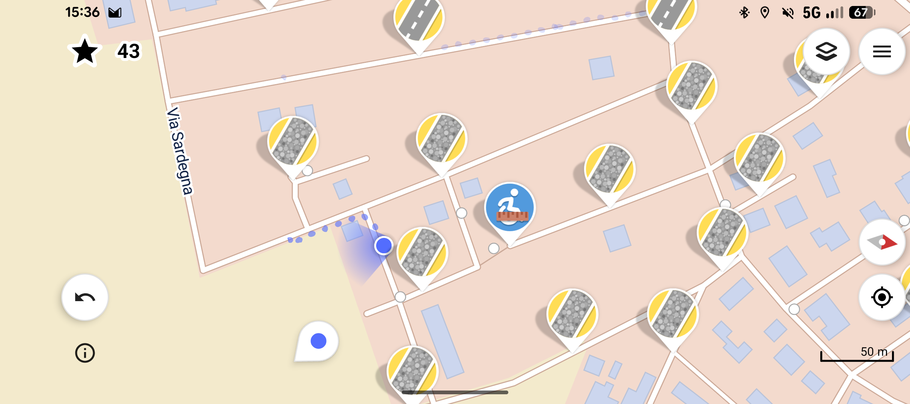

Durante le mie camminate insieme a mia figlia nel passeggino, lei si appisola quasi subito e mi lascia minuti e minuti di silenzio, quindi ho cercato di trovare attività per *riempire* questi momenti. Si lo so, **la noia fa bene**, ma il mio paese è comunque fin troppo noioso per camminare guardandosi intorno *e basta* :D.

I podcast in questi casi sono ottimi, e sto recuperando le puntate che ho perso nelle ultime settimane. Ma mi è venuto in mente che tempo addietro avevo scaricato un'app chiamata [StreetComplete](https://streetcomplete.app/) dopo aver ascoltato una puntata di [Digitalia](https://digitalia.fm/720/) e ho pensto che fosse un buon momento per provarla.

Quest'app applica la **gamification** alle mappe di [OpenStreetMap](https://www.openstreetmap.org) che, se non lo conoscete, è un servizio gratuito e open source di mappe basato sui contributi della community: se anche voi avete cercato alternative a Google Maps sono sicuro che vi sarete imbattiti in [OrganicMaps](https://organicmaps.app/it/) o [CoMaps](https://www.comaps.app/it/), e queste si basano proprio sulle mappe di cui sopra.

Dato che sono basate sui dati forniti dalla community potete immaginare, soprattutto in piccoli paesi, quante informazioni possano essere mancanti: vie senza nomi, attività commerciali con orari mancanti, tipi di strada non segnalati... **Tipi di strada**? Si, perchè OpenStreetMap è la base di molti servizi di mappe non solo per la navigazione automobilistica, ma anche alcuni utilizzati ad esempio nel ciclismo, quindi le informazioni con le quali si può contribuire a migliorare il progetto sono davvero innumerevoli.

Questa è una tipica schermata di **StreetComplete**, e le icone (cliccabili) sono le *missioni* da completare inserendo i dati. Ovviamente ogni informazione inserita vi darà punti, altrimenti che *gamification* è?

Chi me lo fa fare? Nessuno. Il mio contributo farà **davvero la differenza**? Non credo. Ma se si vuole cambiare le cose da qualche parte bisogna pur partire, no?
