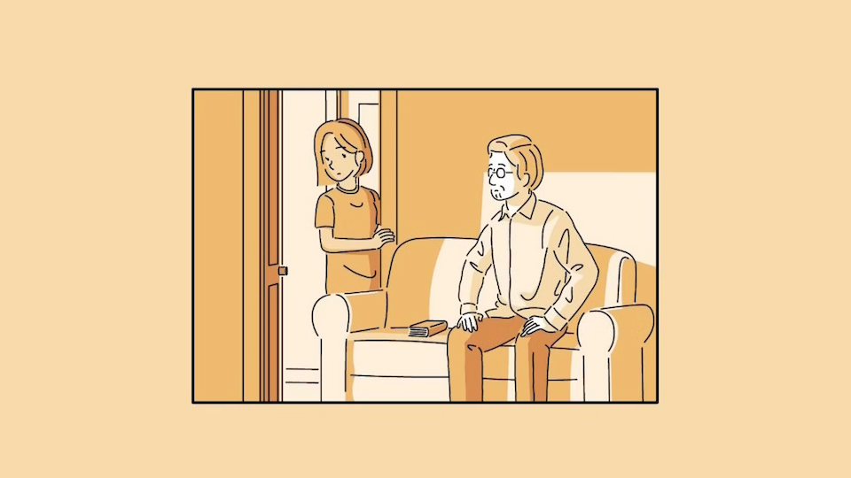

Comprato a scatola chiusa su [suggerimento](https://www.finalround.it/recensioni/630/and-roger-recensione) di [Giulia Martino di Final Round](https://www.finalround.it/staff/6/giulia-martino), **and Roger** è il primo gioco che ho completato in questo 2026.

Il gioco potrebbe essere descritto come una **visual novel interattiva**, ma in realtà il genere è quasi totalmente irrilevante. Quello che importa è che racconta una storia _comune_ raccontata da una prospettiva assolutamente inedita. Ma, soprattuto, che è un potentissimo **pugno nello stomaco**.

Non posso dire qual è l'argomento principale del gioco perchè vi rovinerei l'esperienza, ma vi posso dire che, una volta capito, **ho dovuto interrompere** per qualche ora il gioco per **metabolizzare** quello che stavo giocando.

Nonostante il disagio, quando troveremo il coraggio di andare avanti scopriremo che la storia raccontata è di una **dolcezza davvero toccante** e che fa stare male perchè, se si è passati anche tangenzialmente per una situazione simile, verranno a galla molti ricordi faticosi da digerire: si vede che l'autore è dentro l'opera e che la storia raccontata prende dal suo vissuto, perchè alcuni dettagli sono davvero _troppo reali_.

D'altra parte, questa esperienza è stata una sorta di abbraccio, una maniera per trovare dell'amore in una situazione spiacevole, e per capire che l'esperienza di uno, in questo caso, è l'esperienza di tutti.

Posso dire di essere contento di averlo giocato e che non l'avrei mai acquistato se non fosse stato per il consiglio di cui sopra, per cui **grazie davvero Giulia**.
