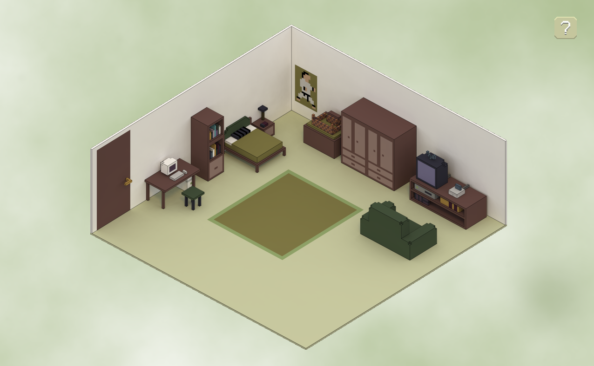

Ho recentemente pubblicato Appena prima di pranzo, un piccolissimo gioco sviluppato per la jam a tema "Nostalgia". Lo potete trovare su [itch.io](https://scario88.itch.io/appena-prima-di-pranzo) e su [indiexpo](https://www.indiexpo.net/it/games/appena-prima-di-pranzo).

Il gioco è stato sviluppato nel 2023, ma non lo avevo mai reso pubblico.
Non che non fossi soddisfatto, anzi, per il tempo che ho investito credo di aver tirato fuori qualcosa di proprio carino. Tra l'altro ho anche fatto [un video-devlog](https://youtu.be/T0GwJvnlVks?si=S2uLfUjHoQw5v25-) a riguardo in cui parlo come ho realizzato la grafica in quella sorta di isometria.

Non lo avevo reso pubblico perchè pensavo fosse troppo personale... ma in fin dei conti perchè tenerlo nascosto? Non ci sono volti se non stilizzati, non ci sono nomi di persone... Insomma, non c'è movito per non *mostrarlo al mondo*, per cui ho deciso di riaprire il progetto con l'intenzione di pubblicarlo.

Ho fatto due interventi principalmente

- aggiornarlo all'ultima versione di GM, e riscrivere variabili / funzioni con i pattern di Feather (il linter di GameMaker)
- aggiungere dei i suggerimenti per gli "enigmi"
Quest'ultimo punto è nato per il semplice motivo che, quando è stato provato in live, in molti non avevano capito come trovare effettivamente le risposte ai quesiti del gioco. Dato che non c'è una reale sfida, o comunque che non è quello il fulcro del gioco, ho inserito un pulsante per aiutare il giocatore se è bloccato sulla risoluzione di un problema.

Il gioco dura circa 5 minuti, e ho scelto di pubblicarlo in HTML5 (come voglio fare da qui in avanti e retroattivamente) affinchè non sia necessario scaricare un intero progetto per 5 minuti di gameplay. 
oi, essendo utente MacOs, spesso devo posticipare la prova di indie perchè la maggior parte sono disponibili solo per Windows, quindi poter provare un gioco direttamente dalla pagina web è un feature che mi fa molto piacere trovare e mettere a disposizione agli altri.

Spero possa piacervi, o comunque possiate trovare qualcosa di interessante da questo mio piccolo progetto nato da una jam.

Dimenticavo: [il repository Github](https://github.com/davidescarioni/appena-prima-di-pranzo) del progetto è pubblico, sbirciatelo pure se vi interessa qualcosa all'interno.
