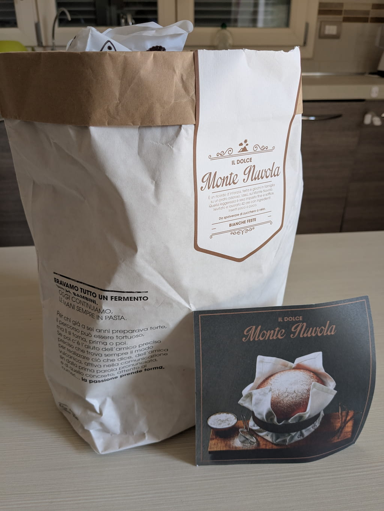

Amazon ha avuto il grande merito di *sdoganare* gli acquisti online: ricordo, tempo addietro, che comprare qualcosa dalla rete regalava solo ansie e paura sulla possibilità che venissero rubati i soldi spesi o che i prodotti venduti non fossero reali.

Ora però il mondo è diverso, e Amazon è l'opposto di una onlus: per quanto sia ancora l'unico modo per acquistare certi tipi di prodotti o per avere un certo tipo di assistenza, cercare di non incrementare lo strapotere di Amazon è una questione "etica" che sento mia.

Questo mese ho fatto tre acquisti da siti "piccoli", e tutti mi hanno dato delle gradite sorprese sulla cura dei prodotti e sul loro packaging.

Il primo acquisto è stato il libro [Storie di VideoGame dal sito di ITOMI](https://itomi.shop/collections/storie-di-videogame).

**Andrea Porta**, l'autore del libro, tiene un [podcast omonimo](https://vois.fm/podcast/storie-di-videogame/) dove racconta le storie produttive dietro a videogiochi famosi. Scrive anche articoli su [Final Round](https://www.finalround.it/), sito che apprezzo particolarmente per i modi diversi con i quali tratta di videogiochi (non da' voti, non tratta news, mantiene un'impaginazione del sito che ricorda le vecchie riviste, ecc), e che ultimamente si è lanciato anche nella pubblicazione di Bookazine per autosostenersi. I ragazzi di Final Round hanno proposto ad Andrea Porta di realizzare un libro e che, dato il successo, è diventato il numero uno di una collana,
Il libro poi è stato prodotto da [ITOMI](https://itomi.studio/), ex fondatore di Lega Nerd che si è messo in proprio e ora è un vero e proprio artigiano, e tra le altre cose produce anche libri con una cura eccezionale nei materiali e nell'impaginazione.
Come avrete poi notato dalla foto, ho ordinato un libro ma ho ricevuto anche un adesivo, un segnalibri molto carino e decisamente a tema e una Goleador (che purtroppo non ho fatto in tempo a fotografare xD).
Questo è il tipo di cura che non si trova nei grandi store e che davvero fanno percepire il cuore con la quale le persone si mettano in gioco online per proporre qualcosa a cui tengono.

Il secondo acquisto è arrivato da [Infermentum](https://www.infermentum.it/), sito fondato da tre ragazzi di Verona in cui vendono lievitati e biscotti fatti da loro, e posso assicurarvi che sono eccezionali.
Ormai la loro non è più una realtà così piccola (ho saputo alcuni imprenditori usano i loro panettoni per i regali natalizi), ma, oltre alla qualità, anche il packaging curato e unico li fa ancora distinguere dalla grande distribuzione.
Ah, nel caso voleste provarlo, vi consiglio assolutamente la Torta di Rose e il Monte Nuvola tra i lievitati, e gli Sbrisolotti tra i dolci :D

Il terzo proviene da [Lize](https://www.lize-shop.it/), sito che si occupa della produzione e vendita di abiti e intimo in materiali naturali e sostenibili.
Qui mi sono aggiunto all'acquisto fatto dalla mia compagna, che ha preso quello che mostro in foto: uno "scrigno" nel quale è contenuto un vello d'agnello da posizionare sul materasso e 4 completi per neonato in materiale naturale traspirante da regalare ad una sua amica per la nascita della figlia.
Devo dire che la sola confezione fa un figurone, e trovare il biglietto di ringraziamento per aver ordinato da loro è uno di quei tocchi che apprezzo di cui parlavo prima.

Se penso poi all'ultimo pacco Amazon che mi è arrivato, sovradimensionato e quasi accartocciato... W le piccole realtà online!
