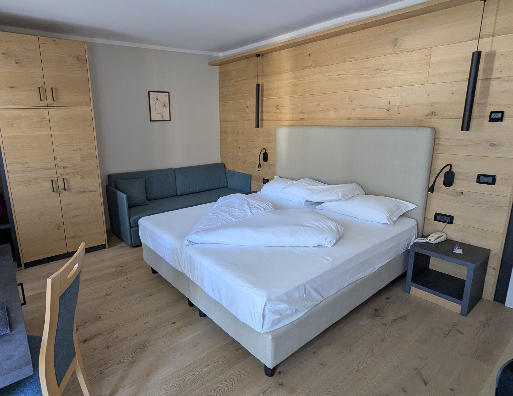
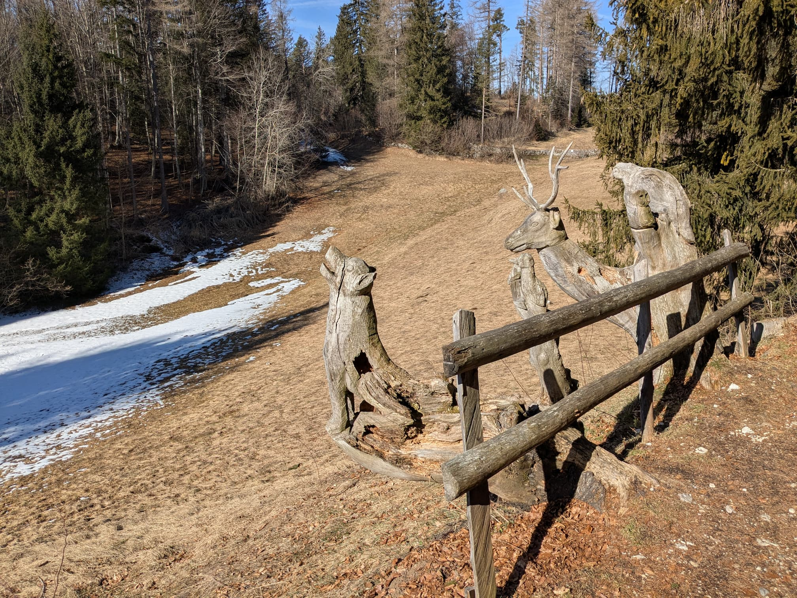
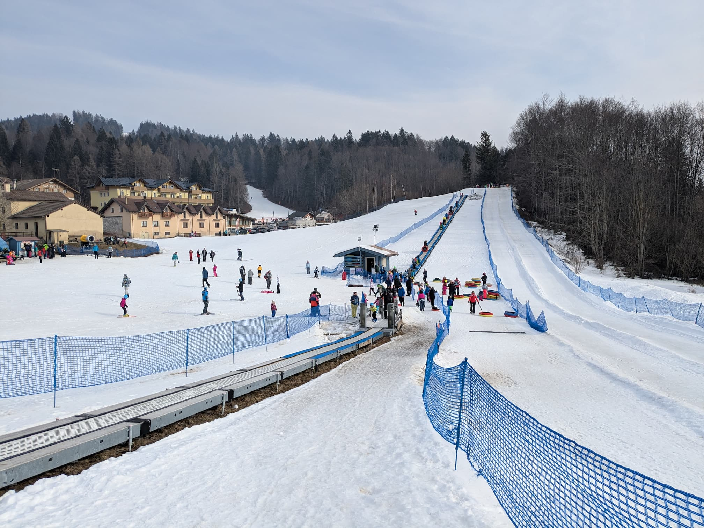
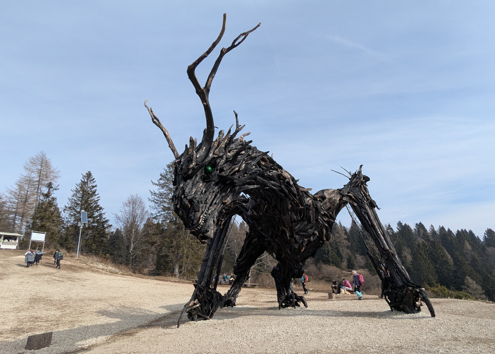
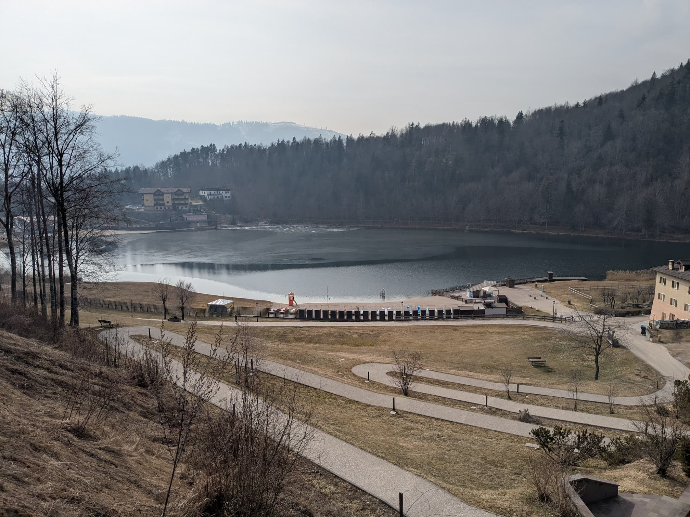
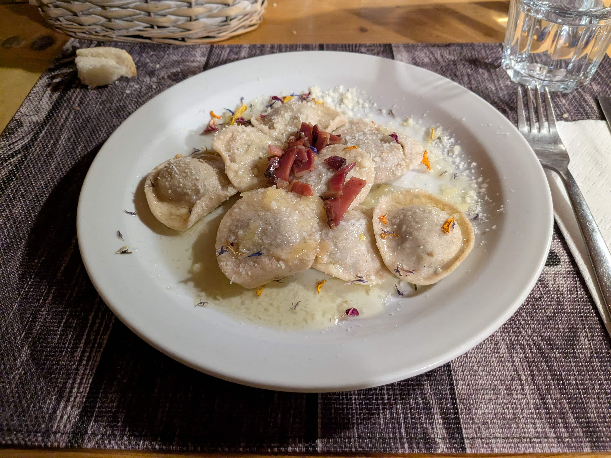
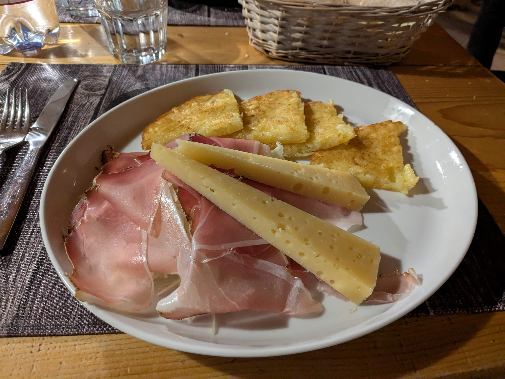

*Commento dopo la rilettura: ok, non sono proprio portato per la scrittura :D ma data la mia scarsa memoria ci tengo comunque a mantenere questo post nel caso possa servire in futuro*

Sono stato con la mia compagna a Bertoldi, una piccola frazione di Lavarone, grazie ad un cofanetto Emozione3 che ci era stato regalato e che stavamo per far scadere.

Abbiamo soggiornato all'hotel [Caminetto Resort](https://www.caminettoresort.it): la struttura è decisamente recente, con camere moderne e ben arredate, e presenta internamente anche una SPA, la quale contiene una sauna finlandese, un bagno turco, e un'area relax. Sono presenti anche una piscina interna, una esterna (usabile solo in estate) e una vasca idromassaggio riscaldata. Menzione d'onore per la colazione: abbondante e varia, dolce e salata, ci ha soddisfatto (la crostata pere e mandorle è stata proprio la ciliegina che ha completato il tutto).

Non si può definire un hotel particolarmente silenzioso in quanto è frequentato principalmente da famiglie, sia per la posizione strategica dello stabile (davanti a [Neveland](https://neveland.net) e a fianco ad un impianto di risalita) sia per le numerose attività organizzate dalla struttura stessa, ma la cosa non ci ha dato nessun tipo di problema.

E' stata una vacanza relax, in cui abbiamo principalmente sfruttato la SPA descritta sopra e fatto delle belle passeggiate nei dintorni.

Riporto qui le nostre attività come suggerimento, nel caso dovesse interessare a qualcuno.

Il primo giorno abbiamo percorso il **Sentiero delle Sorgenti**, un percorso che definirei adatto a tutti della lunghezza di 3.6km: abbiamo incontrato numerose sculture di animali in legno e le Sorgenti che danno il nome al percorso, ghiacciate per l'occasione ([.cit](https://www.youtube.com/watch?v=6bQGLT_cuSU)).

Abbiamo poi fatto una decina di giri con il gommone a [Neveland](https://neveland.net), un piccolo impianto per famiglie in cui è possibile girare con i gommoni appena citati, lo slittino e gli sci.

Il giorno seguente abbiamo intrapreso il Sentiero del Drago, un percorso sempre in mezzo ai boschi che ha l'obiettivo di raggiungere l'opera **Drago di Vaia Regeneration** dell'artista Marco Martalar. **Vaia** è il nome di un evento meteorologico distruttivo avvenuto nel 2018. Dal sito [Visit Trentino](https://www.visittrentino.info/it/articoli/famiglia/drago-alato-vaia) recupero questa citazione:

> Il 29 ottobre del 2018 un vento uragano che ha superato in Trentino i 200 km/h ha ferito le nostre montagne. Un evento meteorologico estremo proveniente dall’Atlantico ha schiantato milioni di alberi, con la conseguente distruzione di decine di migliaia di ettari di foreste alpine.

Il percorso presenta numerose installazioni relative al rispetto che l'uomo deve portare alla natura. Oltre al Drago stesso, è stato realizzata anche [una favola per bambini](https://www.lavaronegreenland.it/vaia-storia-di-un-drago-libro/) per sensibilizzare sull'argomento.

È un percorso che anche qui consiglio e che sicuramente è adatto per famiglie, ma pongo l'attenzione sul fatto che, durante il periodo invernale, ad un certo punto ci si ritrova davanti ad una pista da sci: questa, anche sentendo i maestri che la stavano percorrendo, va attraversata con attenzione per riuscire a ricollegarsi al percorso.

Al ritorno, invece di tornare indietro dalla stessa strada, abbiamo proseguito per Azzolini (percorrendo il percorso del Drago Vaia che parte anche da lì, ma al contrario). Da lì, sempre ben indicato, abbiamo proseguito per il Lago di Lavarone: questo è davvero piccolo e si gira in una decina di minuti, ma abbiamo scoperto che anche Freud era solito girarlo durante le sue vacanze trascorse da queste parti... pensa te!

La sera stessa abbiamo cenato alla [Baita Del Neff](https://www.baitadelneff.it): cibo ottimo e bellissima location, peccato solo per il parcheggio completamente ghiacciato che ci ha fatto passare un brutto quarto d'ora (e ci ha fatto inaugurare le calze da neve per le gomme dell'auto, miracolose!).

L'ultimo giorno, anche complice alcuni problemi con l'auto (nota per il futuro: se la ruota fa uno stridio incredibile, probabilmente è un sasso incastrato nella pinza del freno) abbiamo fatto il percorso chiamato il **Respiro degli Alberi**, con partenza anche qui ben segnalata dal parcheggio gratuito di Lanzino: molto semplice, accompagnato da sculture di vari autori in simbiosi con la natura, la cui meta è il punto panoramico dal quale si riesce a scorgere il lago di Caldonazzo.

Segnalo a Gionghi il [Caseificio degli Altipiani e del Vezzena](https://www.caseificiovezzena.it), nel quale abbiamo acquistato l'ottimo formaggio omonimo in più stagionature.

Considerando che la distanza dalla provincia di Milano da Lavarone è di poco più di tre ore, è assolutamente fattibile come gita per un weekend e che mi sento di consigliare.