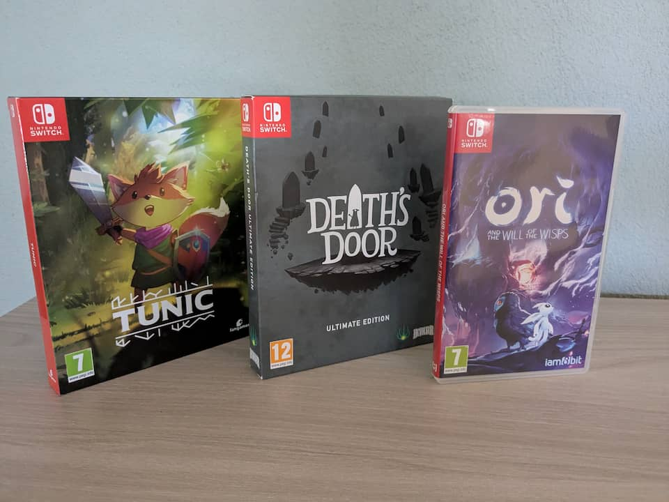

Dopo tanto, tantissimo tergiversare, mi sono deciso a comprare un NAS. E' un mio pallido da anni perchè ho paura di perdere dati: da ragazzo ho cambiato più sistemi di archiviazione e ho ancora roba un po' sparsa tra dischi removibili e cloud, e vorrei finalmente avere un punto centralizzato con tutto dentro.
Nel frattempo è cresciuta anche la mia allergia a servizi che, nonostante siano a pagamento, sfruttano i tuoi dati per pubblicità mirata e per fare training dell'AI. Insomma, ora ho una casa e (finalmente) anche una rete internet decente, se volevo fare questo passo è proprio il momento giusto.

## Il NAS

Ho scelto di acquistare un [Ugreen DXP2800](https://nas-eu.ugreen.com/en-it/products/ugreen-nasync-dxp2800-nas-storage?from=mega-menu): ho avuto occhi solo per Synology negli anni passati ma, date le loro ultime [decisioni aziendali volte a limitare la libertà di scelta degli utenti](https://www.dday.it/redazione/52749/synology-meno-funzioni-sui-nas-consumer-se-non-si-usano-dischi-certificati-o-marchiati-synology), ho preferito acquistare la new entry del settore. Rispetto alla concorrenza è più performante (ha un processore Intel N100, quindi niente ARM), 8GB di RAM espandibili, capienda di 2 dischi da 3.5/2.5 + 2 nvme da usare come dischi stessi o come cache. Io ho scelto di acquistare due dischi Seagate IronWolf da 4tb al momento.
Avevo un po' di timore per il sistema operativo, ma, dopo tante ricerche, sembra che sia ben supportato e di facile compresione (punto fondamentale, di Reti ho fatto un esame in università ma non direi proprio di essere sul pezzo).

Elenco qui come ho cominciato ad usare il mio *disco di rete intelligente*.

## Time Machine

Dopo l'installazione guidata e l'inizializzazione dei dischi in formato Btrfs in RAID 1 (durata ben 8 ore!), il primo step che ho voluto fare è stato eseguire il backup del Mac tramite Time Machine: non ho niente di valore qui nonostante sia il mio pc principale, e mi sembrava un buon punto dal quale iniziare.

I passi da seguire per attivarlo sono semplicissimi, linko qui il [tutorial](https://www.youtube.com/watch?v=cEYphSW7udY&t=4s) che ho seguito.

## Download di ISO

Dovendo formattare il Thinkpad di cui parlavo nell'articolo "Tempo di upgrade", ho pensato di provare ad usare la funzione download per scaricare le iso di Windows 11 e, nel caso qualcosa fosse andato storto, di Linux Mint: mi è bastato indicare la url e il NAS ha fatto tutto lui, permettendomi di uscire di casa con il pc spento... Davvero ottimo!

## Musica

Negli ultimi anni ho acquistato 3 giochi splendidi che avevano la colonna sonora tra i contenuti bonus: [Ori and the Will of the Wisps](https://www.orithegame.com/), [TUNIC](https://tunicgame.com/) e [Death's Door](https://playdeathsdoor.com/).

!

I primi due hanno la colonna sonora scaricabile in digitale, ma non sapevo bene dove salvarla: le avevo "parcheggiate" su OneDrive, ma ascoltare in remoto è sempre stato un'impresa, e tra l'altro mi sono accorto che deficitavano di parecchi metadati.

Ho così creato una cartella sul NAS, l'ho *montata* su MacOS e ho usato il software gratuito [MusicBrainz Picard](https://picard.musicbrainz.org/) per aggiungere i metadati mancanti (tra l'altro pensavo dovesse essere un'operazione manuale e invece ha fatto tutto in automatico, top). Ora dal NAS, usando l'applicazione Musica, riesco perfettamente ad ascoltare le tracce da remoto.

Death's Door invece presenta una OST in CD, ma non ho nessun lettore a casa.... se non nel Thinkpad di cui accennavo sopra. Devo imparare a ripparlo e a salvarlo sopra.

Tra l'altro mentre scrivevo questo articolo mi è venuto in mente che spesso [GOG](https://www.gog.com/en/), sia nei giochi che vende sia in quelli che regala tramite [Prime Gaming](https://gaming.amazon.com/), a volte regala la colonna sonora tra gli extras... vi terrò informati.

Ma come ascolto questa musica sul mio telefono se sta sul NAS?

## Tailscale

[Tailscale](https://tailscale.com/) è una VPN usata per creare facilmente delle reti private sicure tra dispositivi: praticamente attivandola sia sul mio telefono sia sul NAS, entrambi apparterranno alla stessa rete, per cui posso accedere ai file del NAS stesso senza esporlo su internet.

Il processo è molto semplice: va prima di tutto creta un'utenza Tailscale dal sito, e questo ci farà generare una chiave. Questa chiave andrà fornita a tutti i dispositivi e, tramite un client, potranno "vedersI". Non sono molto ferrato sulla questione, ma il tutorial ufficiale di Ugreen è molto chiaro.

Quindi rispondendo alla domanda precedente, ascolto la musica presente nel nas collegandomi con Tailscale alla rete condivisa e usando l'applicazione di Ugreen per ascoltare la musica. Probabilmente cambierà software, ma per il momento va bene così.

## E adesso?

Ok, al momento questo è fin dove mi sono spinto con i miei "esperimenti". Purtroppo la mia settimana di ferie è finita, per cui non posso dedicargli il tempo che gli ho dato precedentemente. C'è ancora molto da fare, ma ci tenevo a segnare i "primi passi" che ho effettuato. Ci sentiamo presto, spero!