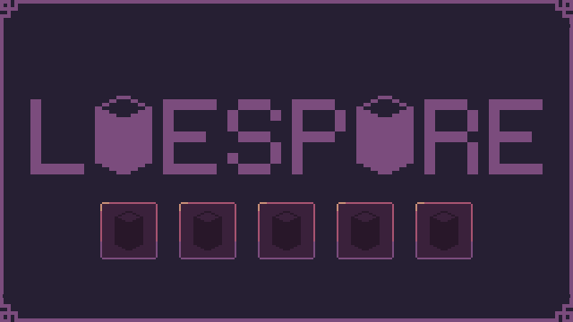
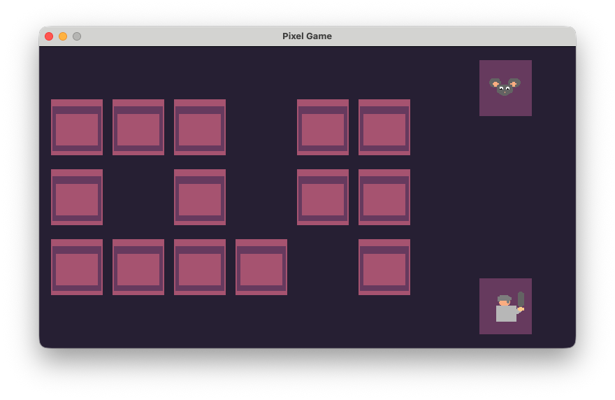
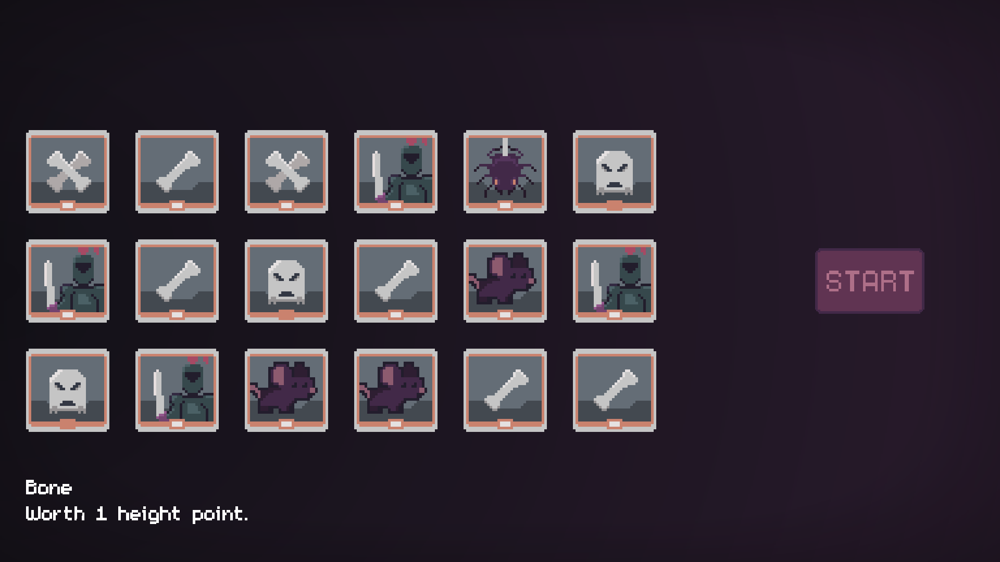
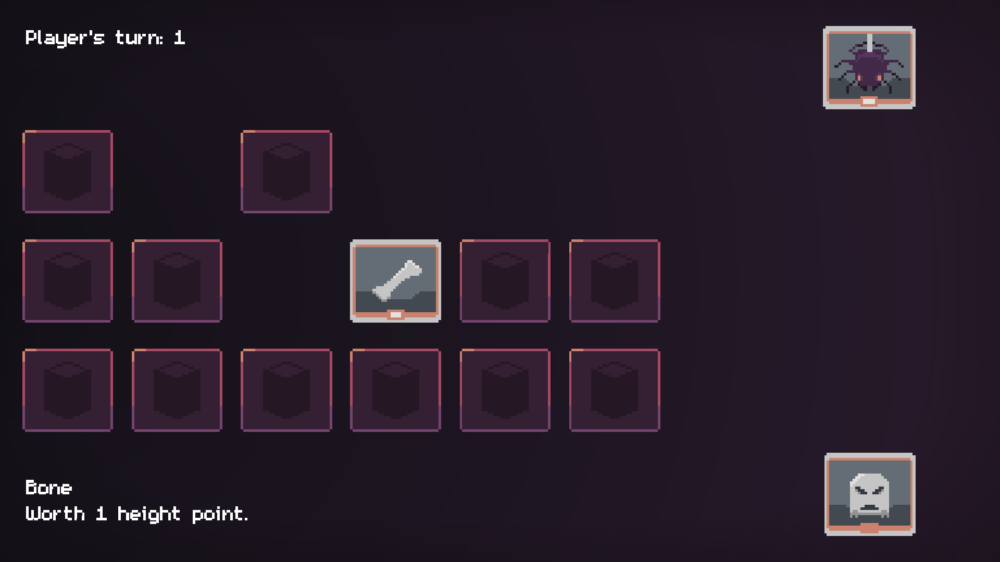

Puntuale come ogni Halloween, anche quest'anno MyMadness Works sul Discord di GameMaker Italia ha proposto la TerrorOttobre, una jam spooky / horror con un tema da seguire: quello di questa edizione era **INGANNO**.

Non era mia intenzione partecipare, però poi, dal nulla, ho pensato che un bel gioco di carte in cui nascondere le vere intenzioni all'avversario poteva essere una bella idea, quindi....

## Comincio a prototipare

Ho voluto fare un esperimento: dato che in ufficio mi chiedono sempre più di **affidarmi a ChatGPT** per lo sviluppo software ma io continuo ad avere riserve a riguardo, ho deciso di usare questo progetto per fare Vibe Coding, cioè lasciare l'IA a sviluppare e scrivere solo PROMPT. Se inizialmente il tutto sembrava andare correttamente (ho scelto per provare appunto un gioco nel quale potenzialmente mi poteva bastare un singolo oggetto), pian pianino l'IA ha perso il contesto e **ha cominciato a non azzeccarne più una**.
Nel mentre ho mandato dei vocali a **Giovanni** (il ragazzo che [sono andato a trovare in Norvegia qualche mese fa](/blog/norvegia/)) dato che è appassionato di giochi da tavolo, e mi ha un po' smontato la mia idea.

...Idea che non vi ho ancora raccontato:

- due giocatori si sfidano a costruire **la torre più alta**
- ogni carta ha un valore di altezza
- vengono mostrate quattro carte per volta, e ne vengono scelte una per turno da entrambi i giocatori, poi si rimettono sul tavolo quattro nuove carte dal mazzo
- **a metà mazzo è posizionata una carta INGANNO**, che cambia una regola fondamentale del gioco, ad esempio: le carte topo smettono di moltiplicare punti, vince la torre più bassa, i mazzi pareggiano l'altezza, ecc.

Quello che _Giò_ mi ha fatto notare è che è troppo determinante la fortuna, perchè la carta INGANNO può far perdere una partita perfetta e far vincere una partita giocata male.

Dato però che INGANNO era il tema della jam non potevo semplicemente toglierla, dovevo proprio cambiare il gioco dalle basi. E, siccome ChatGPT ho capito non essere ancora adeguato, avrei dovuto rifare comunque tutto da 0.

## Nuova idea: memory!

Comincio da un'idea che avevo scartato la scorsa competizione, cioè quella di realizzare un memory competitivo: vengono mostrate tutte le carte, poi ad inizio partita vengono girate e si gioca. L'obiettivo qui non è fare _coppie_ come nel memory tradizionale, ma di andare a pescare la carta giusta al momento giusto.

L'obiettivo resta sempre lo stesso, fare la torre più alta dell'avversario. Cambia però l'INGANNO: questo ora viene mostrato ad inizio partita tramite QR code, così che se l'avversario bara ce ne possiamo rendere conto. Giusto, cosa fondamentale: il gioco multiplayer locale, perchè sviluppare una IA di un gioco di carte per una JAM è troppo _time-consuming_... e poi quanto è bello giocare insieme a qualcun altro nella stessa stanza?

Aspetta... perchè non ho integrato la nuova gestione della carta INGANNO nel prototipo precedente? Semplicemente perchè avrei dovuto rifare tutto e un memory mi sembrava più facile e veloce da realizzare nel tempo rimasto.

Quindi... ecco a voi LIESPIRE.

Il gioco tra l'altro l'ho esportato per web (come precedentemente ho detto di voler sempre fare da ora in avanti), e giocarlo su tablet con un amico è davvero piacevole come esperienza (ma siamo alla stregua di un "_Oste, com'è il vino_?").

Probabilmente non è ancora ben equilibrato perchè è stato giocato da troppe poche persone, e ho in mente di inserire almeno una nuova carta in futuro (il pipistrello, che finirà nel mazzo dell'avversario e non nel proprio).

Se vi va, [qui trovate il link da dove poterlo giocare](https://scario88.itch.io/liespire).
