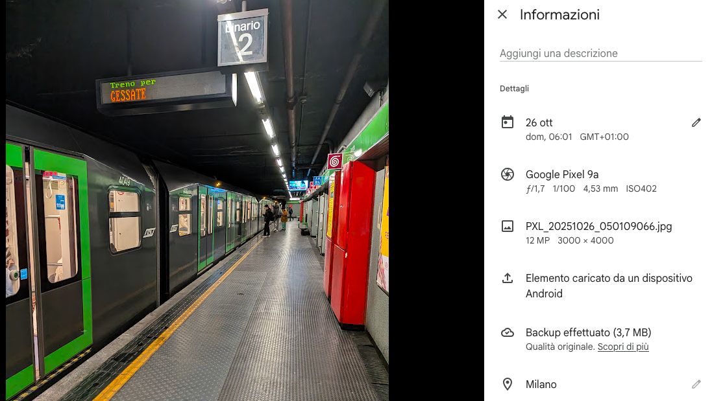
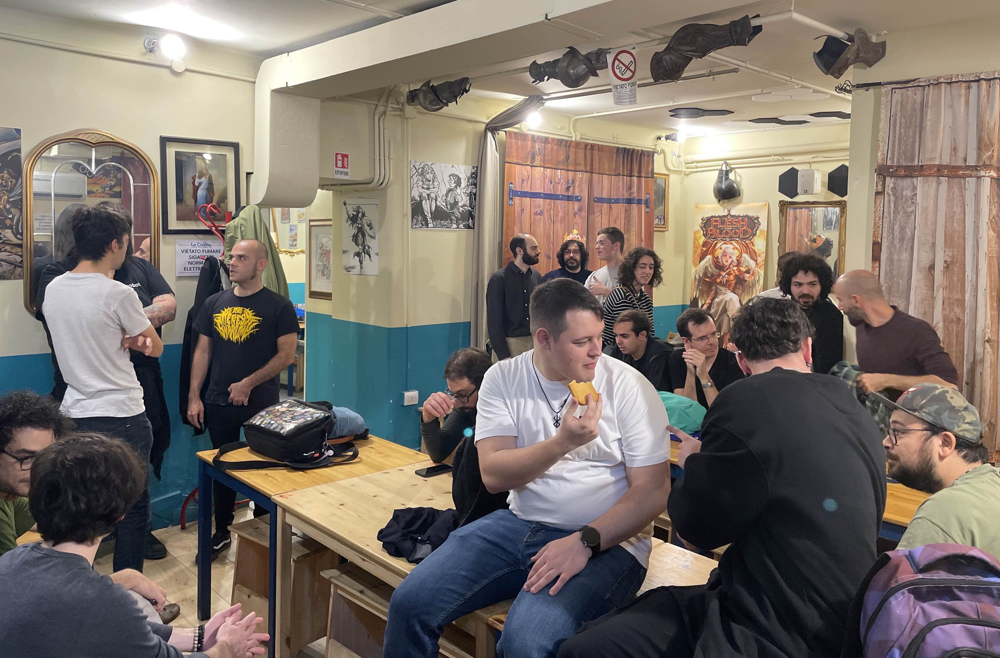
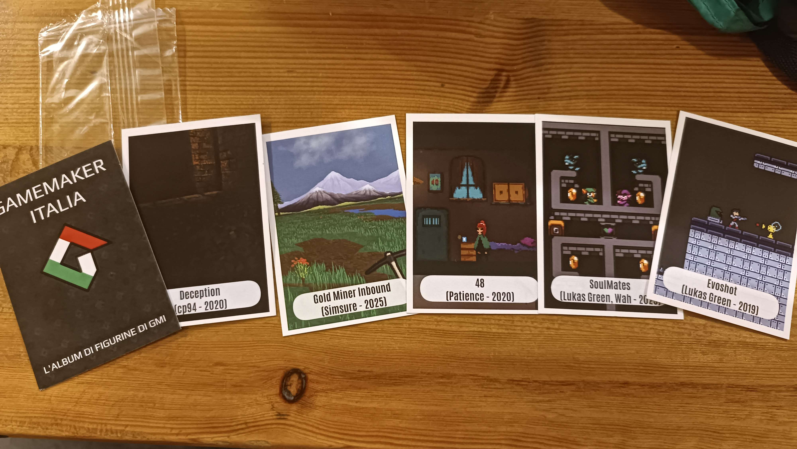
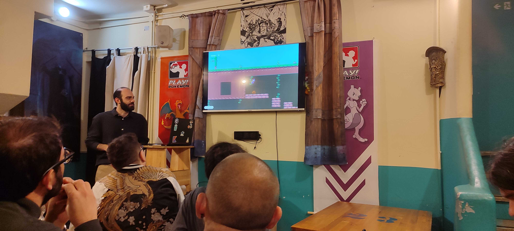
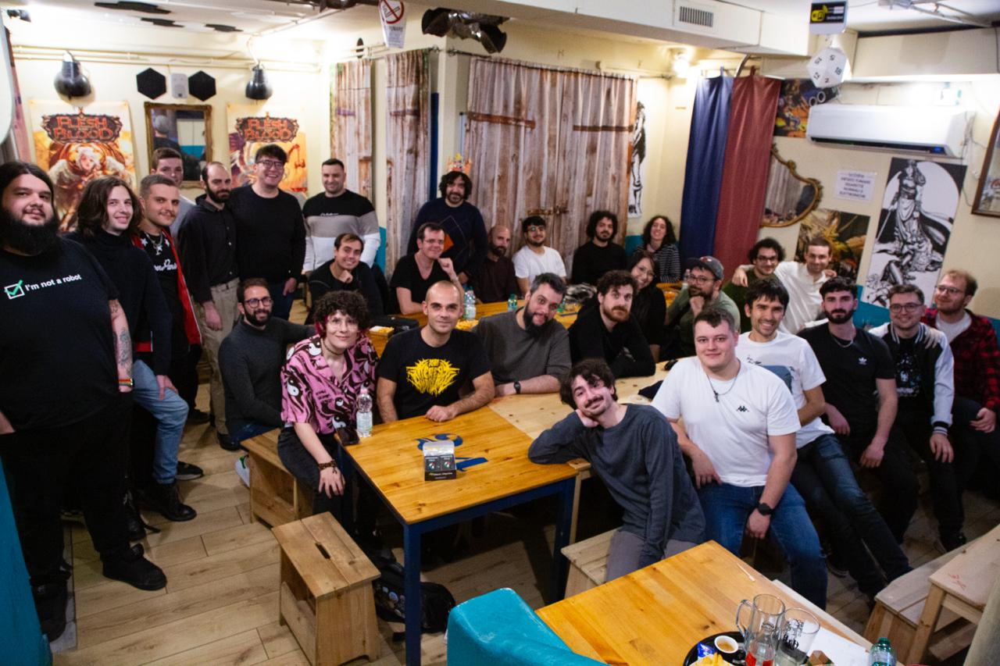

Come avevo anticipato nel post della [Milano Games Week 2024](/blog/milano-games-week-2024/), non era davvero mia intenzione organizzare un altro Meetup per GameMaker

> _Quest'anno poi l'organizzazione [del Meetup, NdR] mi ha davvero distrutto: le chiamate quasi quotidiane con [...] (la location che avevamo scelto) [...]] unite nel calderone delle rotture provenienti dalle nuove incombenze [...] sono state davvero un impegno che, ora come ora, non vorrei più ripetere._

Ma chi sono io per essere coerente? Eccomi quindi qui a raccontarvi com'è andato il Meetup di quest'anno :D
Scherzi a parte, l'organizzazione del Meetup è davvero sfiancante: ricerca del locale, ping ai singoli utenti per capire in quanti si possa essere, contattare _il signor GameMaker_ per capire se è possibile essere finanziati, ecc...
Al tempo stesso però credo sia davvero importante avere questo incontro tra la community, che però è per lo più pigra e non ha la voglia di organizzare. Quindi insomma, forse più per me stesso che per altro, mi sono rimboccato le maniche e ho voluto organizzare anche quest'anno un Meetup: sempre a Roma visto che c'è più partecipazione, e sempre nel locale che già conosciamo, la Civetta Ludopub.

## La mia giornata

**Sveglia alle 4.30**, esco di casa un'ora dopo per riuscire ad arrivare a Famagosta e prendere la prima metro della giornata, quella delle 6.01. Il mondo della domenica mattina quando la notte e la mattina si danno il cambio è incredibile: ho trovato un posto di blocco dei carabinieri per i controlli a chi torna dalla discoteca, e in metropolitana si alternavano persone che andavano da qualche parte e quelle che tornavano, riconoscibili perchè questi ultimi salutavano calorosamente gli amici con in mano una brioche da riportare a casa.

Arrivato in stazione in anticipo (sarò vecchio, ma un po' di ansietta pre viaggio non manca mai) ho fatto una **buona seconda colazione** a base di bioches e caffè da RossoPomodoro che, a quanto pare, serve anche colazioni al mattino.

Il viaggio poi in treno verso Roma è stato comodo come al solito: mi piace viaggiare con Italo, ad una bella run ad Alwa's Awakening sulla Miyoo Mini Plus ha fatto il resto.

Arrivato in stazione ho subito incontrato vecchi e nuovi amici: Benia mi ha aspettato sui binari e mi ha presentato il suo amico (che è stato anche utente per brevissimo tempo su GMI), e da lì ci siamo incamminato e abbiamo incontrato Victroium, Wolfcorp (incredibile, non è un ologramma), KR4ID e la sua fidanzata, Bipo e Wolfrost. Dai nomi avrete sicuramente riconosciuto qualuno che ho già nominato in precedenza, qualcuno no. In ogni caso mi fa sempre piacere rivederli, in particolare Benia: è un utente vecchio come me, abbiamo collaborato insieme, poi lui è diventato un imprenditore e si è staccato dalla scena dello sviluppo, ma a questi eventi gli fa sempre piacere partecipare... un grande insomma.

Mentre ci incamminavamo verso il luogo del Meetup, Mad e Pat mi hanno contattato riempiendomi d'ansia: il locale non aveva capito fossimo in 35, aveva preso altre prenotazioni e ci aveva riservato solo 20 posti. Fortunatamente grazie al fatto che alcuni degli altri avventori non si sono presentati, e al fatto che hanno notato che io avevo avvertito correttamente, al nostro arrivo era già tutto a posto, meno male. Ho avuto un momento il panico anche per il pranzo per le due ragazze celiache, ma la location è stata velocissima a risolvere una volta capito che fosse stata una mancanza loro... meno male!

Il Meetup in sè, poi, è stato davvero bello: caotico, divertente, interessante... insomma, esattamente come me lo aspettavo :D

L'obiettivo era quello di tenere dei talk, e poi di giocare i giochi della community (perchè va bene sviluppare, ma ogni tanto giocare ai propri giochi è davvero divertente!).

## I talk

### ANNUNCIO IMPORTANTE

Quei pazzi di Goldensun e Zigoon hanno tirato fuori dal cappello una cosa meravigliosa: l'album di figurine di GMI. Oltre ad essere un bellissimo progetto, la realizzazione è stata davvero ottima e i presenti sono andati in brodo di giuggiole. Non credo che sarà la prima volta che le vedremo, c'è stato davvero troppo entusiasmo e vogliamo che sia una cosa da far portare avanti, magari come premio alle competizioni... anche perchè non ho trovato nemmeno uno dei miei giochi, devo riuscire a recuperare o scambiare :D

Il progetto è comunque qualcosa che poteva essere realizzata solo in una vera community unita. Bellissimo.

### Spazio ai giochi della community (parte 2)

Anche quest'anno Ballman ha chiesto agli utenti di GMI un gioco da fargli provare e "recensire". Peccato per la poca partecipazione, ma, nonostante questo, Ball ha presentato, con il suo fantastico stile, alcuni dei giochi che non avevo mai provato, quindi sono contento che abbia tenuto il talk.
Io gli avevo chiesto di provare [Spooky Chest](https://scario88.itch.io/spooky-chest), ed è andata bene perchè, durante le chiacchiere mentre si pranzava, ho avuto davvero degli ottimo feedback che mi hanno portato a dargli una rinfrescata nei giorni scorsi. Lo vedo come un gioco che papabile da rendere "vendibile" su uno store, quindi sono contento che a qualcuno sia interessato.

### Room inheritance

AlexoFalco ha tenuto l'unico vero talk tecnico della giornata. E' partito dal concetto di ereditarietà per poi focalizzarsi sull'applicazione nell'ambito delle room, un argomento davvero molto richiesto dalla community perchè un po' oscuro.
È stato davvero molto interessante perchè ha anche mostrato dei casi d'uso molto pratici, devo assolutamente provarle in futuro.

### Presentazione MÖRK BORG Heresy Supreme

[Morbidware](https://www.morbidwaregames.com/) è un **vero** sviluppatore, nel senso che lo fa proprio come professione, ed è venuto a trovarci grazie a Mad: si sono conosciuti infatti quando il primo ha fatto il porting di un gioco del secondo per Nintendo Switch (FIREWORK).

Al Meetup ha presentato il gioco a cui sta lavorando, tratto da un RPG da tavolo. Non lo conoscevo, ma lo stile grafico è pazzesco, e la resa del progetto non sembra uscire da GameMaker da quanto è bella.

Ha detto un paio di cose interessanti tra l'altro, ad esempio che non usa room e pochissimi oggetti perchè fa tutto tramite struct. È un approccio che non ho mai provato, sono davvero curioso di capire quanto può essere vantaggioso con il mio utilizzo di GM.

### Presentazione Sylva + Demo

Wolfcorp, utente storico di GMI, si fa vedere per la prima volta e mostra a tutti il gioco a cui lavora ormai da 4 anni, e con il quale aveva partecipato ad una Competizione, Sylva.
Principalmente ci ha mostrato il nuovo trailer, ci ha raccontato le nuove funzionalità e ci ha regalato la demo in anteprima.
Ha poi usato una cosa curiosa per avere feedback, o almeno, curiosa per me: ha usato un software che genera Word Clouds, quegli insiemi di parole in cui le stesse sono scritte più o meno grandi in base alla quantità di occorrenze della stessa. Spero che possano tornargli utili!

### Presentazione gioco - Nino

Nino, il ragazzo più giovane della community, ha realizzato insieme al suo amico notarore un gioco multiplayer da 4 giocatori, e ce lo ha presentato e fatto provare con una quantità di entusiasmo incredibile. Spero che crescendo continui ad essere una sua caratteristica!

### 3 tips veloci per GameMaker

Il mio primo talk, velocissimo, in cui ho mostrato tre funzionalità che ho utilizzato per sviluppre [LIESPIRE](/blog/liespire/). Vedo ri riportare a breve qui sul blog anche queste fantomatiche tips.

### Memento

Il mio secondo talk, che ha suscitato un sacco di curiosità. Invecchiando, il tema della preservazione del passato è una questione a me cara, e anche il "passare ai posteri" il proprio lavoro è qualcosa a cui penso spesso. Dato che non ho le capacità di sfondare, tutti i miei piccoli giochi probabilmente spariranno nell'etere, anche e soprattutto perchè produco solo cose digitali. Mi piacebbe che la community **realizzasse una sorta di GMI50** (un gioco di giochi in stile UFO50), un **launcher con i giochi della community** o dei **libri** in cui parlarne, ma la verità è che un progetto con tante persone, per esperienza personale e a parte poche eccezioni, per me è un progetto destinato a fallire.

La mia personale soluzione è quella di usare un launcher già pronto, [Ninty Launcher](https://ninstars.itch.io/ninty), e popolarlo con i miei giochi. Ma, se a qualcuno va di partecipare, basta che in ogni suo gioco inserisca anche un banner quadrato nei suoi progetti, così che tutti possiamo usare Ninty e popolarlo con i giochi della community. Minima spesa massima resa.

FLASH FORWARD: yatima, utente del forum che in passato ha sviluppato proprio **per** GameMaker, ha trovato interessante l'idea del launcher e ha cominciato a svilupparlo, tra l'altro con integrato anche Wine. Piango, e spero che non rompa il mio cuore abbandonandolo durante lo sviluppo.

### Rally Stil

Avevo chiesto a Benia di portare da mostrare alla community Rally Still, un gioco perso nel tempo di cui praticamente ricordavo solo io l'esistenza. Gli ho chiesto di portalo, oltre che per farlo conoscere, perchè ricordavo avesse fatto una cosa bellissima, ossia dei controller dedicati stile cabinato delle sale giochi. Peccato non averlo potuto provare a dovere per colpa dei tempi stringenti, ma ha suscitato davvero molto entusiasmo e sono contento che Benia si sia prestato alla cosa.

## La mia giornata (parte 2)

Tra una chiacchiera, un hamburger e qualche scambio di figurine la giornata è volata. Alle 19 ho salutato tutti e mi sono recato in stazione per prendere il treno di ritorno, non prima di essere passato al Mercato Centrale per recuperare le sfogliatelle di Scaturchio e una pizza romana da portare a casa alla mia compagna.

Il viaggio di ritorno è stato peggio di quello dell'andata: ero stanco ma le luci mi hanno impedito di dormire, la rete era terribile (ecco perchè due anni fa mi ero salvato dei film in locale, bravo Scario del passato) e ho guardato la puntata di MyHero Academia a scatti e non avevo voglia di giocare, per cui mi sono accontentato di portarmi in pare con un paio di podacast.

Al mio rientro a mezzanotte ho decretato che non ho pià l'età per fare Milano - Roma in giornata :D Ma è stato bellissimo e lo rifarei domani.

Spero di rivedervi tutti presto, anche se, per forza di cose, non sarà così.

