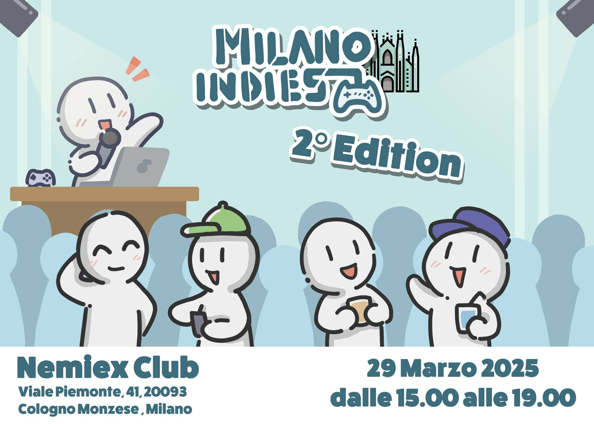

**Milano Indies** è un evento nel quale viene dato spazio a sviluppatori di videogiochi indie per presentare i proprio prodotti, siano essi terminati, in sviluppo o in via di definizione.

È stato organizzato al Nemiex, un locale a Milano (o meglio, Cologno Monzese) che mi sembra ormai sia diventato il punto di riferimento principale per questo tipo di eventi, sicuramente con merito: l'area messa a disposizione per l'evento aveva una parte adibita a museo di hardware e software con qualche anno sulle spalle, mentre quella principale era una grossa sala comprendente un palco con proiettore affinchè i partecipanti potessero mostrare il loro gioco.

Io ho partecipato solo come pubblico: ho tergiversato fino all'ultimo perchè non ero sicuro di avere qualcosa degno di essere presentato e avevo paura davvero di avere solo prodotti poco interessanti. Come dicevo all'inizio, però, alcune presentazioni hanno mostrato solamente dei mockup di idee, quindi potenzialmente la prossima volta potrei buttarmi se trovo il coraggio di parlare davanti ad una platea :D.

Sono andato all'evento per conto mio, ma ho trovato parecchie vecchie conoscenze: c'erano [Wolfrost](https://giovanni.orciuolo.it/) e Nannasaurus Rex (che fanno parte di GameMaker Italia) a presentare i loro giochi, e ho trovato un po' di persone conosciute alla Milano Games Week (o meglio, Nanna conosce il mondo e lei non si fa problemi a presentarti chiunque) come Jahir e Giorgio, che ogni volta tirano fuori grandi sorprese.

L'evento è stato davvero bellissimo: il mondo degli sviluppatori mi piace sempre un sacco, perchè le persone all'interno si vede che hanno un sogno e ce la mettono tutta per realizzarlo. È vero, probabilmente non tutti quei sogni verranno realizzati, ma sono sicuro che anche solo avere delle persone che ti ascoltano e dimostrano interesse per quello che stai creando ti da' la carica che ti serve per portare avanti i tuoi progetti.

... E tra l'altro ha dato la carica anche a me per il progetto della competizione: ieri mi sono rimboccato le maniche e ora comincia ad avere una "forma" da gioco vero e proprio, sono soddisfatto.
