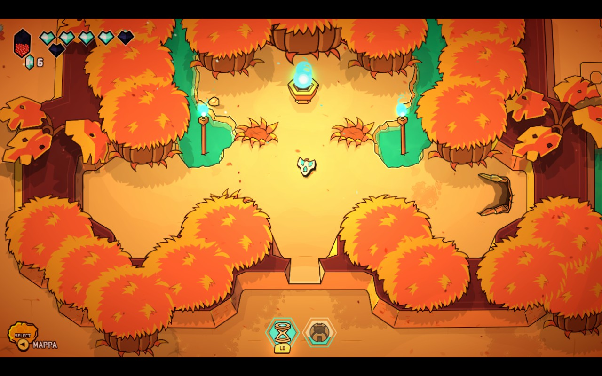
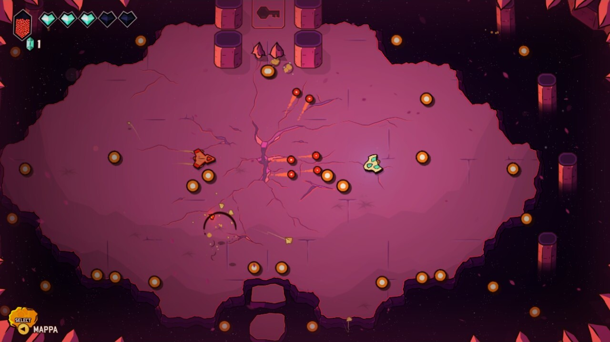
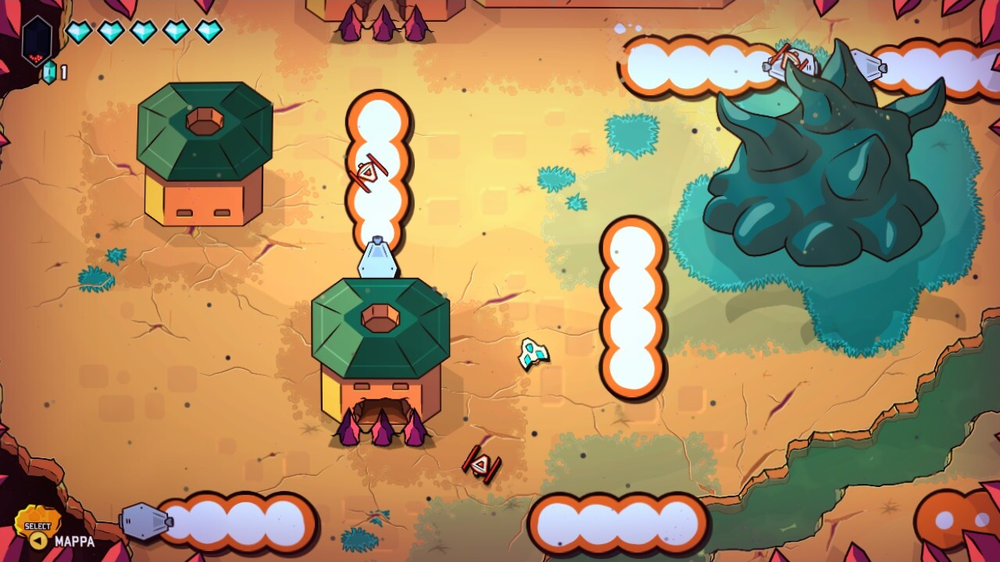
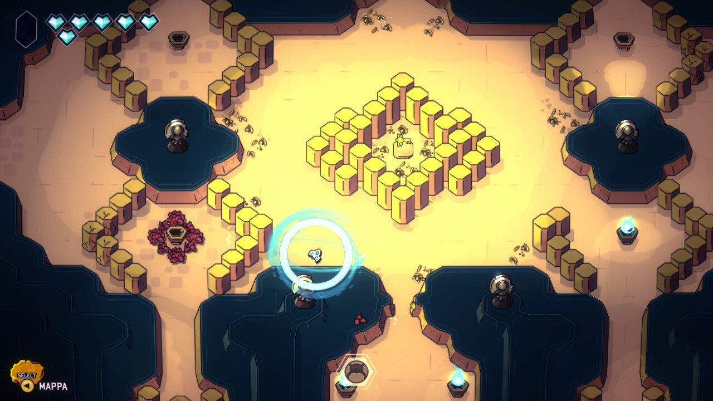
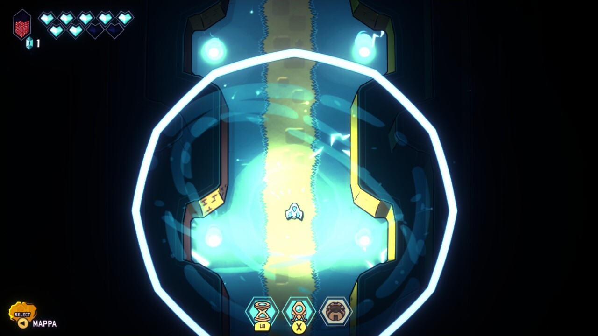
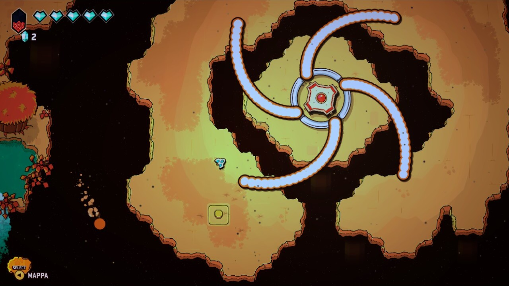

[Minishoot' Adventure](https://store.steampowered.com/app/1634860/Minishoot_Adventures/) è un **gioco d'avventura** 2d molto classico: c'è una mappa ampia, elementi che bloccano la nostra strana, interruttori da premere e nemici da sconfiggere. Il _twist_ del gioco è che il nostro eroe è un'**astronave**: no, il nostro protagonista non è a bordo di questa, è proprio essa stessa, così come anche gli altri NPC con il quale ci troveremo a che fare.

La cosa non solo funziona benissimo, ma è anche una scelta intelligente dal punto di vista dello sviluppo. Il gioco è sviluppato con **asset vettoriali**, e se avete presente il mondo dello sviluppo sapete che per animare questo tipo di _sprites_ la soluzione tradizionale è [Spine](https://it.esotericsoftware.com/), che però da' una sorta di _effetto marionetta_ ai personaggi: le astronavi e i nemici qui invece non hanno bisogno di essere animati, perchè la maggior parte degli effetti sono fatti via codice, come lo scaling degli asset e la loro deformazione. Il risultato è davvero piacevole, con la presenza di un mondo colorato e consistente davvero carino, almeno dal mio punto di vista.

L'altro motivo per cui la scelta di un eroe _non umano_ funziona è che il sistema di combattimento e di movimento sono molto piacevoli e facili da pilotare fin da subito: non ci sono combo complesse da imparare per attaccare i nemici o parate / _parry_ da effettuare, qui si mira, si spara e si schiva, niente più.

Ok, rileggendo l'ultimo paragrafo potrebbe sembrare che il gioco sia noioso, ma non è così. I nemici sono vari e le situazioni proposte anche: la semplificazione aiuta invece a riprendere il gioco in fretta se dobbiamo lasciarlo in pausa per molto tempo... cosa che purtroppo mi accade sempre più spesso di dover fare.

**Minishoot' Adventure** stupisce poi perchè sembra aver imparato **la lezione di Zelda** molto più di altri: il vero focus del gioco è l'esplorazione: la mappa è molto ben interconnessa, e spostarsi da un estremo all'altro _con il motore di un'astronave_ porta via pochissimo tempo, ma soprattutto è piena di grotte, di interruttori nascosti, di oggetti che sono ad un passo da noi ma sono irraggiungibili senza aver risolto un puzzle ambientale... Ogni volta che si prende in mano il gioco e si prova a fare un giro nella mappa, state pur certi che scoprirete qualcosa di nuovo.

Ho apprezzato poi un oggetto che si può acquistare relativamente in breve tempo nel gioco, e permette di sapere se una grotta nella quale siamo entrati è stata completata oppure no. Rovina il desiderio di scoperta? Forse un po', ma è un oggetto opzionale e aiuta, quelli come me, che possono perdersi delle informazioni da una partita con l'altra.

Il gioco offre poi un sistema di _livelli_ dei componenti dell'astronave come se fosse un RPG semplificato, ma lo fa in maniera che venga incontro al giocatore: ogni volta che si combatte si ottiene esperienza, indipendentemente che moriremo nello scontro oppure no. Quindi, come intuirete, affrontare dei combattimenti più volte renderà gli stessi sempre _un po' più semplici_. Ma anche qui, i power up sono opzionali, quindi vi troverete voi a modulare un po' la difficoltà.

Tutte queste **semplificazioni** mi hanno fatto aprire gli occhi su quanto è piacevole trovarsi davanti un gioco che ha un **occhio di riguardo verso al giocatore** e che sia così **rispettoso** del suo **tempo**.

Il gioco è lungo il giusto per essere completato senza annoiare; in poco meno di **9 ore** sono arrivato al termine dell'avventura **completando la mappa al 100%**. Resterebbe il post game, che ho solo sbirciato ma che al momento non ho intenzione di intraprendere, che da quel che ho visto può regalare tranquillamente altre 2 ore indicative.

Questo gioco rischia davvero di rientrare tra i miei preferiti giocati quest'anno.
