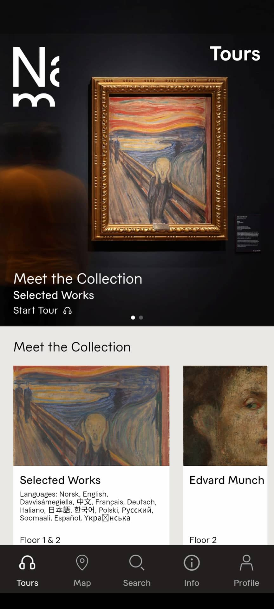

La scorsa settimana io e il mio collega Simone siamo andati a trovare un nostro ex-collega (Giovanni) ad Oslo, città nella quale si è trasferito per fare un'esperienza lavorativa all'estero. Avevo qualche timore prima di partire, perchè sono persone che frequento poco fuori dal lavoro, e visto che ormai sono anni che vado in ferie solo con la mia compagna, pensavo di aver perso un po' l'abiudine a stare con gli altri per così tanto tempo: devo dire che invece è andata bene, ci sono dei compromessi da tenere ma riesco ancora ad adattarmi facilmente.

**Domenica**, al nostro arrivo, Giò ci ha portato a fare un giro per il centro città: siamo partiti dalla [Biblioteca Deichman](https://www.visitoslo.com/it/articoli/biblioteca-deichman/), poi siamo saliti all'[Opera House](https://www.visitnorway.it/dove-andare/norvegia-orientale/oslo/opera-di-oslo/) e infine abbiamo fatto quattro passi dentro le mura della [Fortezza di Akershus](https://www.visitoslo.com/it/prodotto/?tlp=2978773&name=Fortezza-di-Akershus).

La **biblioteca** è un luogo incredibile: non immaginatela come il classico completamente silenzioso e frequentato solo da quei pochi che entrano per ritirare un libro, ma come un luogo nel quale poter davvero trascorrere del tempo al suo interno, anche in compagia. La struttura è composta da 5 piani, ognuno a tema, e nel quale non solo poter noleggiare o leggere libri, ma anche a dedicarsi ad imparare altre discipline: abbiamo trovato macchine da cucito, stampanti 3d, tastiere elettroniche, tutte a disposizione da pate degli utenti per apprendere una nuova _skill_.
Sono presenti ovviamente anche tanti luoghi dove studiare e lavorare, sia comuni sia affittabili (un po' come gli spazi di co-working, se avete presente) per stare effettivamente al silenzio all'interno.
Ci sono anche delle sale adibite a "Cinema" privati, nel quale poter riprodurre film presi a noleggio dalla stessa biblioteca.

Sono rimasto davvero affascinato, e Giò stesso ci ha detto di andare spesso a lavorare lì nel pomeriggio (è uno sviluppatore e può lavorare praticamente sempre da remoto) per poi fermarsi a suonare la tastiera quando gli va.

Altra cosa curiosa della biblitoca è la sezione dedicata alla [Biblioteca del futuro](https://it.wikipedia.org/wiki/Biblioteca_del_futuro): 100 autori selezionati per il loro contributo alla letteratura stanno realizzando un libro che viene "sigillato" dentro a questa sezione, e solo tra 100 anni verrà estratto e stampato, tra l'altro con alberi già "segnati" all'interno di un bosco specifico.

Niente da segnalare invece riguardo all'**Opera House**, struttura dal design moderno e bella da passeggiarci sopra, se non che, se sei italiano, ti verrà ricordato _ad nauseam_ che è tutta fatta in marmo di Carrara :D.

Alla sera Giò ci ha portato a mangiare all'[Oslo Street Food](https://www.visitoslo.com/it/prodotto/?tlp=4751143&name=Oslo-Street-Food), dei locali con all'interno più stand appartenenti a diverse cucine del mondo: io ho preso un ramen coreano davvero niente male, piccante il giusto... peccato solo averlo ordinato sbadatamente vegetariano -.-".

**Lunedì** invece ho fatto un'esperienza nuova indipendentemente dallo stato in cui mi trovavo: abbiamo scalato in palestra. Bellissima esperienza, era da tanto che volevo provare a farlo... E pare non sia nemmeno così male, per lo meno a salire: ci è voluto un po' prima che mi convincessi a lanciarmi dall'alto di una parete xD

Nel pomeriggio invece siamo stati al [Parco di Vigeland](https://it.wikipedia.org/wiki/Parco_di_Vigeland), un parco nel quale tutte le numerosissime e inquietanti strutture sono state scolpite dall'omonimo autore. Dico inquetanti perchè tutte ritraggono persone avvinghiate ad altre, alcune in abbracci, altre in scene di lotta, altre interpretabili in più modi. Sarebbe stato bello avere una guida per capirne qualcosa in più.

In compenso questa nota amara è stata cancellata da un softies con dei brownies fatti in casa, comprato dentro al parco stesso. E dal sorriso che il Maestro Scapin ci ha strappato quando ci siamo seduti su una panchina qualsiasi.

Abbiammo poi scelto di prendere il traghetto e dirigersi nella prima isola di fronte ad Oslo, l'[Isola di Hovedøya](https://www.visitoslo.com/it/prodotto/?tlp=2982863&name=Isola-di-Hovedoya), dove sono presenti le rovine di un vecchio monastero.

Alla sera un secondo street food, questa volta dovuto più che altro a motivi di orario (i Norvegesi cenano alle 17.30, a orari "italiani" è difficile trovare qualcosa di aperto). Qui ho mangiato un "normale" tacos spagnolo, davvero buono e con tantissimo ripieno.

**Martedì** la giornata è iniziata con una bella pioggia, così ne abbiamo approfittato per _nerdare_ un po' la mattina e dedicarci a dei boardgame (Cartae, Nome in Codice Duel, Hanabi). Il pomeriggio invece siamo stati al lago [Sognsvann](https://www.visitnorway.it/listings/sognsvann-lake/44806/), bellissimo per fare una passeggiata e comodo da raggiungere direttamente in metro: tra l'altro ho potuto constatare quanto sia importante lo sport per i Norvegesi, qui corrono tutti, grandi, anziani e bambini!

Dopo la passeggiata siamo andati a fare una cena di pesce, sia perchè abbiamo pensato che mangiare il salmone in Norvegia sarebbe stato un must, sia per sdebitarci dell'ospitalità con Giovanni. Il primo locale in cui siamo stati non ci ha accettato, in quanto la cucina era già chiusa (erano le 20... l'ho già detto che cenano presissimo? xD), mentre il secondo, tale [Lofoten Fiskerestaurant](https://www.lofoten-fiskerestaurant.no/) non solo ci ha accettato, ma con un pescato del giorno con crema al basilico e un salmerino con purea di cavolfiore ci ha fatto davvero passare una bella serata!

**Mercoledì** per me e Simone è stata la prima giornata senza essere accompagnati da Giò, e ci siamo lanciati all'avventura prendendo l'[Oslo Pass](https://www.visitoslo.com/it/attivita-e-attrazioni/oslo-pass/), la carta turistica che da' accesso a mezzi e a svariati punti di interesse. L'abbiamo sfruttata per andare al [National Museum](https://www.visitoslo.com/it/attivita-e-attrazioni/attrazioni-turistiche/?tlp=6258223&name=Museo-Nazionale), museo dove è esposto tra gli altri il famoso **Urlo di Munch**. Il resto del museo è interessante ma davvero grande, e ad una certa abbiamo accusato la stanchezza. Menzione d'onore però per l'[app del museo](https://www.nasjonalmuseet.no/en/visit/locations/the-national-museum/the-national-museum-visitor-guide/), completissima, con audioguide e percorsi personalizzati in base al tempo che si ha a disposione, e completamente in italiano.

Il pranzo lo abbiamo poi fatto da Backstube, una catena _tipica_ norvegese nel quale abbiamo mangiato dei semplici panini farciti, un dolcetto a base di cannella e mela e... il mio primo caffè americano! Che, nonostante tutti me ne parlassero male, non ho disprezzato. Ma sulla cucina Norvegese in generale tornerò a fine post.

Nel pomeriggio abbiamo deciso di stare all'aria aperta facendo una passeggiata sull'[Isola di Lindøya](https://www.visitnorway.it/listings/isola-di-lind%C3%B8ya/44815/), che a quanto pare è anche un'oasi naturale, tra l'altro habitat naturale dei miei acerrimi nemici gabbiani testa nera.

Mentre la raggiungevamo abbiamo fatto la conoscenza (e suonato) la [campana stonata](https://www.akdolven.com/untuned-bell-oslo), una campana rimossa dalla torre campanaria di Oslo nel 1949 perchè non più accordata insieme alle altre e che un artista ha deciso di posizionare sul lungomare di Oslo, permettendo a chiunque di suonarla premendo un pedale posto ai suoi piedi.

Una volta arrivato Giò dopo il lavoro, abbiamo fatto una "pazzia": [la sauna con il bagno nel porto di Oslo](https://www.visitoslo.com/it/articoli/saune-urbane-sul-fiordo-di-oslo/). Bellissima esperienza! E... si, l'acqua è fredda come uno si può immaginare :D Anche cercando di nuotare i piedi diventano ghiacciati in un'attimo... ma il tuffo rinfrescante dopo la sauna ci vuole proprio!

Alla sera, mentre Giò ci mostrava i prodotti italiani che si era portano in Norvegia, ha notato di avere del pecorino romano che aveva perso il sottovuoto, così Simone ha proposto di sfruttarlo subito davendo una carbonara. L'abbiamo quindi cucinata tutti insieme e l'abbiamo accompagnata con un buon Valpolicella Ripasso... Un tocco di italianità in questa fresca norvegia :D

**Giovedì** è stata un'altra giornata che abbiamo trascorso insieme solo io e Simone.
Siamo partiti facendo il pieno di avventure navali con la visita al [Museo della nave polare Fram](https://www.visitoslo.com/it/prodotto/?tlp=2982663&name=Fram-Museo) e quello della [pazza avventura con la zattera Kon-Tiki](https://www.visitoslo.com/it/prodotto/?tlp=2982703&name=Museo-Kon-Tiki)).
Il primo è davvero qualcosa di epico, con la presenza di due navi con le quali sono state fatte le prime spedizioni artiche nella loro interezza e con una marea di reperti e reportage.

Il secondo è la descrizione di un'impresa assurda: un tale Thor Heyerdahl, appena dopo la seconda guerra mondiale, con altre 5 persone senza esperienza di viaggio navale decidono di partire dal Perù per raggiungere in zattera la Polinesia, per dimostrare (in opposizione alla comunità scientifica internazionale) che la colonizzazione di quelle isole poteva essere avvenuta partendo proprio dall'America.

A pranzo ci siamo spostati al [Museo Folkloristico Norvegese](https://www.visitoslo.com/it/prodotto/?tlp=2978173&name=Museo-Folkloristico-Norvegese) e abbiamo pranzato con un _tipico_ panino pieno di salsa all'uovo e cipolle e la davvero tipica Suksessterte ("torta del successo").

Questo museo a cielo aperto è davvero particolare: dal 1850 in poi sono state portati qui svariati edifici (soprattutto case, ma il vero simbolo / gioiello dell'esposizione è una tipica chiesa in legno) da tutta la Norvegia, per fare in modo di preservare la loro cultura anche sotto l'aspetto degli edifici. Particolare, un po' "pesante" senza guida, ma è troppo unico per non essere visto.

Una volta che Giò ci ha raggiunto abbiamo imbastito una sorta di picnic sull'[Isola Langøyene](https://www.visitnorway.it/listings/isola-di-lang%C3%B8yene/44809/), frequentata soprattutto come meta turistica estiva (ha una spiaggia piuttosto grande).

Rincasando poi abbiamo fatto la nostra ultima "prima" esperienza: il tragitto verso casa con il monopattino!

**Venerdì** siamo partiti, e ci è voluto poco che ci mancasse la Norvegia, soprattutto lato clima: in tutte queste giornate siamo partiti in maglietta, messo il maglioncino nel pomeriggio e, a volte, indossato anche il giubbotto leggero alla sera... Ora sto scrivendo da una candissima collina del Monferrato e non c'è proprio paragone!

Grazie ancora Giò per averci ospitati, è stata una bellissima avventura <3.

## Note:

### Il cibo norvegese

il **cibo** in Norvegia mi era stato descritto come pessimo, insapore, mangiato solo per necessità. Io devo dire di non aver mangiato male in generale, ma credo di aver capito il motivo del primo giudizio: in Norvegia si pranza alle 11.30 e si cena alle 17.30, quindi mangiando noi "fuori orario" quello che si trova nei locali sono principalmente panini. Poi c'è da dire che effettivamente il pranzo per loro è spesso un panino farcito, ma ad esempio la sera a cena ho trovato una discreta varietà per lo meno di pesce. C'è da dire anche che Oslo è una città davvero multietnica sia negli abitanti sia nella cucina, e i ristoranti con cucina estera sono in ogni dove.
Sarebbe carino approfondire su quali sono effettivamente i loro cibi tipici e poterli assaggiare... Io sono comunque tornato in italia con il Brunost, il "formaggio marrone" che ha accompagnato le mie colazioni norvegesi (anche se di fatto è un burro più dolce).

Sempre riguardo alla cucina c'è il discorso caffè: dall'italia [avevo letto benissimo della loro cultura del caffè](https://www.visitoslo.com/it/ristoranti-vita-notturna/caffe/), ma viaggiando con persone italiane "comuni" si sono sempre aspettate di trovare un espresso buono, rimanendo poi deluse. Da quando mi sono appassionato di [Specialty Coffee](https://en.wikipedia.org/wiki/Specialty_coffee) ho capito davvero che ogni paese ha un suo modo di farlo (tendenzialmente filtrato in qualche modo), e approcciandosi con una "mente aperta" è facile apprezzarlo.. l'importante è che non ci si deve aspettare di bere la stessa cosa. Tra l'altro il caffè in italia non è proprio il massimo ed è principalmente bruciato quello che ci viene dato in caffetteria, quindi fa sempre specie sentire qualche italiano che si lamenta di quello estero.

### Le app

L'app [Ruter](https://play.google.com/store/apps/details?id=no.ruter.reise&hl=it) per i mezzi, l'app [Flytoget](https://flytoget.no/en/travel-information/tickets-and-fares/flytoget-app/) per acquistare il biglietto del treno tra l'Aeroporto e Oslo centrale, e la già citata [app per il museo nazionale](https://www.nasjonalmuseet.no/en/visit/locations/the-national-museum/the-national-museum-visitor-guide/) sono tutte bellissime: esteticamente rispettano i canoni di Google (ho un telefono Android, quindi ho provato solo quelle) e sono facili da usare, chiare e con tutte le funzionalità che ci si possa aspettare. Ah, e soprattutto niente malefico effetto glass che sembra andare tanto di moda :D.
