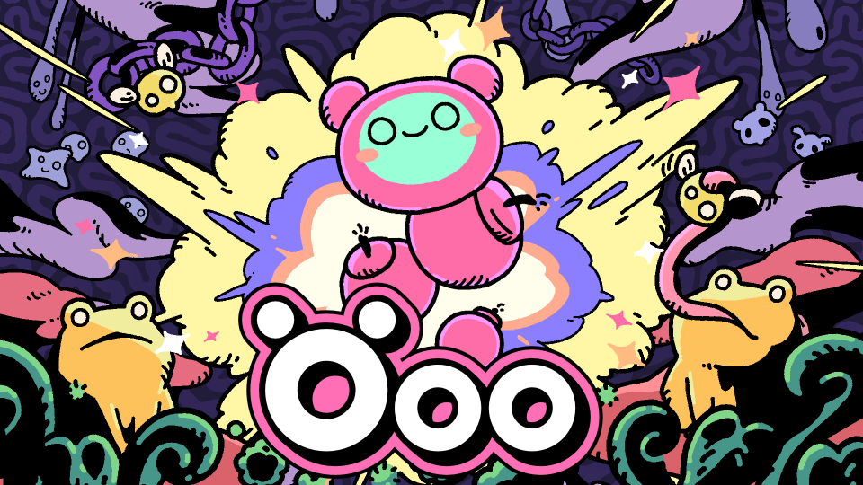
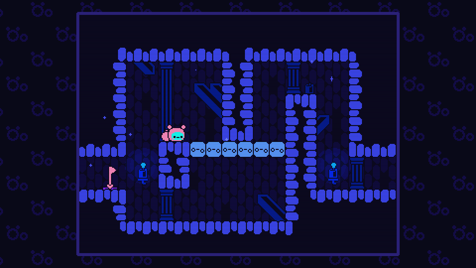
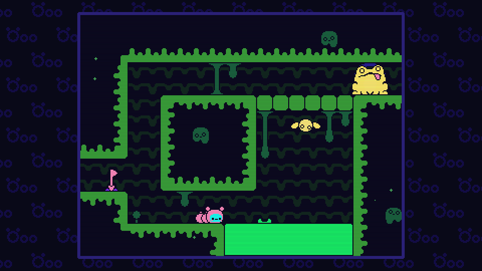

Öoo è il nuovo gioco di [Nama Takahashi](https://namatakahashi.notion.site/en), autore che ho conosciuto grazie al bellissimo ElecHead.

Dalla [demo](https://namatakahashi.itch.io/oo) e dai vari post su [Bluesky](https://bsky.app/profile/namataka.bsky.social) il gioco sembrava essere un "normale" puzzle-platform con la sua meccanica innovativa, mentre, una volta portato a termine, posso dire con certezza che si tratta di un MetroidBrania.

Ma partiamo dall'ininizio: in Öoo impersonifichiamo un bruco (anche il titolo del gioco stesso lo "impersonifica", tra l'altro) che non può saltare, ma che può perdere una porzione della coda che si tramuta in una bomba, e la sua esplosione ci permetterà di muoversi e spostarci nei vari livelli di gioco. Se inizialmente la bomba sembra appunto solo un esplosivo per far saltare in aria pareti crepate o muri nascosti, capiremo ben presto che tutto il fulcro del gioco è quello di capire come utilizzarle per spostarci tra i vari enigmi ambientali che ci vengono proposti.

La mappa di gioco è studiata davvero in maniera interessante: spesso ci troviamo di fronte a dei bivi, uno bloccato da un enigma che ci sembra irrisolvibile e una strada "classica": bene, quest'ultima in realtà funge da espediente per portarci ad imparare un nuovo concetto usando i mezzi che abbiamo sempre avuto. Non ci saranno nuovi power up all'interno del gioco, se non far passare la "coda" da 0 a 2 pezzi, tutto quello che ci porterò a progredire è la conoscenza di meccaniche nascoste ma che abbiamo sempre avuto a nostra disposizione. Per questo non posso non definirlo MetroidBrania.
Gli enigmi in generale non li ho trovati mai nè troppo facili nè troppo difficili... Come direbbe Mark Brown, il gioco è pieno di *Ah-ha moment*, quelle situazioni in cui capisci come affrontare l'ostacolo e ti fanno sentire intelligente. Sembra una cosa banale ma, avendo in prima persona provato a sviluppare questo genere di giochi, posso dire che è davvero difficile riuscire a farlo, e soprattutto a farlo così bene come lo fa Nama.

Ho completato il gioco in 2 ore e 15 minuti, e l'ho giocato in 3 momenti diversi: l'ho davvero adorato, il gioco è davvero rispettoso del tempo del giocatore senza allungamenti di brodo e, nei momenti in cui non giocavo, mi è capitato di tornare a pensare all'enigma con cui avevo lasciato il gioco prima di spegnerlo.

Tra l'altro, nonostante abbia completato anche gli achievement di Steam, il gioco ha un post-game segreto di cui mi ha messo a conoscenza Patience di GMI: non voglio spoilerare nulla qui, dico solo che ha a che fare con delle statue... Probabilmente riaprirà il gioco perchè ora sono molto curioso :D ma lo farò con davvero tanto piacere. 