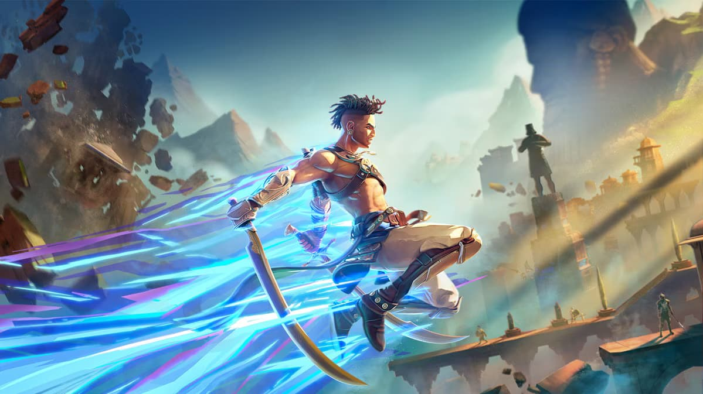
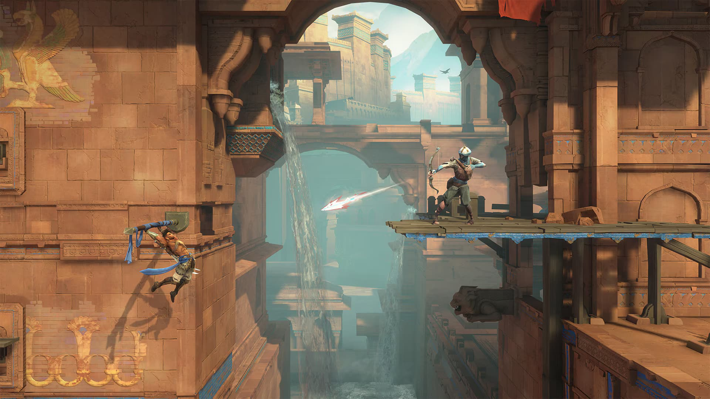
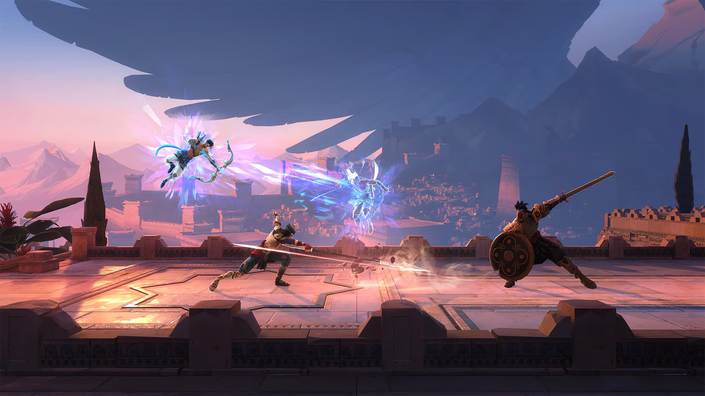

Partiamo dalla fine: [Prince of Persia: The Lost Crown](https://www.ubisoft.com/it-it/game/prince-of-persia/the-lost-crown) mi è **piaciuto moltissimo**, forse è addirittura il mio MetroidVania preferito tra quelli giocati fino ad ora. Si, probabilmente è solo il parere a caldo di una persona entusiasta che lo ha appena terminato, ma difficilmente ricordo un gioco "lungo" che mi facesse venire voglia di riprenderlo anche se lo avevo appena terminato.

Ma andiamo con ordine: *The Lost Crown* è un MetroidVania dalla struttura decisamente classica, fatta di mappe e segreti da scoprire, nemici sempre più grossi da sconfiggere e ostacoli da superare grazie a power up da sbloccare.

E' il primo gioco della serie in cui non impersoniamo il *Principe* del titolo: guideremo infatti Sargon, un guerriero che fa parte del gruppo degli Immortali, nella missione di salvataggio del Principe stesso.

Il gioco, ad un primo sguardo, non sembra particolarmente originale e ho avuto più di un deja-vu giocandoci.
Ho trovato infatti:

- amuleti che variano i poteri di attacco o di movimento, come gli charm di [Hollow Knight](https://www.hollowknight.com/)!
- pareti e superficie presenti in un'altra dimensione che si palesano alla pressione di un tasto, come in [Guacamelee](https://www.drinkboxstudios.com/games/guacamelee-super-turbo-championship-edition/)!
- movimento del personaggio molto fluido e responsivo, come in [Ori](https://www.orithegame.com/)!

Sto dicendo che è PoP è un prodotto derivativo? In parte si, ma lo fa con un deciso carattere e aggiungendoci pure del suo: ad esempio la possibilità di inserire in mappa degli screenshot di quello che si vede in quel punto è una genialata che spero di rivedere in MetroidVania futuri.

*The Lost Crown* poi è davvero "giocoso". Mi spiego meglio.
La storia c'è, anche con un bel colpo di scena, ma di certo è messa in secondo piano da un gameplay sontuoso. Il già citato **movimento del personaggio che fa da protagonista ed è una delizia da comandare** e le sezioni platform (presenti e alcune decisamente impegnative) sono davvero belle da affrontare.
Vanno di pari passo con un sistema di combattimento inaspettatamente profondo per il genere di gioco: parate, "perry", combo in aria e a terra, poteri del tempo da usare in combinazione al resto, attacchi speciali in stile "anime" (addirittura un filo esagerati, ma ci si abitua in fretta a questa _tamarraggine_ xD).
Un po' come in Celeste, anche qui sento già la nostalgia delle sensazioni "pad alla mano" rispetto al resto.

Già, il resto: la grafica ricorda molto i giochi mobile, sia per la scelta di usare un 2.5d sia per lo stile utilizzato che, a parte qualche bella eccezione (la battaglia navale all'interno di un temporale bloccato nel tempo **è splendida**, ad esempio), non è memorabile.

Le boss fight sono cattive, ma affrontabili dopo qualche tentativo. E la mappa è piena di cose da trovare, come il buon Metroid insegna.

L'ho terminato da quasi due settimane e devo dirlo, mi manca già. Fortuna che c'è un DLC che devo ancora provare, ma odio sapere che il team di sviluppo sia già stato sciolto perchè le vendite del gioco non sono state granchè.

**Fast Forward**: ... Ops, non avevo ancora pubblicato l'articolo, e nel mentre ho acquistato e completato anche il **DLC Mask of Darkness**: il contenuto è un'area a se' stante dalla mappa, con un'atmosfera più dark, sempre con mappa "metroidvaniosa" ma senza la possibilità di acquisire nuovi power up. Anzi, in quest'area subiremo un deciso downgrade, probabilmente per permettere a tutti gli utenti di giocare la stessa esperienza.

E' un contenuto più focalizzato sul platforming che sul combattimento, anche se in entrambi i casi il livello di sfida è più alto rispetto al gioco base. Gli ostacoli da platform e i nemici sono comunque completamente originali e non "riciclati" dal gioco base, e questo fa davvero incrementare il valore dell'espansione.
In generale però il *mondo del DLC* è qualitativamente meno bello delle singole aree presente nel gioco originale, ma è stato comunque divertente e ho avuto difficoltà a non giocarlo ininterrottamente nei giorni scorsi. Non è imperdibile, ma se vi è piaciuto il gioco base, anche questo DLC **vi piacerà**.
