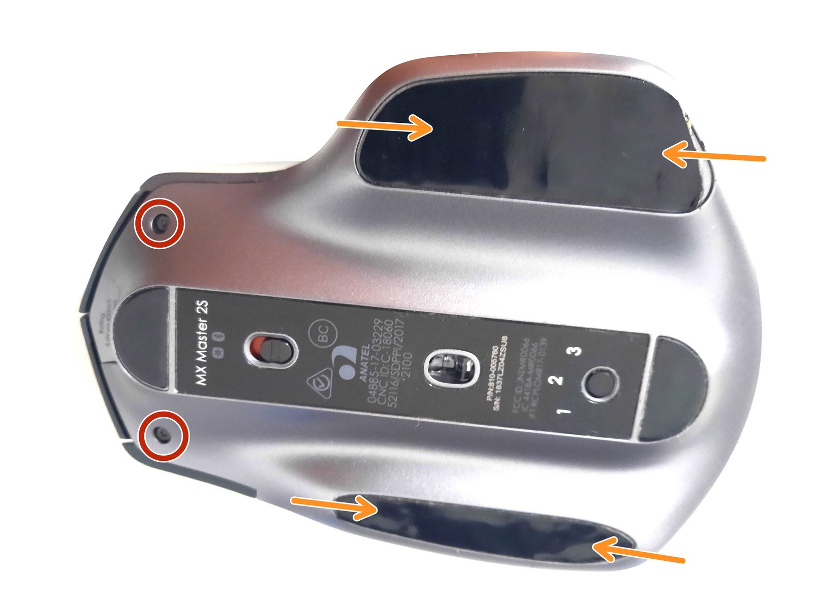
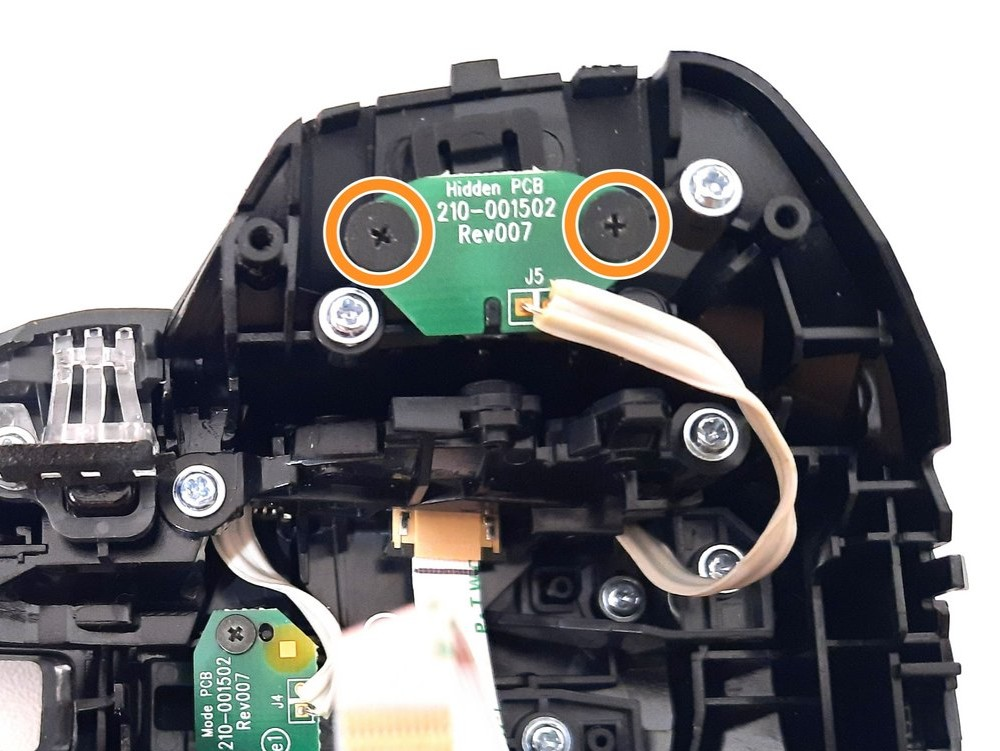

Vi è mai capitato che il vostro mouse Logitech Mx Master 2s non recepisse più nessun movimento, ma è ancora possibile fare click?

Se si non preoccupatevi, il mouse non è da buttare, basta un cacciavite e un po' di pazienza per rimetterlo *quasi* a nuovo. Non è nemmeno un problema così raro: anche ai miei colleghi di ufficio con lo stesso mouse è capitato, quindi è probabilmente **un difetto intrinseco nella costruzione del prodotto**.

Il problema è dovuto al fatto che il **thumb button** (il bottone invisibile posizionato esattamente sotto a dove poggia il pollice) rimane incastrato: purtroppo non è disattivabile da software, e per far funzionare il mouse va **sbloccato** a mano.

Ho scattato delle foto quando l'ho aperto oggi giorno fa (la terza volta in quasi sette anni di servizio), ma ho visto che [la guida di iFixit](https://it.ifixit.com/Smontaggio/Smontaggio+del+Mouse+Logitech+MX+Master+2s/140395) ha immagini chiarissime per cui userò quelle.

Per la cronaca nel caso non aveste nessun cacciavite in casa, io ho usato quello di [HOTO](https://www.amazon.it/HOTO-Cacciaviti-Precisione-Resistenti-Elettronica/dp/B0B8MFHTBV/ref=sr_1_4_sspa?hvexpln=0&hvocijid=17035423351288554328--&hvqmt=b&mcid=ed9600636400391d957e8a7b03e24b5b&aref=N0O75fK9qv).

Qui vanno svitate le viti in fondo al mouse: le due visibili in alto sono T5 (io ho usato un T5H ed è andato comunque), le altre quattro sono sotto i pad e sono delle normali a stella. Attenzione ai pad: sono ben incollati e, se riuscite a non danneggiarli, potete poi riattaccarli alla fine del processo. Io qui ho avuto dei dubbi perchè, probabilmente a causa dei tanti anni di vita del mio mouse, il pad si è diviso in due "strati" sovrapposti, e vanno rimosso entrambi.

Una volta rimosse tutte le 6 viti, aprite **gentilmente** la scocca, tenendo presente che c'è un cavo all'interno del mouse che tiene collegate le due metà: non c'è bisogno di staccare anche quello, una volta aperto il mouse tenete le due parti il più separato possibile e non avrete problemi.

Il nostro obiettivo è allentare le due viti nere posizionate sotto al thumb button. Una volta compiuta questa operazione fatte subito una prova e premete il pulsante: quando farà **click** avete raggiunto il vostro obiettivo.

Richiudete tutto, ma fate attenzioni alle viti della parte sinistra (quella sotto al thumb button): io le ho lasciate un po' allentate, perchè stringendole completamente ho sbadatamente **bloccato nuovamente il bottone stesso**.

Ah, da ora in avanti il pulsante sarà utilizzabile facendo molta attenzione, ma **in generale eviterei di usarlo**: come anticipavo tra le righe, ho già effettuato questa operazione tre volte perché mi sono fidato un po' troppo della mia riparazione :D
