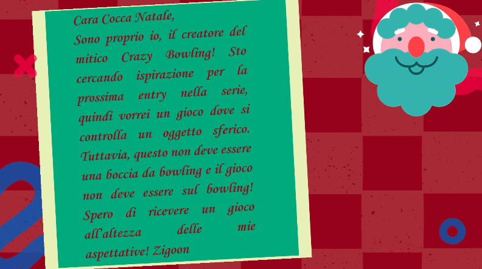
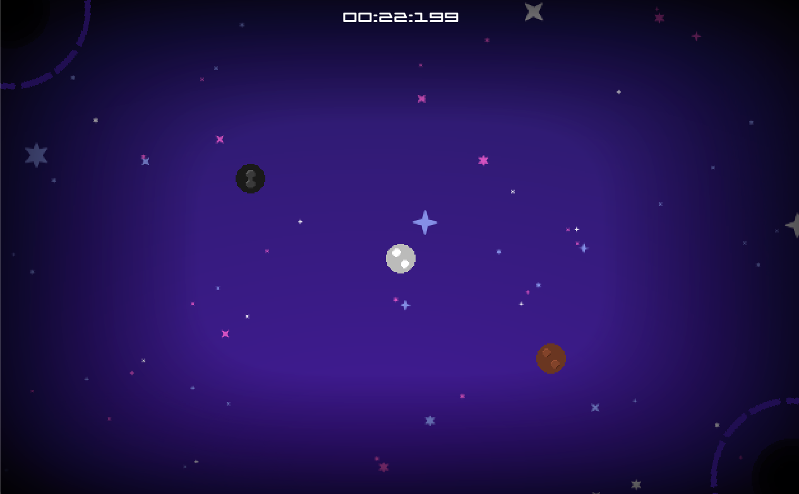
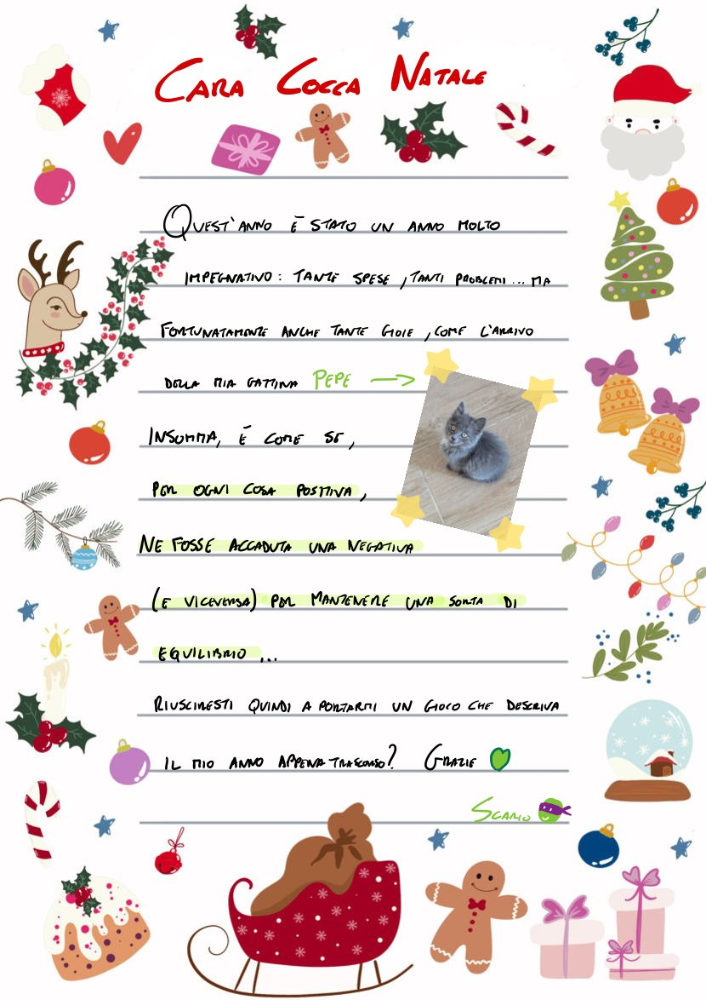
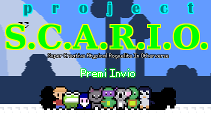
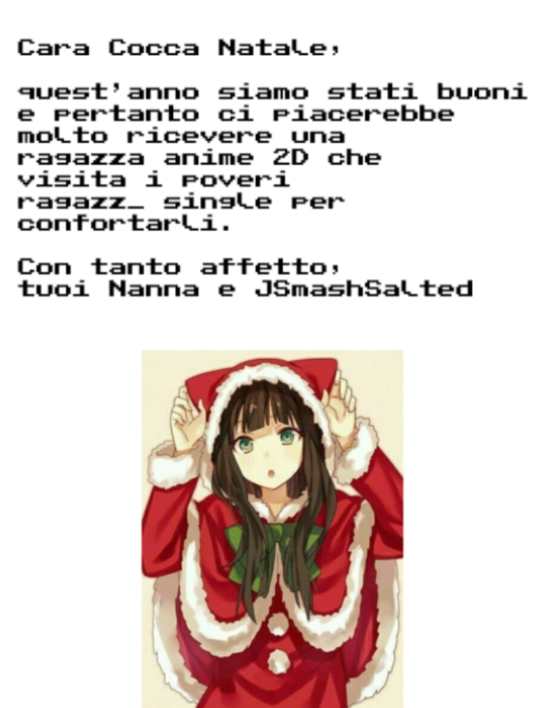
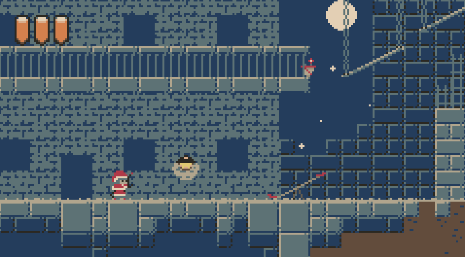

La _Secret Santa Jam_ è una jam che ho proposto e che facciamo ormai da tre anni su [GameMaker Italia](https://www.gamemakeritalia.it): sono davvero contento che è stata apprezzata e portata avanti dalla community perchè è la mia preferita tra quelle che organizziamo là dentro.

In cosa consiste? Ogni partecipante deve **scrivere una letterina** in cui specificherà cosa gli piacerebbe ricevere, evitando di specificare generi o stili grafici così da rendere la jam il più possibile inclusiva. Per ogni partecipante verrà estratto un altro partecipante al quale **confezionare un gioco secondo le indicazioni della letterina**. Il gioco verrà poi consegnato e giocato direttamente in live.

Perchè mi piace? Perchè, a differenza di altre jam, spinge davvero a sperimentare: mi sono trovato più volte a _piegare_ il tema della jam per far sì di riuscire a sviluppare un platform :D Invece qui le letterine sono talmente **pazze** che è impossibile non inventare qualcosa di nuovo.

Quest'anno ho pescato la letterina di [Zigoon](https://zigoon.itch.io), un utente di GMI al quale piace sviluppare esperienze immediate e arcade.

Il gioco che ho confezionato per lui è stato [Crazy Space Pool](https://mega.nz/file/wU5AAA6b#v66BPi4cOGHphOAgpKw2QF9xJ4Y4mgcOVmOIIyzdF90), un gioco nel quale **alcune** regole del biliardo vengono usate per spazzare via degli asteroidi.

Non sono completamente soddisfatto del risultato: ho usato per la prima volta la fisica di GameMaker e ho dovuto impazzire un po' per riuscire a capire come farla funzionare al meglio, e questo ha portato via tempo rendendo il gioco più semplice di quello che avrei voluto. Sembra comunque sia stato apprezzato, fortunatamente! [Qui trovate il punto preciso della live nel quale viene giocato](https://youtu.be/zdvzZ2pV9MU?si=HlwbImegllS7m2f0&t=4609).

La mia letterina è stata poi casualmente pescata da Zigoon stesso (è la prima volta in cui capita di pescarsi a vicenda):

Come detto dallo stesso autore in live, lui per me ha fatto davvero un lavorone:

[Project S.C.A.R.I.O.](https://zigoon.itch.io/project-scario) è un roguelike dove i protagonisti, le ambientazioni, i nemici e le musiche sono tratte dai giochi che ho sviluppato fino ad ora: praticamente un enorme fan game! È venuto davvero bene, mi lusinga e si gioca davvero bene... **non avrei potuto chiedere regalo migliore**! [Qui trovate il punto preciso della live nel quale lo gioco e rimango estasiato per la prima volta :D](https://www.youtube.com/watch?v=zdvzZ2pV9MU&t=7807s).

Ma cosa sarebbe la _Secret Santa Jam_ senza una sana dose di magia, colpi di scena e sorprese?

Un utente (jak di denari) aveva consegnato una letterina e glie ne era stata affidata una, cioè quella di [Nannasaurus Rex](https://noemifrulio.itch.io) e del suo amico [JSmash Salted](https://jsmash-salted.itch.io). Purtroppo il suo pc è stato colpito da svariati problemi (nemmeno Carcallo, _colui che sa tutto_, è riuscito ad aiutarlo). C'era quindi il problema che il gioco della letterina che gli era stata affidata non sarebbe stato consegnato, lasciando due utenti senza regalo proprio alla jam di Natale!

Così ho prontamente contattato Cocca Natale (l'utente che si è occupata dello smistamento pacchetti e letterine) per propormi di sviluppare il gioco mancante oltre al mio, ma, sorpresa sorpresa, anche [MyMadnessWorks](https://mymadnessworks.itch.io) (Mad, da ora in avanti) si era proposto di fare altrettanto! Quindi, carichissimi, riceviamo la letterina in questione:

Anche dati i nostri caratteri, il desiderio sembrava davvero arduo da realizzare. Fortunatamente Mad è riuscito a salvare la situazione trovando un modo _elegante_ di risolvere la questione e abbiamo cominciato a realizzarlo: io mi sono occupato dello sviluppo, Mad di grafiche, suoni, musica e alcune parti di sviluppo... insomma, è stato grazie a lui se siamo riusciti a portarlo a termine.
Il gioco risultante, **Ah! My life as a normal girl changed when Santa Claus gave me work so I had to save Christmas all alone** è davvero carino e curato, anche se ovviamente molto breve, ma siamo stati davvero molto contenti del risultato, soprattutto considerando il tempo a disposizione.

Il gioco è disponibile gratuitamente sul Patreon di Mad, ma qui potete comunque trovare il momento preciso in cui il gioco è stato "scartato e provato".

Che dire, è stata dura dato il periodo pieno di eventi e la "doppia jam", ma non vedo già l'ora sia il prossimo Natale :D.
