Come scrivevo giusto l'[anno scorso](./secret-santa-jam-2024.html), la **Secret Santa Jam** è una jam organizzata sul Discord di GMI nella quale

> [...] Ogni partecipante deve **scrivere una letterina** in cui specificherà cosa gli piacerebbe ricevere, evitando di specificare generi o stili grafici così da rendere la jam il più possibile inclusiva. Per ogni partecipante verrà estratto un altro partecipante al quale **confezionare un gioco secondo le indicazioni della letterina**. Il gioco verrà poi consegnato e giocato direttamente in live.

Questa volta, prima di iniziare a scrivere la mia letterina, [Nannasaurus Rex](https://sites.google.com/view/noemi-frulio) ha scritto sul canale della jam di voler partecipare ma di non voler sviluppare, così mi sono proposto di partecipare con lei come sviluppatore e abbiamo fatto squadra! Lavorare con lei è stata davvero una bella esperienza, perchè Nanna ha sì disegnato, ma ha anche tirato fuori un sacco di belle idee e mi ha insegnato a lavorare in team (cosa che non faccio mai), stilando un GDD, un Excel con i vari task da sviluppare e una Miro Board per prendere ispirazione negli sviluppi.

## Cosa abbiamo sviluppato

Ma andiamo con ordine. La letterina che ci è arrivata da sviluppare è stata questa:

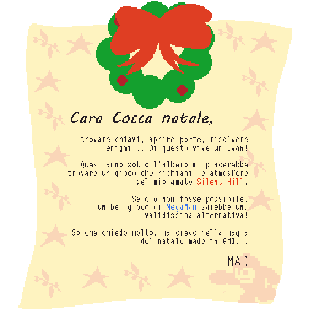

Benissimo: io ho giocato a qualche **Megaman** ma non avevo mai provato prima un **Silent Hill**, **Nanna** invece aveva giocato **solo a quest'ultimo**.
Così prima di tutto ho fatto i compiti a casa: ho provato la prima mezz'ora di Silent Hill per Playstation 1 (e mi sono trovato davanti un gioco molto più cinematrografico e godibile rispetto a quanto avrei mai immaginato), poi ho scelto di giocare Megaman 3 per GameBoy (odiando i boss con tutto me stesso, c'è troppo poco spazio per schivare i loro attacchi!).

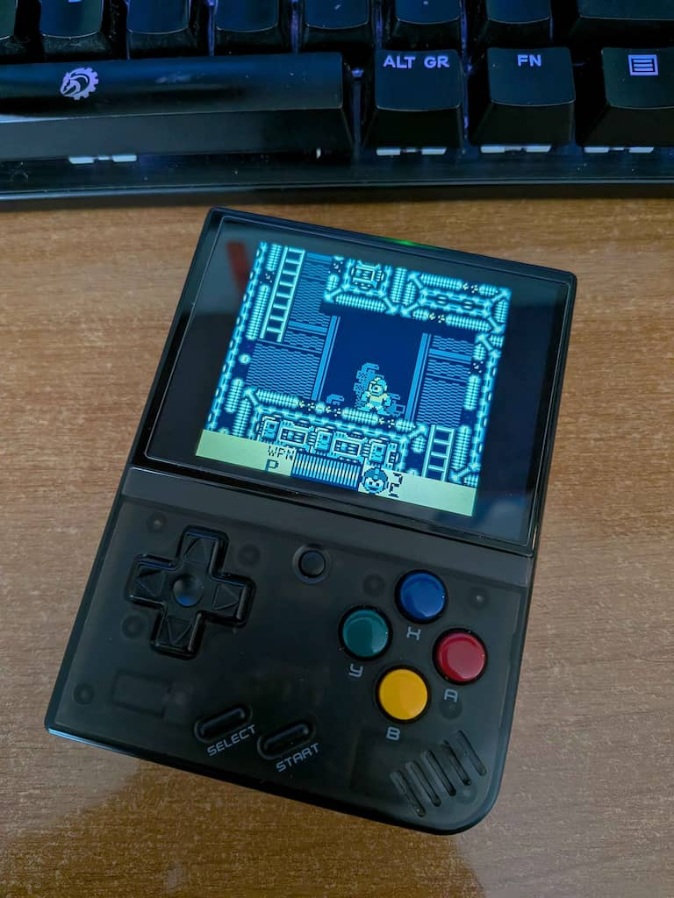

Ora che abbiamo tutti i mezzi, come scegliamo di rispettare la letterina? Sviluppiamo un gioco alla Silent Hill o alla Megaman?
Beh, il gioco è per Mad, non possiamo di certo risparmiarci... perchè quindi non sviluppare qualcosa **che contenga entrambi**?

Dopo un confronto, l'idea che abbiamo partorito è stata quella di creare un mondo esplorabile, nel quale dobbiamo muoverci alla ricerca di pile. Queste ci servono per riuscire a giocare a MegaMan con il nostro GameBoy, ma (twist top di Nanna) i mostri sconfitti nel gioco vengono liberati nel mondo reale e saranno lì pronti ad ostacolare la nostra ricerca di pile.

Ho così sviluppato un prototipo al volo per mostare a Nanna cosa intendevo con mondo esplorabile: la mia preoccupazione era principalmente la creazione della nebbia, per cui ho limitato il movimento del giocatore a 2 direzioni per semplificarmi la vita.

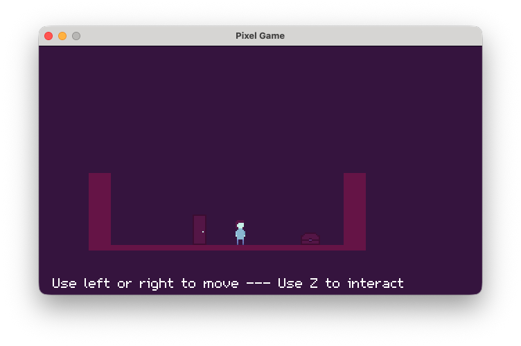
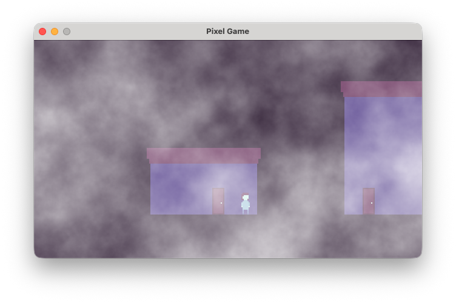

Nanna a questo punto ha un'altra bellissima idea: perchè non usare la neve al posto della nebbia? L'importante è che il soprannaturale sia nascosto e fraintendibile, *eldritch piu' che horror* (ho dovuto cercare su Wikipedia, ma mi ha insegnato una cosa nuova).
Così facendo, tra l'altro, potremmo usare figure del folklore natalizio nordeuropeo come nemici. Così ecco che nascono Krampus, [Mari Lwyd](https://en.wikipedia.org/wiki/Mari_Lwyd) e San Nicola.

L'idea iniziale, che qui condivido ma che non troverete nel gioco, è che il nemico fosse solo uno generato dalla fusione degli altri.

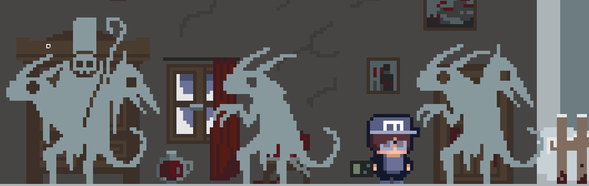

Trovato poi il nome del gioco (**Silent Night**, di cui ancora ci chiediamo di chi sia la paternità), il resto è stato solo sviluppo, disegno e... taglio delle feature perchè ormai devo accettare che sviluppare la sera è per me faticoso e sono lento :D

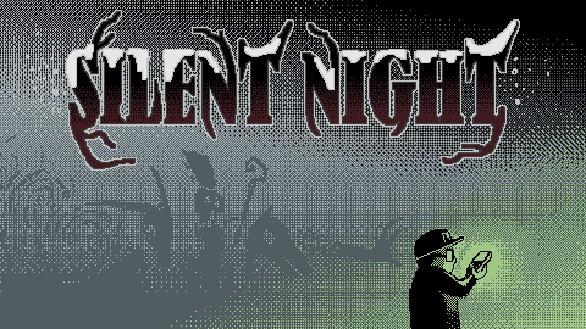

Tra le feature tagliate menzioniamo:

- la possibilità di lanciare del VOV per allontanare gli spiriti, sostituita dalla possibilità di schivarli abbassandosi
- dei livelli "veri" per la sezione al Game Boy, e quindi la presenza di minions nemici
- una sorta di minigioco per aprire i bauli alla "The Witness"

Qualche ritocco lo faremo ancora, magari integrando il punto due, ma per il resto credo che il gioco resterà così com'è. E non è necessariamente un male, dato che Mad sembra averlo davvero apprezzato. Peccato solo che il video mentre "scarta il regalo" sia andato perduto.

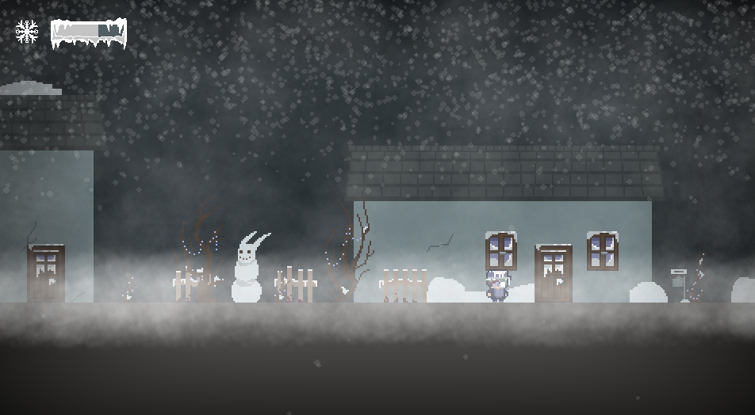
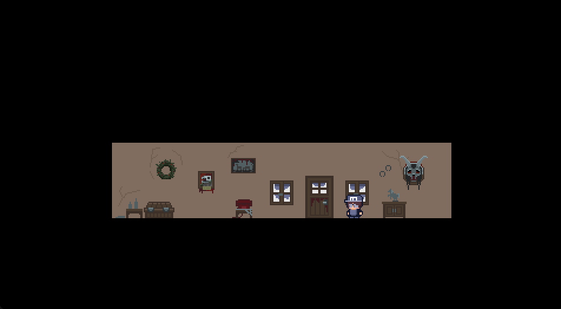
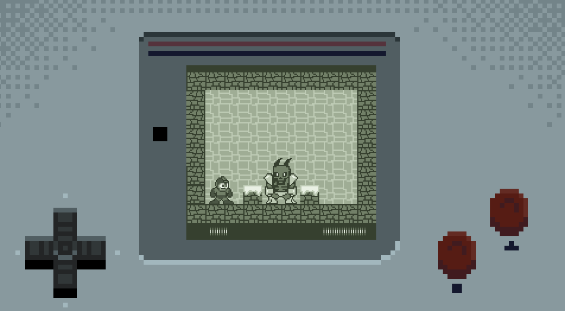

Spazio ai ringraziamenti ora:

- innanzitutto a Nannasaurus Rex, una compagna di team fantastica piena di idee e bravissima nel disegno
- a [Tiz](https://tiz010.itch.io/) per il suo script per la gestione degli input
- ad [AlexoFalco](https://www.alexofalco.com) per il [tutorial sulla gestione del multilinguismo su Game Maker](https://gamemakeritalia.it/posts/traduzione-e-internazionalizzazione-con-game-maker/)
- a [Freeflip](https://santiagocalzolari.wordpress.com/) perchè, dopo aver visto la live, mi ha scritto per aiutarmi a correggere come vengono disegnate le particelle
- Enrico Maria Perlini per aver aiutato Nanna con l'utilizzo di Reaper per gli SFx.

## Cosa abbiamo ricevuto

Io e Nanna abbiamo una passione in comune, quindi è stato facile redigere la letterina:

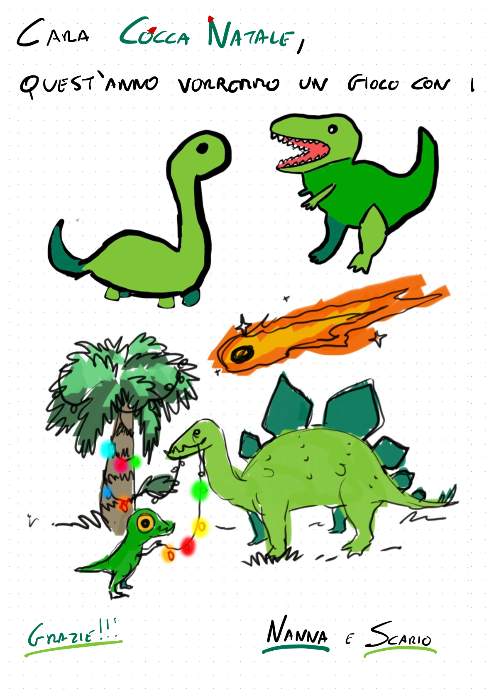

Siamo stati fortunati: siamo stati pescati da [Goldensun](https://goldensun-it.itch.io/) e abbiamo ricevuti Dino Slop, un puzzle dove bisogna usare dinosauri di forma e dimensione diverse per raggiungere la bandierina di fine livello.s

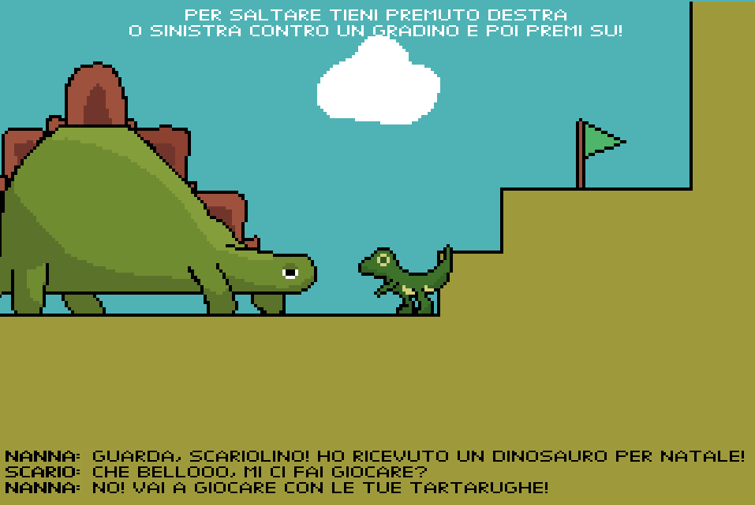
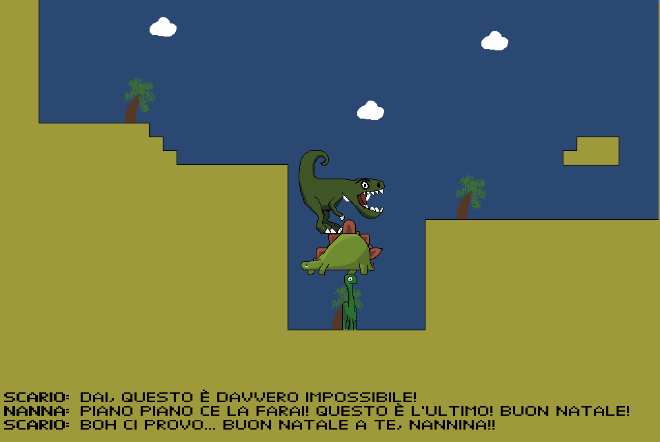

Golden si è detto non completamente soddisfatto per la mancanza di polish e di qualche bug, ma a noi è sinceramente piaciuto... Anzi, spero che lo porti avanti e lo chiuda come desidera, è davvero una bella idea!

E con questo si conclude anche la Secret Santa 2025. Non c'è stato nessun partecipante segreto o gioco segreto da consegnare, ma nonostante questo è stata faticola e soddisfacente come al solito ;) Ci si legge l'anno prossimo!
