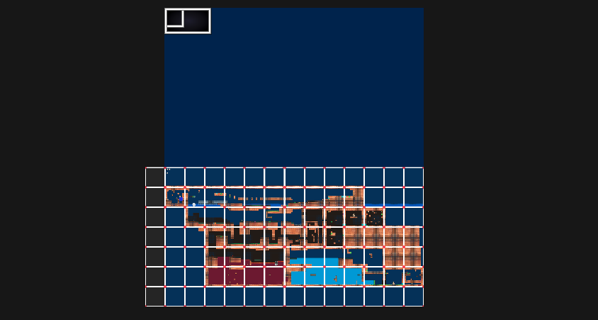
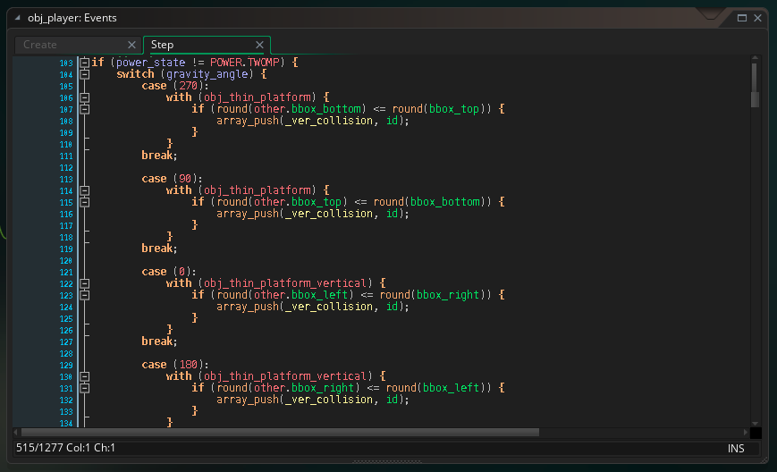

**Stardrop** è la mia _entry_ di quest'anno alla Competizione di GameMaker Italia: dovrebbe essere quello che ultimamente viene definito [MetroidBrainia](https://www.nintendolife.com/features/what-the-heck-is-a-metroidbrainia-introducing-the-newest-genre-on-the-block), ma molto probabilmente è un puzzle platform, quasi un labirinto con regole non scritte.

[Premi qui per scaricarlo da itch.io](https://scario88.itch.io/stardrop). Password della pagina: **gmi**

NB: questo articolo presenta parecchi spoiler sul gioco, quindi se volete provarlo vi consiglio di leggerlo una volta terminata la vostra run.

La mia idea iniziare era quella di creare qualcosa che spiazzasse e stupisse il giocatore: negli scorsi mesi ho giocato a [COCOON](https://www.cocoongame.com/), [Hollow Floor](https://amidos2006.itch.io/hollow-floor), [Tunic](https://tunicgame.com/) e [Pigments](https://tiz010.itch.io/pigments), giochi tutti di caratura diversa ma con in comune il fatto di avermi regalato delle _serendipity_ ogni volta nella quale il gioco riusciva a insegnarmi una meccanica senza che me lo dicesse.

Partendo da queste premesse, mi sono chiesto come reagirebbe un giocatore di fronte a ostacoli tipici "da platform classico", se improvvisamente le regole venissero sovvertite. Da questa riflessione è nata l’idea di sviluppare un gioco in cui il personaggio cambia forma e comportamento in base a cosa calpestasse.

L'idea mi è piaciuta subito, e con una caratteristica così "lasca" ho dato spazio alla fantasia: forme nelle quali non si può cadere, altre nelle si può passare attraverso a qualcosa, altre ancora che intervengono sulla gravità: messo tutto in una stanza singola, con tanti poteri a disposizione, l'idea sembrava funzionare alla grande. Però c'è un motivo se volevo chiamare questo articolo _Come NON sviluppare un MetroidBrania_...

Sono partito disegnando la possibile mappa di gioco su iPad, partendo da situazioni che volevo che il giocatore affrontasse in base al potere aquisito

Ho scelto di disegnare il personaggio giocabile come una _goccia di stella_, per fare in modo di avere qualcosa di potenzialmente "malleabile": volevo poi che, come in COCOON, interpretassimo un alieno alle prese con un pianeta che non conosce, così da poter stupire e straniare il giocatore ribaltando le sue aspettative.... ma si è rivelata un po' un'arma a doppio taglio.

> _aliento (/a·liè·no/, aggettivo, "Che appartiene ad altri; non com., estraneo, fuor di proposito") [Oxford Languages]_

Veniamo allo sviluppo.

La schermata introduttiva non è niente di speciale, se non fosse che il pianeta che ruota fa la sua porca figura. E' stato realizzato utilizzando il tool [Pixel Planet Generator](https://deep-fold.itch.io/pixel-planet-generator)

Il gioco in se' è invece una singola grande room, anzi, una **esageratamente** enorme: il mio vecchio Macbook Air 2017 si blocca costantemente spostandomi all'interno! L'avevo fatta così grande perchè ho cominciato a svilupparla prima di terminare di disegnarla, per cui non avevo idea delle reali dimensioni di cui avrei necessitato.
Dallo screenshot qui sotto la vedete grande la metà di quella che ho consegnato, perchè ho sperimentato con successo (almeno per 3 lati su 4) [Room Shift](https://github.com/YAL-GameMaker/room-shift), una web app del buon YAL che permette di ridimensionare la room in tutte le direzioni, a differenza di quello che fa GameMaker nativamente.

Il rettangolo nero in alto è la soluzione che ho adottato per avere una "cornice" attorno alla mia schermata di gioco: una viewport punta verso la cornice, mentre la viewport successiva inquadra la room di gioco.

Alla fine non l'ho poi veramente sfruttata come feature, ma è stato sicuramente formativo imparare come fare una cosa del genere, sono sicuro che potrei utilizzarla per il futuro.

Il codice di gioco non è particolarmente rifinito, anzi. E no, non intendo per alcuni problemi con le collisioni, ma perchè ho cercato di scrivere tutto nella maniera più semplice possibile. I motivi sono due:

- lavorando al progetto al mattino prima di andare a lavoro, e nemmeno tutti i giorni, se il codice non era più che leggibile avrei passato più tempo a capire cosa fare che effettivamente farlo
- dato che il potere di ruotare le stanze (spoiler) è stato uno dei primi che ho inserito, ho voluto che tutti i poteri potessero venire usati in tutte e 4 le direzioni in cui posso ruotare le stanze e la gravità. Dato che ho perso una settimana per riuscire a rendere tutto più astratto possibile, fallendo, ho duplicato il codice per tutte e 4 le direzioni di gravità (Jak di GMI, perdonami xD)

Veniamo ora ai motivi per il quale accennavo prima di non essere soddisfatto del mio sviluppo:

- il gioco richiede moltissimi test: i tanti poteri con cui affrontare diverse situazioni, cercando di dare al giocatore la possibilità di spostarsi come e dove più preferisce dando origine a tantissimi problemi. Il giorno successivo al rilascio mi ero accorto di un possibile softlock e mi sono mangiato le mani, ma dopo il test dei giudici mi sono accorto che le possibilità di _incastrarsi_ nel livello sono davvero molte
- sempre riferito al punto prima, il gioco è di fatto un enigma di cui io so già la soluzione: tutto quello che mi sembra chiaro e/o banale non è detto che lo sia anche per il giocatore, e anche qui quello che mi sarebbe servito davvero è del testing da una parte di almeno una persona terza
- non avevo molto tempo a disposizione, ho provato a scegliere un'idea che mi sembrava poco complessa e veloce nella realizzazione, puntando tutto sul level design. Beh, così non è stato: la realizzazione del livello di ha fatto ammattire, e la mia scelta di rendere possibile le transformazioni per ogni angolo di gravità ha fatto sì che anche il codice sia più complesso del previsto. Tutto questo a scapito del polishing grafico e audio, ovviamente :(

Credo poi che il gioco in sè non sia così divertente e non invogli il giocatore a completarlo: i giudici della competizione non sono riusciti a portarlo a termine, e ho ricevuto pochissime richieste di aiuto riguardo a puzzle non ben comprensibili.

Il gioco [si è posizionato al 9° posto su 16](https://gamemakeritalia.it/competizioni/contest/?contest=28): vedendo la qualità dei giochi di quest'anno non posso sicuramente lamentarmi, anzi, credo che qualche gioco arrivato sotto al mio sarebbe dovuto essere premiato di più.

[Qui trovi il link del video della live di premiazione, nel momento in cui viene mostrato StarDrop](https://youtu.be/_sj5MZDS73M?si=qqR-bGsvUXKn7FzU&t=5421).

Ma non tutto il male viene per nuocere. Ho chiesto feedback alla community di GMI, e ne sono arrivati parecchi!

- Secondo i giudici la mappa "consultabile" (se ci giocate sapete cosa intendo) mostra troppo poco dell'area di gioco. Era una scelta per invogliare il giocatore a disegnare la mappa su carta, ma nessuno lo ha fatto, per cui tengo in considerazione di cambiare completamente questa parte
- Patience mi ha suggerito (e ho prontamente sviluppato) un panic button per resettare la posizione e il potere del giocatore, così da permettere di terminare la partita durante un softlock
- [Jak ha apprezzato tantissimo l'introduzione dei comandi](https://youtu.be/fKC5rcu6WZc?si=Ew6TMUwQo4tjWBZb&t=3866), e la cosa non potrebbe rendermi più felice. Mi ha però detto che ha trovato alcuni poteri ma posizionati: se i primi ti permettono di "provarli e giocare" prima di effettivamente usarli, altri vanno presi e capiti "al volo".
- Mad consiglia di rendere più comprensibile l'enigma degli animali, mentre quello sonoro l'ha trovato abbastanza comprensibile.

Voglio portare a termine questo gioco e dargli un degno "confezionamento": metto in pausa gli sviluppi per un po', rifiato, prendo un po' di feedback e poi penso a come farlo evolvere.
Se tu che stai leggendo hai voglia di darmi un feedback non farti problemi, anzi, apprezzerei moltissimo!
