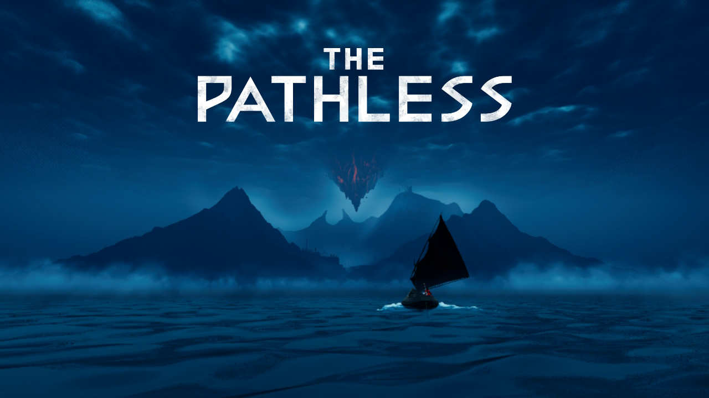
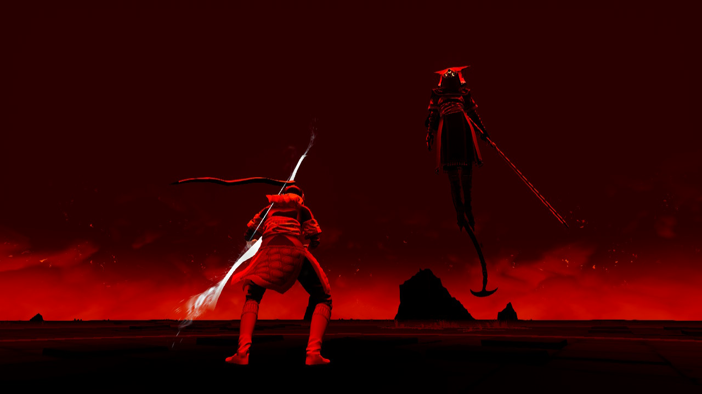
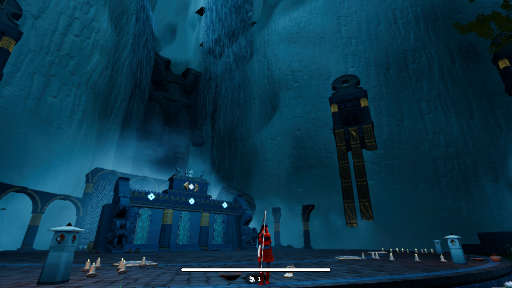
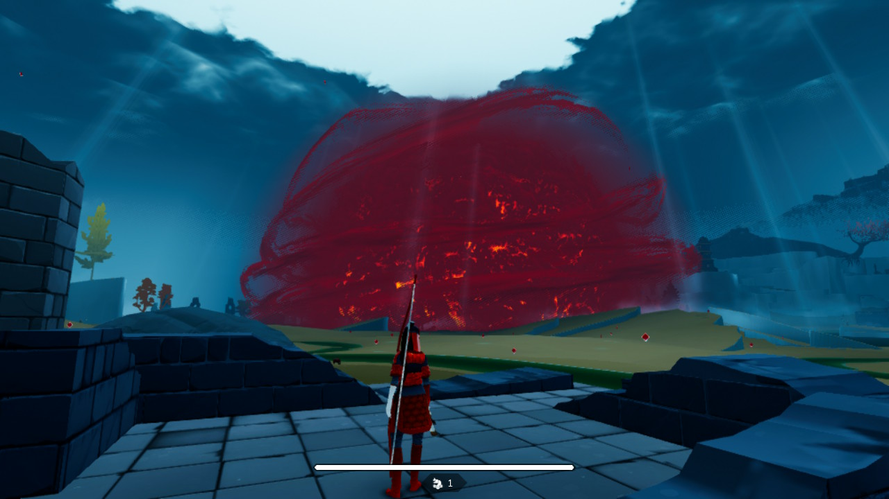
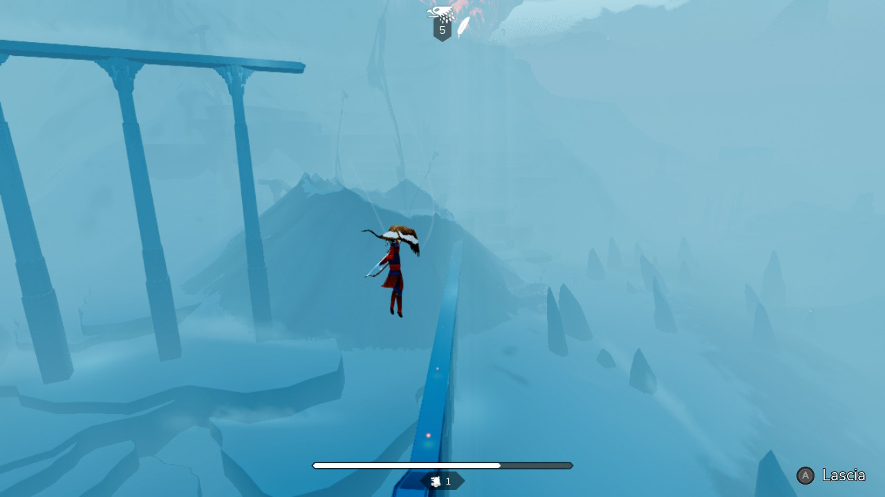

Ogni tanto mi chiedo se sia utile scrivere qui di videogiochi dato che scrivo solo di quelli che porto a termine e che quindi mi piacciono. Finalmente è arrivata l'eccezione.

## Premessa

[The Pathless](https://store.steampowered.com/app/1492680/The_Pathless/) è un gioco che non era nella lista delle cose da acquistare quest'anno, ma dopo aver trovato la versione fisica nuova a 12€ ho deciso di portarmelo a casa e giocarlo.
Da qual che sapevo, il gioco si rifà per genere, _mood_ e stile a giochi come [Journey](https://store.steampowered.com/app/638230/Journey/) e [ABZU](https://store.steampowered.com/app/384190/ABZU/): non ho giocato quest'ultimo, ma il primo mi ha lasciato un bel ricordo e quindi ho pensato di essere compatibile con il genere.

## Unboxing

Il prodotto si presenta benissimo, perchè all'interno della confezione sono presenti alcune cartoline con dei disegni riferiti ad alcuni momenti di gioco: avrei preferito trovare un manuale di gioco al loro posto, ma, abituato al nulla cosmico dei giochi attuali, è stata comunque una piacevole sorpresa

## Il gioco

Come anticipato, The Pathless è una sorta di gioco di avventura alternato da alcuni puzzle ambientali. Impersoneremo l'ultima **Cacciatrice**, una figura che, armata di arco, ha come obiettivo quello di riportare l'ordine nel mondo di gioco, piegato al volere del cattivo di turno, il **Godslayer**.

Il perno portante di tutto il gioco è il **sistema di movimento**, e in particolare la corsa: la stamina si scarica molto in fretta, ma possiamo costantemente caricarla e avere un piccolo / grande _boost_ colpendo dei bersagli posizionati a mezz'aria, e non posso negare che la cosa, almeno inizialmente, è galvanizzante. Tra l'altro la mira è automatica, e più premiamo il pulsante per tendere l'arco più il nostro colpo sarà preciso: la sfida sarà quindi quella di riuscire a mantenere il momentum della nostra corsa più a lungo possibile, più che ad avere una buona mira.

Questi momenti di corsa vengono intervallati da puzzle ambientali, che però non ho trovato così brillanti: le sfide sono più o meno di tre varianti diverse, e non diventeranno mai dei veri e propri ostacoli al nostro cammino, anche se quelli dell'ultima mappa li ho trovati più interessanti di quelli proposti precedentemente.

Il gioco, dicevo, è ambientato in un mondo diviso in 4 macroaree: in ogni area dovremo fermare la divinità corrotta di quell'ambiente, e per farlo dovremo recuperare delle Icone all'interno di quell'area protette dagli enigmi di cui sopra. A parte i boss, non sono presenti altri nemici, se non un'unico ostacolo: una sorta di massa enorme di energia negativa, che stancamente si sposta all'interno del livello. Se veniamo toccati da questa dovremo affrontare una sfida con il boss in modalità stealth.

Questa parte è quella che ho **maggiormente odiato nel gioco**: non sono mai riuscito a completarne una, e comunque non essendoci nel gioco la possibilità di venire sconfitti, il tutto si riduce al perdere alcune gemme di gioco, una "valuta" che, accumulata, ci permetterà di fare più salti in aria.

Insomma, posso riassumere il tutto in: **quando si corre, il gioco funziona; quando, per amore di varietà, il gioco ci fa rallentare, il tutto diventa mediocre**. he, tra l'altro, sembra la possibile chiusa di una qualsiasi recensione di un Sonic in 3d :D.

Leggendo le recensioni online invece il gameplay viene principalmente promosso, quindi capisco che la questione possa essere soggettiva. Il gioco poi l'ho portato a termine, per cui proprio _terribile_ non l'ho trovato.

Quanto c'è di oggettivo, invece, è la resa grafica: guardando online, le immagini prese da una PS5 lasciano senza fiato, regalando emozioni anche solo osservando dei fermo immagine.
Su Switch i compromessi sono enormi: ci sono cali di frame durante il cambio area (poco male), ma soprattutto i mondi sono completamente piatti e danno una resa quasi _low-poly_ al gioco stesso.
**Sono davvero l'ultimo a pensare che la grafica sia un parametro importante** o che i downgrade siano inaccettabili, anzi, altrimenti non avrei mai giocato a giochi di terze parti su Switch: il fatto è che **The Pathless**, come anche il sopra citato Journey, **fa della resa grafica parte integrante dell'atmosfera, che qui si va a perdere completamente**.

Peccato.

Se vi va di provarlo, quindi, non giocatelo su **Nintendo Switch 1**.
