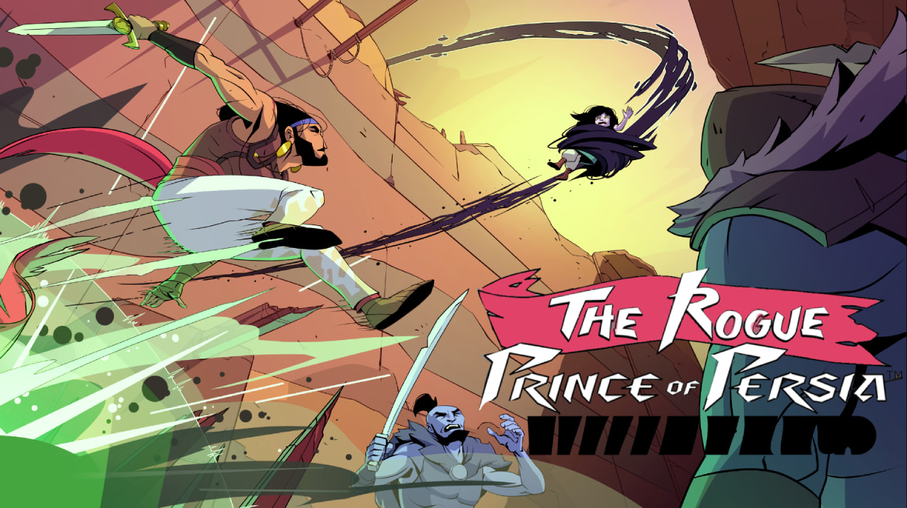
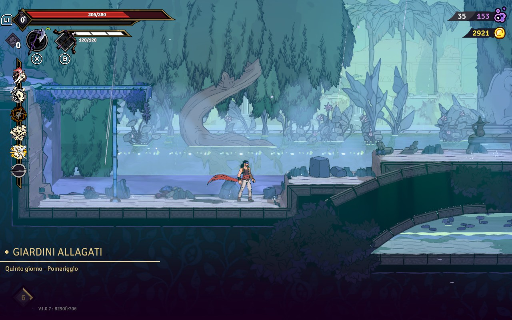
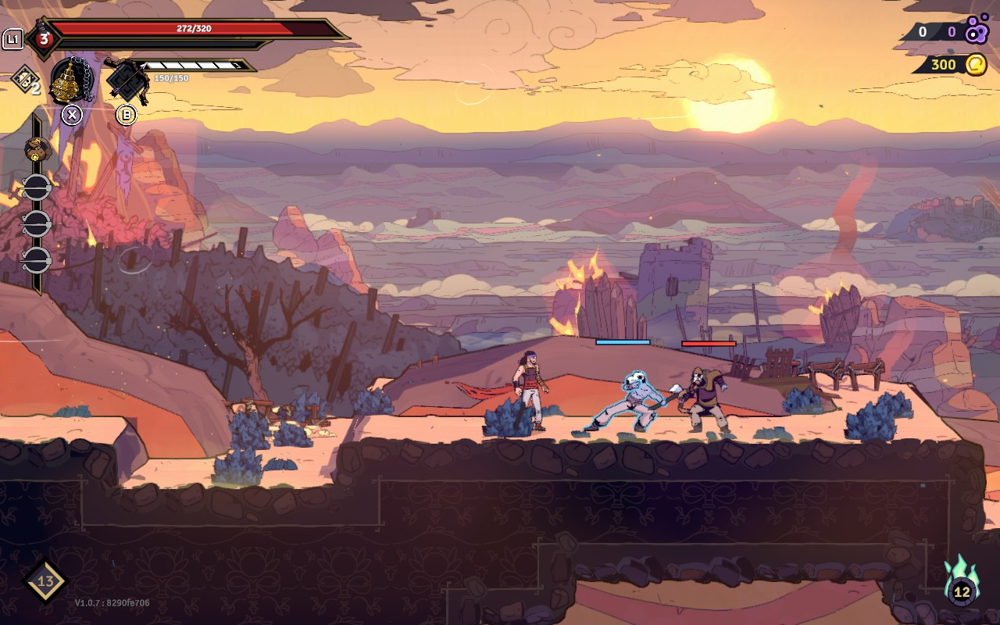
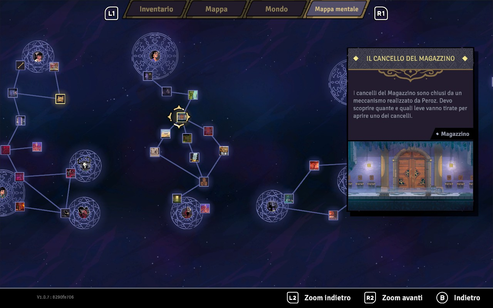
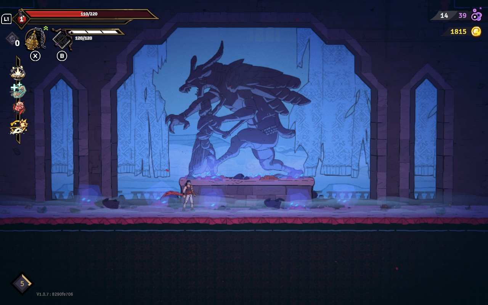
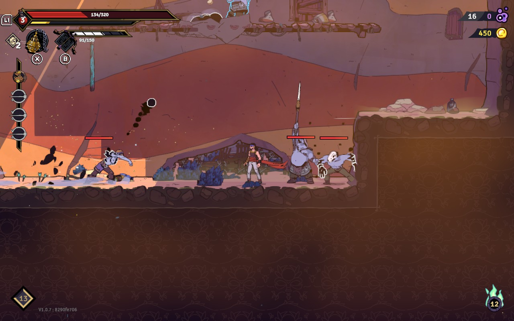

Avete presente la **vellutata di porri e patate**? Non è il cibo più godurioso del mondo, eppure è proprio buono perché è morbito e caldo, e fa piacere mangiarlo soprattutto durante le fredde serate invernali... Lo definirei un mio cibo **confort**.

Giocare a [The Rogue of Prince of Persia](https://therogueprinceofpersia.com/) mi ha dato lo stesso effetto. Sarà perché è un MetroidVania con una **struttura pressoché identica a Dead Cells**, un gioco che già conoscevo? Oppure sarà perché **il sistema di movimento è molto fluido** e facile da memorizzare? O perché il gioco **non è facile ma nemmeno particolarmente difficile**? Probabilmente è l'insieme di tutto questi fattori che mi ha tenuto incollato per le **circa 10 ore di gioco**.

La storia del gioco ci porta nell'antica Persia, in un momento nel quale gli Unni tentano di conquistare il regno aiutati dalla **magia nera**. Noi impersoniamo il principe che, nel tentativo di salvare il regno, muore: qui verremo a conoscenza del ciondolo magico (o, per meglio dire, una bola) del protagonista che lo salva riavvolgendo il tempo e lo riporta all'inizio della giornata ogni volta nella quale perde la vita... una scusa perfetta per un roguelike :D
Insomma, le vicende narrate sono poco più di una scusa, ma ho apprezzato il modo in cui la narrazione viene portata avanti: parlando con determinati personaggi o trovando indizi all'interno di certi biomi, sblocchiamo dei nuovi luoghi da visitare alla run successiva e la mappa, che inizialmente è lineare, prende più bivi a seconda dell'uscita del livello da cui decideremo di terminarlo.

Interessante anche l'idea della **mappa mentale**: quando troviamo un indizio che porta avanti la trama, questo verrà disegnato a forma di grafico in cui più eventi possono intrecciarsi e questo aiuterà il protagonista a capire qual'è il passo successivo da fare per riuscire a salvare tutti i suoi cari e proseguire nella nostra avventura. L'ho trovata davvero interessante anche perchè aiuta a recuperare il **filo del discorso** nel caso dovessimo riprendere una partita dopo un periodo di sosta (si, lo dico spesso nelle recensioni, ma per me è un aspetto di QoL davvero importante).

Come anticipavo, il sistema di movimento è molto fluido ed è piacevole fare il _traversing_ delle varie aree: oltre al classico **walljump**, ci sono il meno classico **wallrun** e l'inedita **corsa a parete** a rendere ogni partita una bellissima corsa senza soluzione di continuità, se lo vorremo.
La **corsa a parete** è quel "classico" movimento dei vari Prince of Persia 3d nel quale potremmo camminare su una parete "laterale": trasposta in 2d continua a funzionare benissimo, anche se bisogna prenderci un po' la mano per capire quanta **stamina** si ha per compiere questo genere di azioni.

Il sistema di combattimento è molto semplice: avremo un'arma principale e una secondaria, e la principale avrà un attacco alternativo / pesante utilizzabile rispettando certe condizioni (combo lunghe o tenere premuto il pulsante di attacco, ad esempio).

Funziona, perchè l'azione frenetica del gioco non ha necessariamente bisogno di un sistema di combattimento più profondo.
Ho trovato però mal bilanciata la distribuzione della armi: nelle ultime ore dell'avventura, quando mi era già chiaro cosa fare e quale strada seguire per terminare il gioco, mi sono imbattuto in nuove armi da sbloccare, a volte addirittura meno interessanti / forti rispetto alle precedenti... Probabilmente l'uscita di un DLC con un proseguimento dell'avventura o con qualche nuovo bioma potrebbe aiutare a sistemare la distribuzione di questi elementi all'interno del gioco e il bilanciamento stesso.

Giusto, bilanciamento: il gioco non si può prendere alla leggera, soprattutto dopo averlo terminato **la prima volta** (si, qui le cose funzionano esattamente come Hades, debuff compresi... non dico altro per evitare spoiler), ma non è nemmeno così complesso: due boss li ho addirittura battuti al primo colpo, cosa alquanto strana data la tipologia di gioco. È comunque un gioco confort come dicevo, quindi anche qualora si dovesse ripetere qualche boss più di una volta (perchè c'è stato anche questo caso, malefico **Baatar**) lo prenderemo davvero come un'occasione per potenziarci e arrivare a batterlo con piacere la volta successiva.

Il vero problema che ho trovato nel gioco è che i biomi hanno una generazione procedurale dei livelli che però reitera molto spesso situazioni ed enigmi ambientali sempre identici a sè stessi: il senso di deja-vu qui si sente molto di più rispetto ad altri roguelike.

È un motivo sufficiente per non giocarlo? No, non direi. Pensate che ho riacceso il gioco per fare qualche screenshot da inserire in questo post, e non so come mi sono ritrovato incollato a terminare un run.
