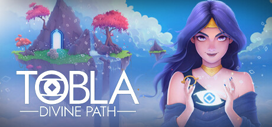
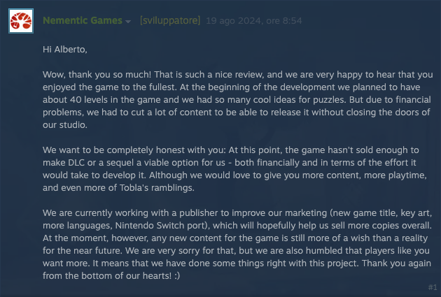
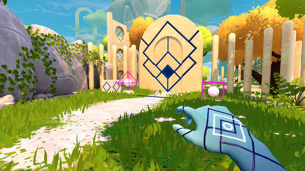

[Tobla - Divine Path](https://store.steampowered.com/app/2717750/Tobla__Divine_Path/) lo avevo da parecchio nella mia wishlist, ma non avevo mai premuto sul pulsante "Acquista" perchè nelle recensioni è spesso bollato come "troppo corto e semplice" e il prezzo a cui era venduto mi sembrava eccessivo per quello che sembrava offrire.
Dopo aver letto questo commento di uno degli sviluppatori, però, ho pensato che se il gioco mi interessa è giusto supportarlo.

Ora che l'ho giocato e terminato, posso dire anche io che è troppo corto? No, non userei questa definizione: ho completato al 100% Tobla in circa 2h 30m, ma sono state delle ore in cui mi sono divertito e che hanno _saziato_ la mia voglia di puzzle game in un weekend trascorso a casa.

Il gioco è, appunto, un puzzle game che trae decisamente ispirazione da Portal: una divinità ci osserva dall'altro e ci sfida a superare delle prove di intelligenza dopo averci donato il potere di far scambiare di posto due oggetti.... Non trovate anche voi delle somiglianze? :D

Gli oggetti in questione, se Sokoban ci ha insegnato qualcosa, hanno tutte caratteristiche diverse: si va da differenze di dimensione, alla possibilità di poter essere spostati alzandoli a (senza fare troppi spoiler) avere effetti particolari solo **dopo** essere stati scambiati di posto.

La meccanica dello swap, cioè la possibilità di scambiare due oggetti di posto, è quella che mi aveva convinto a mettere in wishlist il gioco (ho un progetto con una meccanica molto simile che ho mostrato sul Discord di GMI tempo addietro), e devo dire che vengono fuori davvero dei bei puzzle, anche se qui la difficoltà non mi sembra tarata benissimo: si passa da livelli quasi "guidati" ad altri in cui va davvero capito come funziona la fisica del gioco: non nego che per il secondo livello con "le sfere" e l'ultima sezione del boss finale ho dovuto dare un'occhiata su YouTube.

La divinità che segue le nostre peripezie ha un carattere che ricorda molto GLaDOS di Portal, con un po' meno carisma ma con davvero un ottimo livello di recitazione.

A parte la questione del bilanciamento menzionata prima non ho trovato reali difetti: la grafica non è da urlo ma fa il suo dovere, si gioca comodamente su Steam Deck, intrattiene e mette insieme degli enigmi ben studiati. Se vi piace il genere e volete divertirvi un paio di sere mi sento di consigliarlo.
