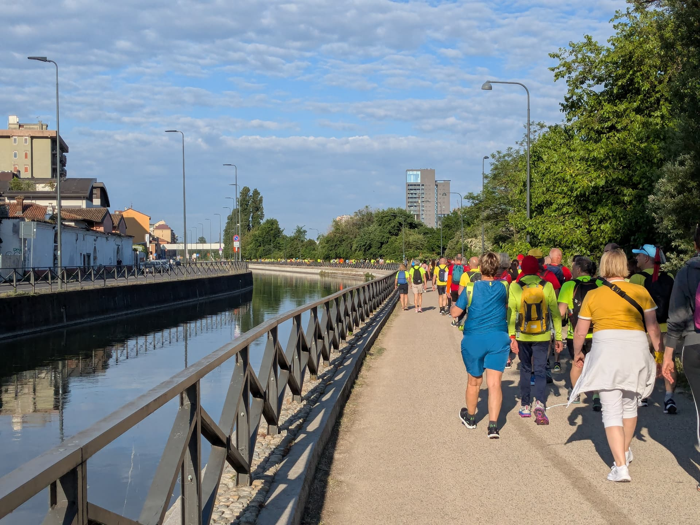
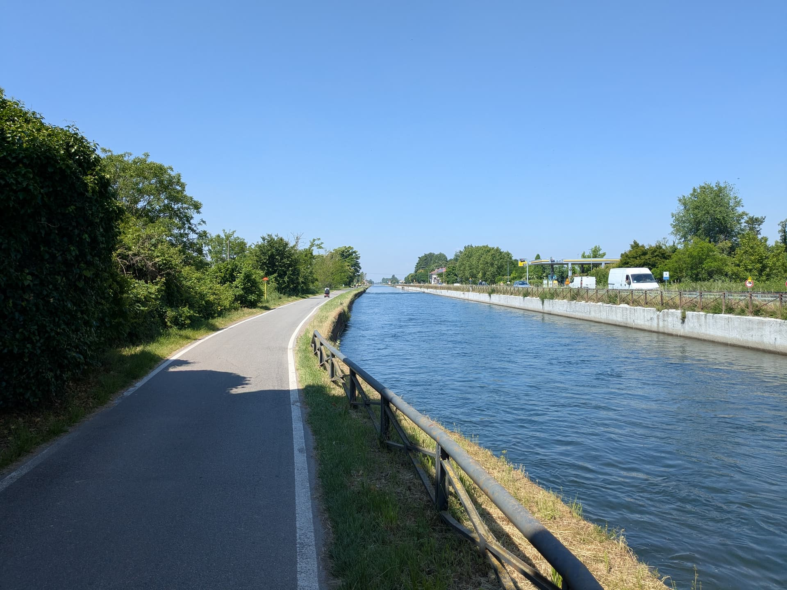

Sabato, in compagnia della mia compagna, sua madre e altre centinaia di persone, abbiamo fatto la *pazzia* di fare la Milano - Abbiategrasso, una passeggiata accanto al naviglio di circa 24km.

Siamo arrivati ad Abbiategrasso alle 6.00, abbiamo lasciato lì la macchina e siamo saliti in treno fino a Milano Porta Genova in perfetto orario: vedere Milano che si sveglia, poi, è stato un plus che non avevo tenuto in considerazione.

Partenza puntuale alle 7, e un fiume giallo è partito dalla Darsena milanese e ha cominciato ad accostare il Naviglio.

La camminata è stata piacevole: giornata calda con un filo di vento (quanto basta per scottarsi il braccio senza rendersene conto, NdR) e i 24km sono stati meno faticosi del previsto. Tra l'altro un plauso all'organizzazione dell'evento da parte dei [Caminantes](https://www.facebook.com/iCaminantes/): le tappe ristoro erano ben distanziate una dall'altra, e i bar scelti erano pronti per l'impresa di rifocillarci e darci asilo per un momento in bagno.

Ci abbiamo messo 6h 30m, un po' più del previsto, ma se consideriamo anche le tappe bagno e cibo direi che non è andata male!

Al nostro arrivo abbiamo provato la pizzeria [Napoleone all'Allea](https://www.ristoranteilnapoleone.it/) di Abbiategrasso.
Promosse sia la pizza mia e della "suocera" sia la pasta allo scoglio della mia compagna: la pizza poi aveva un formato "tradizionale", e mi è quasi sembrato strano non mangiarne una con il cornicione alto alla napoletana... finalmente. No, non ho nulla contro quella, anzi, ma sembra che sia diventato obbligatorio ormai fare una pizza con il bordo così alto, ma non è scontato saperlo fare.

Purtroppo la camminata non verrà più riproposta, perchè è nata come un'alternativa alla Milano - Pavia che non è stato possibile fare per lavori sulla strada da percorrere. Ma quella è lunga 34km, e l'ho già provata nel 2018... è stata davvero faticosa.

Portiamoci dietro il bel ricordo di questa.
