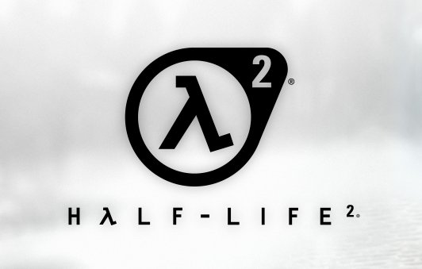

Oggi, 16 novembre 2024, è [il 20esimo anniversario di _Half-Life 2_](https://www.half-life.com/it/halflife2/20th): un traguardo significativo per un gioco che ha rivoluzionato il mondo dei videogiochi in molti modi.
È un titolo che è stato sicuramente importante anche per me, ma non è questo il motivo per il quale sento il bisogno di scriverne.

Per questa occasione, Valve, la casa produttrice del gioco, ha deciso di **regalare il gioco** comprensivo dei due DLC usciti per i prossimi due giorni, di far uscire un **aggiornamento importante** (vari QoL, miglioramenti grafici, fix di bug, commentary degli sviluppatori all'interno del gioco, piena compatibilità con tutte le feature di Steam Deck, ...), e di rilasciare un **documentario di due ore** sulla storia produttiva dello stesso.

Leggere questo genere di notizie mi fa **rimanere estasiato**. È lo stesso trattamento che Valve stessa aveva dedicato qualche tempo fa per l'anniversario dell'uscita del primo capitolo quindi non dovrei stupirmi, ma se penso allo stato attuale del mondo dei videogiochi, queste eccezioni le apprezzo ancora di più.

Quanti giochi hanno "festeggiato" i loro anniversari con aggiornamenti a pagamento, remaster o remake? E quanti, invece, hanno ricevuto aggiornamenti gratuiti e costanti che li rendono perfettamente giocabili su hardware moderno, vent’anni dopo la loro uscita? Half-Life 2 oggi si presenta in una versione persino migliore di quella originale.

Questo, per me, è un'autentica dimostrazione di amore verso i videogiochi: si parla tanto di preservazione degli stessi, ma un trattamento simile non lo vedo fare da altre case sviluppatrici.

Scrivo di tutto questo sul mio blog perchè è questo il risultato a cui voglio ambire: amo sviluppare giochi, e la voglia di cominciare sempre qualcosa di nuovo è fortissima. Ma sto valutando di fare una pausa quest'anno dallo sviluppare qualcosa di nuovo per dedicarmi a ciò che ho già realizzato e **prendermene cura**, migliorandolo e preservandolo.

Vedremo come andrà. Ma ora scusatemi, voglio andare giocare Half-Life 2 (rigorosamente con il commento degli sviluppatori attivato).
