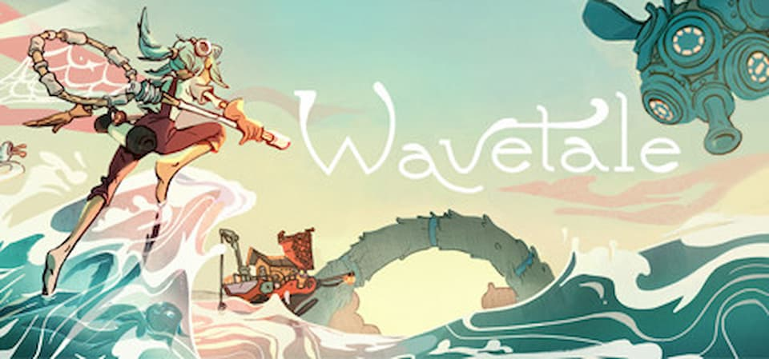

[Wavetale](https://store.steampowered.com/app/1823930/Wavetale/) era più volte comparso nel mio radar, complice il [trailer](https://www.youtube.com/watch?v=r344jabH3fI) che mostra la protagonista surfare tra le onde del mare alternandosi a fasi da più classico platform 3d. Mi ha sempre fermato però il fatto che viene definito come un'avventura piuttosto semplice in termini di difficoltà, ma in questo momento di vita avevo proprio bisogno di qualcosa che fosse divertente senza pretese e ho deciso di acquistarlo.

Wavetale, come mostrava correttamente il trailer, è un **platform 3d a mappa unica**, che si aprirà man mano che riusciremo a diradare le nebbie che limitano i nostri movimenti in mare: non riuscirei a definirlo **open world** perchè di fatto ci muoveremo solo per seguire l'avventura principale, dato che le quest secondarie sono poche, limitate in spazi piccoli e talmente monotone che smetteremo ben presto di farle.

Come anche per [The Pathless](./blog/the-pathless/), il sistema di movimento è il protagonista del gioco: per _motivi di trama_ potremo ben presto camminare e surfare sulle onde, e la parte più divetente del gioco è proprio questa. Non c'è nessuna sfida a riguardo (se non per qualche gara sparsa qua e là), è insomma limitato al solo spostamento da un'area con l'altra, ma muoversi tra le onde, con la musica **chill** proposta dal gioco e, ogni tanto, finire su dei percorsi che ci faranno guadagnare accelerazione è davvero piacevole e soddisfacente.

Ma cosa si fa **fuori dall'acqua**?
Sostanzialmente si salta su piattaforme alla ricerca di interruttori da colpire o oggetti da recuperare (salti e doppi salti precisi con l'aggiunta della possibilità di planare rendono l'esperienza piacevole) e si combatte... Purtroppo.
Le fasi di combattimento non stonano all'interno del gioco stesso, ma, come potete immaginare, se il resto del gioco è _cozy_ anche le battaglie tendono ad esserlo: nemici facili da sconfiggere, nessuna combo particolare, ci si trova al massimo a schivare i loro attacchi. Tenete conto che non so cosa succeda quando si perdono tutte le vite perchè non mi è mai capitato che mi accadesse in tutta l'avventura, e io non sono certo un fenomeno.
Gli unici combattimento interessanti sono quelli contro i boss, nei quali saranno comnque le nostra abilità con i salti a fare la differenza piuttosto che quelle con la nostra arma.

Solitamente i platform 3d sposano un animo collectaton, cioè quella meccanica per la quale i livelli sono sparsi di oggetti più o meno segreti da raccogliere. Ecco, qui non proprio: ci sono delle **sparks**, la valuta di gioco, disseminate per i livelli, ma il loro utilizzo è confinato nell'acquisto di componenti estetici per il nostro personaggio.

Insomma, com'è questo Wavetale? È proprio carino. Ripeto, lo si apprezza solo se siete nel mood di voler giocare qualcosa di rilassante, e in questo caso funziona benissimo.
Anche **la trama**, per quanto non abbia particolari colpi di scena, l'ho trovata interessante: ha un **messaggio ecologista** abbastanza classico ma che non fa mai male ricordare.
**Nota di merito** per la traduzione in italiano che comprende anche il doppiaggio di ogni singolo dialogo, e per la maggior parte dei personaggi è persino di buon livello: davvero inaspettato che ci sia, data la natura indie del prodotto.
