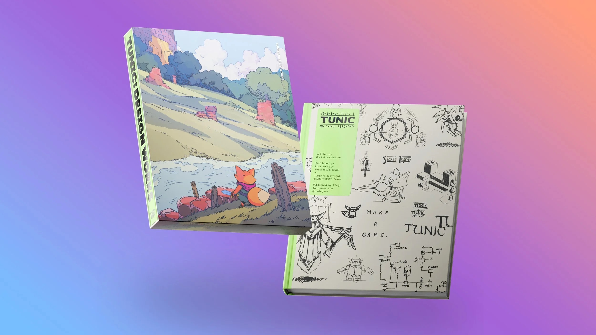

---js
const eleventyNavigation = {
	key: "Whishlist",
	order: 4
};
---

# Whishlist

Sicuramente è capitato anche a voi che qualcuno vi chieda cosa vogliate per Natale / Compleanno / ecc. Io sono fortunatamente nella posizione di poter dire di non aver bisogno di nulla: ho un lavoro, una casa, una compagna, una salute decente... non ho davvero niente di cui lamentarmi.

Ma effettivamente ci sono cose che desidero, delle passioni che mi piacerebbe approfondire o delle passioni che vorrei fare. Da qui nasce questa pagina.
È una **lista dei desideri** vera e propria.

Un piccolo sommario delle categorie:

- [VideoGames](#videogames)
- [Caffè](#caffè)
- [Lego](#lego)
- [Libri](#libri)

## VideoGames

Sono una delle mie principali passioni quindi sarebbe stato strano non vederne nessuno in lista.

Al momento gioco principalmente su tre console: [Nintendo Switch Lite](https://www.nintendo.com/it-it/Console-e-accessori/Famiglia-Nintendo-Switch/Nintendo-Switch-Lite/Nintendo-Switch-Lite-1595961.html), [Steam Deck](https://www.steamdeck.com/it/) e [Miyoo Mini Plus](https://www.miyoogame.com/product/miyoo-mini-plus-retro-handheld-game-console/).

Mi piace molto avere l'edizione fisica dei giochi stessi quando possibile, quindi nei casi in cui questa esista preferisco prendere i giochi su **Nintendo Switch**. In caso contrario gli store di [Steam](https://store.steampowered.com/), di [GOG](https://www.gog.com/en/) e di [itch.io](itch.io/) coprono le mie esigenze per il gioco su Steam Deck.

Il gioco che più bramo per **Nintendo Switch** al momento è [UFO 50 Deluxe Edition](https://www.fangamer.com/collections/ufo-50/products/ufo-50-game-nintendo-switch-deluxe-edition), una raccolta di 50 giochi anni '80 per una console... mai esistita. E' sviluppato da 6 autori (di cui apprezzo particolarmente il suo lavoro, [Derek Yu](https://www.finalround.it/monografie/559/inside-derek-yu)), e la **Deluxe Edition** lo differenza dal gioco "standard" per [UFO Companion](https://www.fangamer.com/collections/ufo-50/products/ufo-50-players-guide), una sorta di rivista dedicata a questa console comprendente guide e consigli per giocarla. UFO 50 "Standard" è disponibile anche su Amazon, ma al momento la Companion (sia confezionata insieme che a parte) no.

.

Dato che la versione fisica era a tiratura limitatissima ed è introvabile, in digitale il gioco che mi piacerebbe di più provare è [Animal Well](https://store.steampowered.com/app/813230/ANIMAL_WELL/). È stato sviluppato in 7 anni dal solo sviluppatore Billy Basso, ed è un gioco di esplorazione senza combattimenti e pieno di regole non scritte. Non bastano queste premesse per aver incuriosito anche voi?

.

## Caffè

Un paio di anni fa la mia compagna mi ha regalato un [macina caffè manuale](https://www.timemore.com/) e una confezione di [caffè specialty](https://www.vinhood.com/magazine/tutorial/cosa-sono-gli-specialty-coffee-e-cosa-li-rende-cosi-speciali/) in chicchi, convinta che sarebbe potuto piacermi nonostante io non fossi nemmeno a conoscenza di questo mondo. Aveva assolutamente ragione, e ora mi trovo con una passione in più :D

Nel corso del tempo ho scoperto che apprezzo i caffè che tendono all'acido (sentori di frutta gialla in particolare), ma mi piace molto sperimentare e provare bevande con lo spettro diametralmente opposto.

Ho provato e apprezzato i caffè di [Ditta Artigianale](https://dittaartigianale.com/), [NOWHERE](https://nowherecoffeeroasters.com) e [iDruper](https://www.idrupercoffee.com/)

Ho fatto poi un corso su con [Mirabilia](https://www.mirabilia.coffee/) riguardo i metodi alternativi di estrazione del caffè, e lì ho conosciuto questa realtà che vende sia singolarmente del caffè accuratamente scelto sia impacchetta delle box degustazione (singole o in abbonamento). Sono un po' costose e quindi non ho mai provato ad acquistarle, ma di certo le apprezzerei.

Tra i metodi alternativi di estrazione che nominavo prima c'è il filtraggio: ho a casa un filtro a pressione con il quale ho cominciato a divertirmi, ma mi piacerebbe molto provare la [Aero Press](https://caffelab.it/aeropress-aerobie-coffee-maker/), un oggetto creato dall'[inventore del Fresbee](https://en.wikipedia.org/wiki/Alan_Adler) che amava farsi un caffè buono anche fuori casa.

.

## Lego

Cosa c'è di meglio di un bel LEGO a Natale? Forse solo un dinosauro... Quindi, come non desiderare questo [fossile di T-Rex](https://www.lego.com/it-it/product/dinosaur-fossils-tyrannosaurus-rex-76968)? Inutile, enorme... e bellissimo.

Dato però che mi piacciono molto anche i LEGO "decorativi" (come la serie Botanical, per intenderci), trovo ltrettanto bella e con prezzo difficilmente giustificabile la [Via Lattea](https://www.lego.com/it-it/product/the-milky-way-galaxy-31212).

## Libri

Fare il pendolare ha tanti lati negativi, ma ammetto che il fatto di essere obbligato a restare su un autobus per 1h-1h30 al giorno mi aveva dato una bella routine di lettura.

Da quando sono tornato a lavorare vicino a casa ho guadagnato tempo ma ho smesso di investirlo in questa attività, e leggo principalmente in ferie o quando c'è qualcosa che mi incuriosisce moltissimo. Non ne vado fiero, è sicuramente una cosa su cui dovrei migliorare... Anche se non saprei da dove iniziare. Mi piacerebbe leggere un bel giallo o thriller appassionante, ma essendo fuori dal giro non saprei da dove partire. Adoro Agatha Christie e ho letto quasi tutto quanto prodotto da lei con protagonista Poirot, e mi sono piaciuti molto libri della collana de [I Bassotti](https://www.lafeltrinelli.it/libri/collane/i-bassotti-p202848), una serie dove far conoscere racconti scritti da un autori sconosciuti ma appartenente al periodo d'oro del giallo.
Dovrei davvero farmi consigliare da qualche lettore o dalla bibliotecaria da dove ripartire.

Se allarghiamo invece la categiria, ultimamente mi sto appassionando ai **bookazine**, soprattutto a tema videogiochi: sono prodotti a metà tra un magazine e un libro con un occhio di riguardo alla veste grafica e ai materiali con i quali vengono prodotti.

Tra i più interessanti che conosco e che mi piacerebbe sfogliare ci sono:

- i bookasine realizzati dagli italianissimi [RoundTwo Publishing](https://roundtwo.world/), in particolare [Void Arcana](https://roundtwo.world/pages/void-arcana), interamente dedicato ai due Hollow Knight (che sono tra i miei giochi preferiti);
- [TUNIC - Design Works](https://www.lostincult.co.uk/tunic) di [LostInCult](https://www.lostincult.co.uk), un libro dedicato allo sviluppo del gioco TUNIC, uno dei miei preferiti di sempre.
- [The SNES Pixel Book](https://www.bitmapbooks.com/collections/all-books/products/the-snes-pixel-book?) di [Bitmap Books](https://www.bitmapbooks.com), un libro interamente dedicato al Super Nintendo

