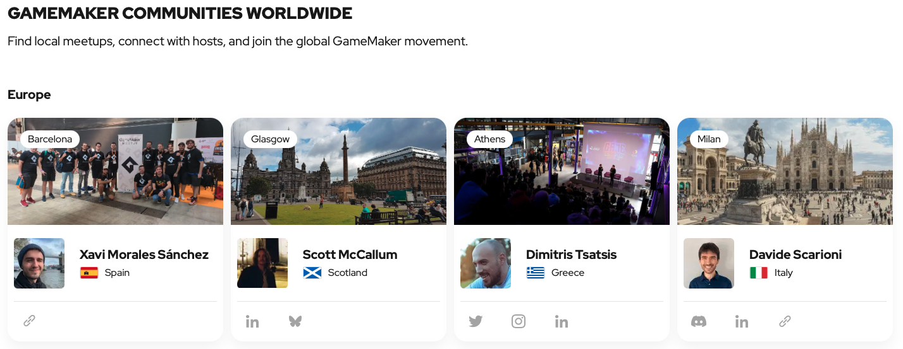
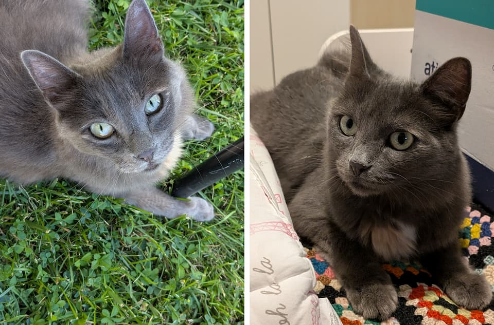

Mi chiamo Davide, sono un _ragazzo_ nato nel 1988 e online mi firmo come **Scario**: mi riconosci facilmente dall’avatar di Donatello delle Tartarughe Ninja in pixel art.

Di lavoro faccio il **Frontend Developer** ma amo sviluppare anche nel tempo libero, che siano piccoli siti, o, soprattutto, [piccoli videogiochi indie](https://scario88.itch.io): per questi ultimi uso soprattutto GameMaker, e infatti sono molto attivo nella community di Game Maker Italia, dove pare che ~~sono santo (.cit)~~ ho il ruolo di organizzatore eventi.

Quando non sviluppo videogiochi mi piace effettivamente giocarli: i miei generi preferiti sono **i platform, i metroidvania e i puzzle game**. Prima o poi credo che farò una lista dei miei preferiti, stay tuned.

Non sono riuscito a terminare gli studi in Ingegneria Informatica, ma incredibilmente, grazie soprattutto all'aiuto e alla pazienza della mia compagna, sono riuscito a superare l'esame per diventare [Sommelier FISAR](https://www.fisar.org): non mi serve a nulla come titolo, ma almeno ora ho credito per ordinare il vino giusto al ristorante :D

A casa, oltre con la mia famiglia umana, condivido le giornate con Pepe, la gatta mascotte della casa, che finge di odiare tutto e tutti ma alla fine della giornata guai a chi non le da' attenzioni 😝.

## Qualcosa in più su di me

- La mia [wishlist](/wishlist/)
