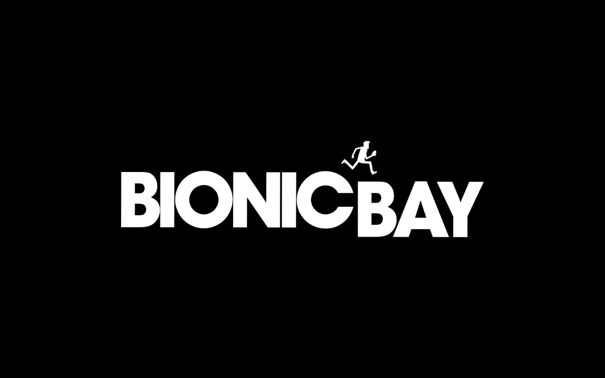
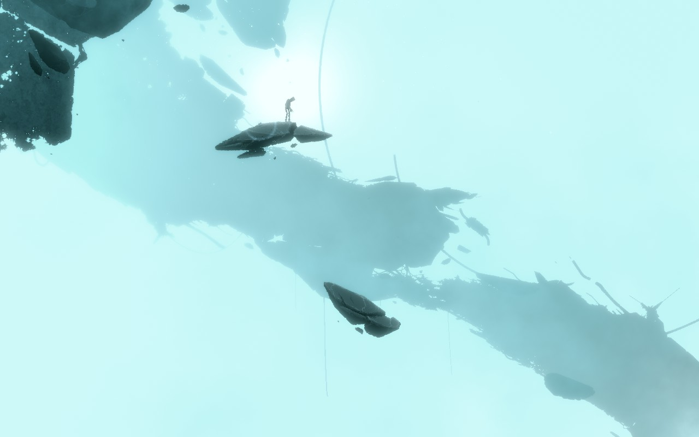
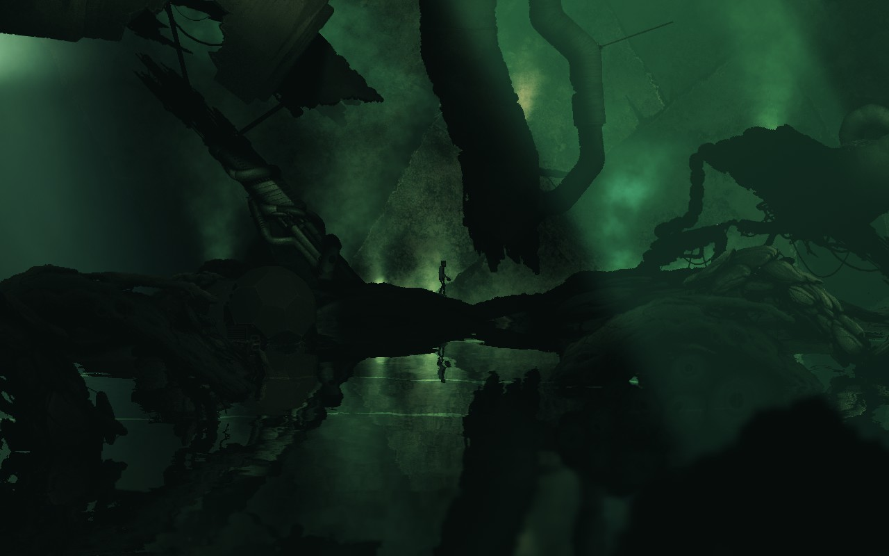
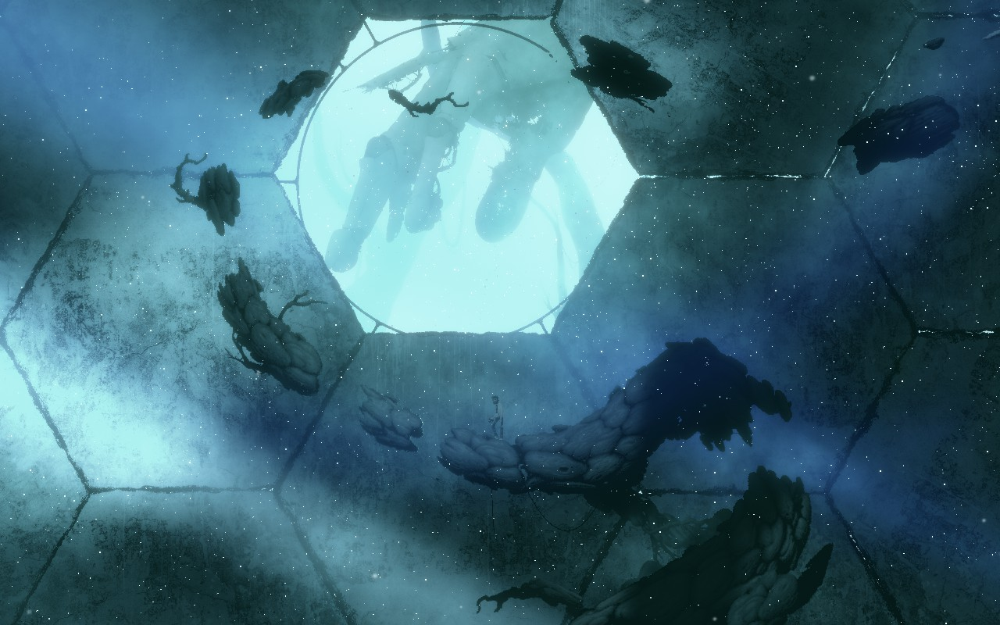
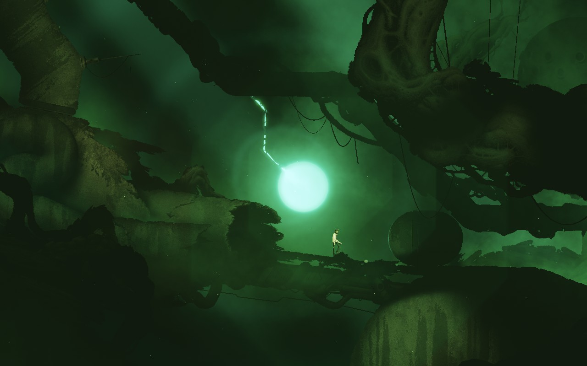

[Bionic Bay](https://store.steampowered.com/app/1928690/Bionic_Bay/) è gioco che rientra perfettamente nella categoria **PLATFORM**. No, non un action platformer, non un puzzle platformer, non un metroidvania con elementi platform. In BB non ci sono combattimenti, non ci sono enigmi, semplicemente si salta con il giusto tempismo e si schivano gli elementi **mortali** atterrando con la giusta precisione, sfruttando l'ambiente e i poteri che ci sono stati messi a disposizione.

Il gioco di per sè ha una **storia appena accennata** e decisamente criptica: c'è un esperimento andato a male e un protagonista che finisce in un ambiente ostile, forse alieno, probabilmente enormemente più grande di lui. E questa sembra assolutamente una buona scusa per saltare in giro per i vari ambienti di gioco, no?

**Il sistema di movimento** è quindi il main focus del gioco, **è molto soddisfacente** e permette di concatenare più azioni in maniera molto fluida (alcune azioni ricordano addirittura quelli di Mario Odyssey).
Il tipo di platforming qui però, a differenza di quelli in cui è presente l'idraulico baffuto, è basato completamente su un **motore fisico**, con i suoi pro e contro: se da un lato la conservazione del momentum e la possibilità di concatenare il salto con lo "slancio" rende tutto molto veloce con un'azione molto piacevole, alcuni ostacoli mobili, soprattutto a causa delle innumerevoli esplosioni presenti, causeranno cadute o lanci di oggetti completamente imprevedibili (e ovviamente mortali).

Come anticipavo (ma non è uno spoiler, è visibile all'interno del trailer di gioco) vedrete che nel gioco sono presenti alcuni **poteri**: Quello che mi ha colpito e mi ha spinto a provare il gioco è quello del poter **scambiarsi di posto con un oggetto**, una volta **taggato**.
Il potere in questione ci accompagnerà per praticamente tutta l'avventura, ma i veri "casi d'uso", dopo un inizio entusiasmante, purtroppo tendono molto a ripetersi tra loro: interessante, ma avrei sperato in qualcosa di più.
In generale comunque il mix tra i poteri sbloccabili e i tantissimi ostacoli del gioco generano davvero molte situazioni impegnative e divertenti. L'unico **ostacolo che ho mal digerito** sono state le "sfere" che cambiano la gravità del giocatore facendole puntare al loro centro: di per sè non hanno nulla di male, anzi, ma il fatto è che spesso ci viene richiesto di abbassarsi in quei frangenti, e per farlo dovremo puntare l'analogico verso il centro della stessa... ed è stato davvero fastidiosissimo.

In generale comunque il gioco è godibile e divertente, anche se forse un po' troppo lungo nella **parte centrale** che ho trovato un po' **superflua** nonostante continui a proporre idee sempre nuove.

C'è una parte che invece ho solo provato e abbandonato: c'è un'intera **parte online dedicata agli speedrunner** con classifiche, sfide giornaliere e **fantasmi** degli avversari da battere. Sembra fatta bene ma non fa per me.

Lo avrete già visto dalle immagini, ma non ho parlato del **lato grafico**: pixel art del personaggio a contrasto di ambienti 3d con illuminazione adattiva in base alla situazione o al livello, **fa davvero la sua scena**. Il limite è che essendo ambienti alieni bio/meccanici la vera differenza tra un livello e l'altro è posta solo nel colore delle luci, rendendo il resto dell'ambiente un po' monotono: questo però aiuta a mantenere il focus sull'azione, e gli scorci che potete ammirare negli screenshot sono comunque bellissimi ai miei occhi.

Per concludere, non trovo che il gioco sia un capolavoro, ma credo in ogni caso che sia il platform "fisico" più divertente e curato a cui abbia mai giocato.
