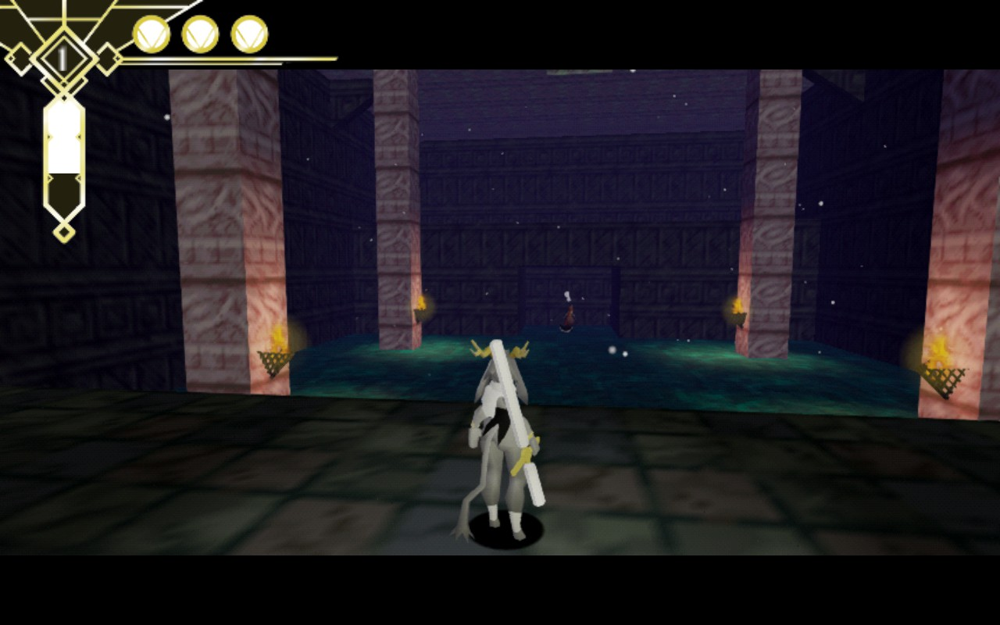
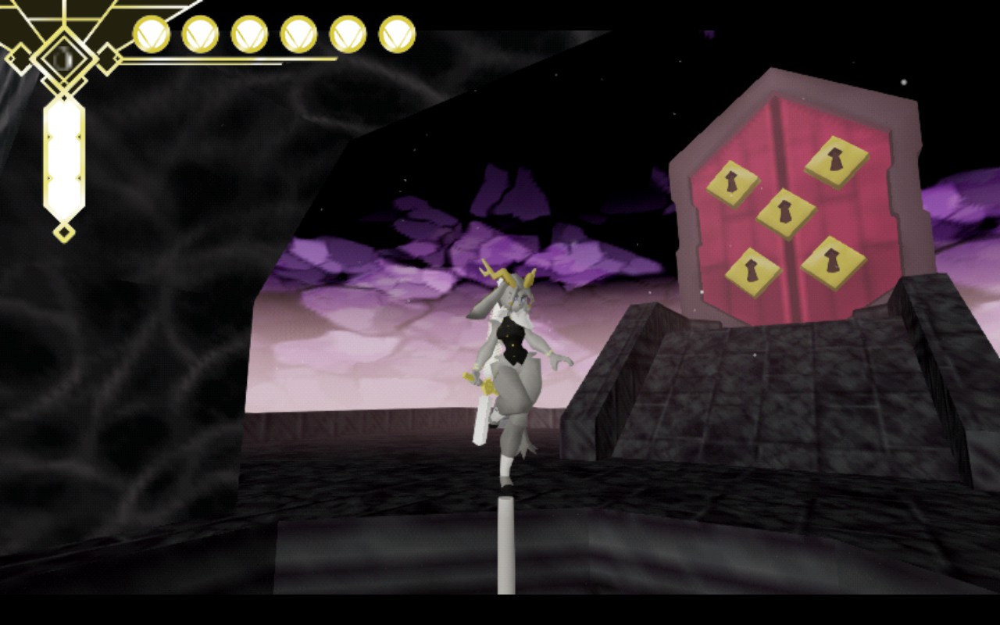
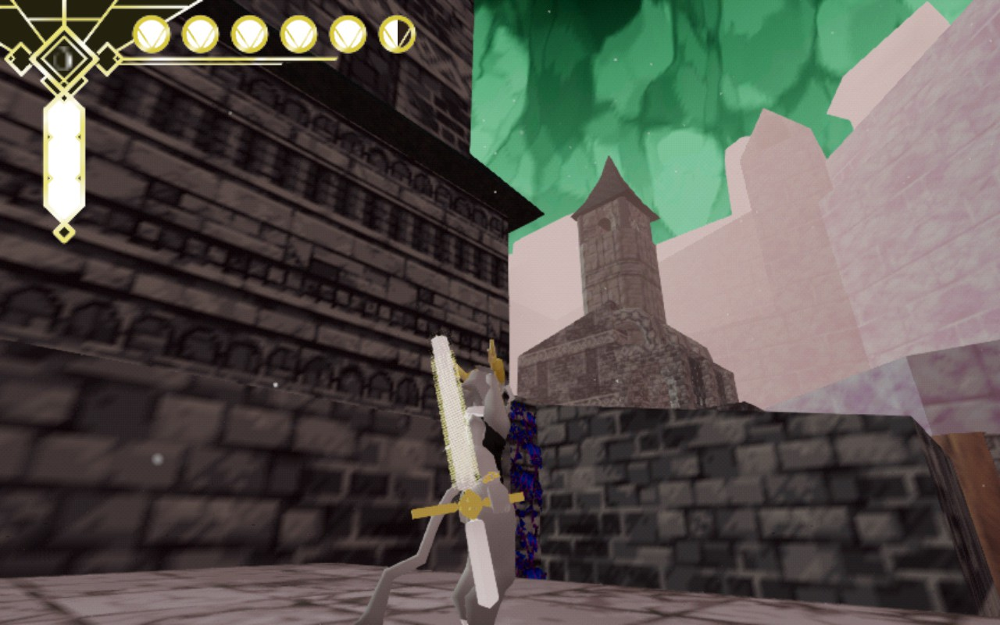

[Pseudoregalia](https://store.steampowered.com/app/2365810/Pseudoregalia/) è un platform 3d indie che mi ha divertito molto giocare, nonostante non sia un gioco perfetto.

Esteticamente, come potete vedere dalle immagini in questo articolo, il gioco si presenta come se **fosse uscito dall'epoca PS1**: modelli, palette di colori e "vibe" estetiche sembrano quelle di un gioco del passato, e se mi conoscete sapete che questo è un grandissimo plus per me :D

Il **sistema di movimento**, grande protagonista, è invece assolutamente moderno: _Pseudoregalia_ è pieno di azioni di movimento concatenabili in maniera fluida, difficili da padroneggiare inizialmente ma che **donano un sacco di soddisfazione** più tempo trascorrerete all'interno del gioco.

Ovviamente per far risplendere questo aspetto ci deve essere una **mappa di gioco degna di nota**, e qui è assolutamente presente.
La chiamo "mappa" anche se in realtà sono più aree di gioco interconnesse e collegate da strade e shortcut tutte da scoprire: il gioco infatti è sostanzialmente un **MetroidVania**, con percorsi da sbloccare e potenziamenti da raccogliere per riuscire a visitare tutto il mondo di gioco. Non l'ho definito ad inizio articolo in questa maniera perchè il gioco è **decisamente sbilanciato verso la parte platform**, con gli scontri lasciati davvero in secondo piano e probabilmente inseriti solo per dare varietà o per avere una scusa per portare con sè l'arma in nostro possesso.

**Tornando alla mappa**, gli ostacoli e le piattaforme sono tutte ben posizionate in maniera tale da far risplendere le azioni di gioco, con shortcut quasi sempre azzeccate (quasi, perchè a volte mi sono trovato a sbloccare strade inutili perchè avevo già raccolto dei potenziamenti che mi permettevano di bypassarle).

Ogni volta che entreremo in una nuova "area" ci chiederemo se saremo in grado di affrontarla con le nostre abilità (sia nostre come giocatore sia quelle di Sybil, il nostro avatar) o se è troppo presto e dovremo tornare sui nostri passi più tardi.

Questa per me è stata un'arma a doppio taglio: se da un lato favorisce la **sperimentazione di nuovi percorsi e salti impossibili**, dall'altro ci fa davvero **sentire persi all'interno del mondo di gioco**, e la **mappa di gioco davvero davvero scarna** in termine di riferimenti spaziali non ha aiutato in questo frangente. Le _shorcut inutili_ che menzionavo prima sono proprio causate dal fatto che possiamo spesso _inventarci_ strane alternative se siamo sufficientemente bravi. Probabilmente tutti questi sono pregi se siete persone a cui piace rigiocare i proprio giochi oppure se amate le speedrun.

Stavo chiudendo quando mi sono dimenticato di due aspetti, **la colonna sonora** e **la storia di gioco**. Se la prima è memorabile (secondo me qualche pezzo è molto al di sopra rispetto ad altri, ma va a gusti), la seconda è quasi totalmente assente, e rimanda all'interpretazione del giocatore a dialoghi assurdi con gli npc e a qualche riga presa da dei libri presente in una particolare area di gioco.

Bastano quindi una mappa illeggibile e una storia accennata per dirvi di evitare un gioco da **5-10h con un bellissimo platforming**? No, assolutamente, se vi piace il genere **tuffatevi senza remone** e sarete ripagati dei vostri sforzi. Magari dopo aver fatto un salto con rimbalzo, una scivolata su una parete e qualche wall jump.
