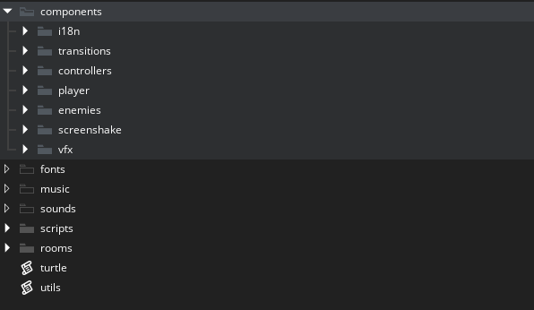
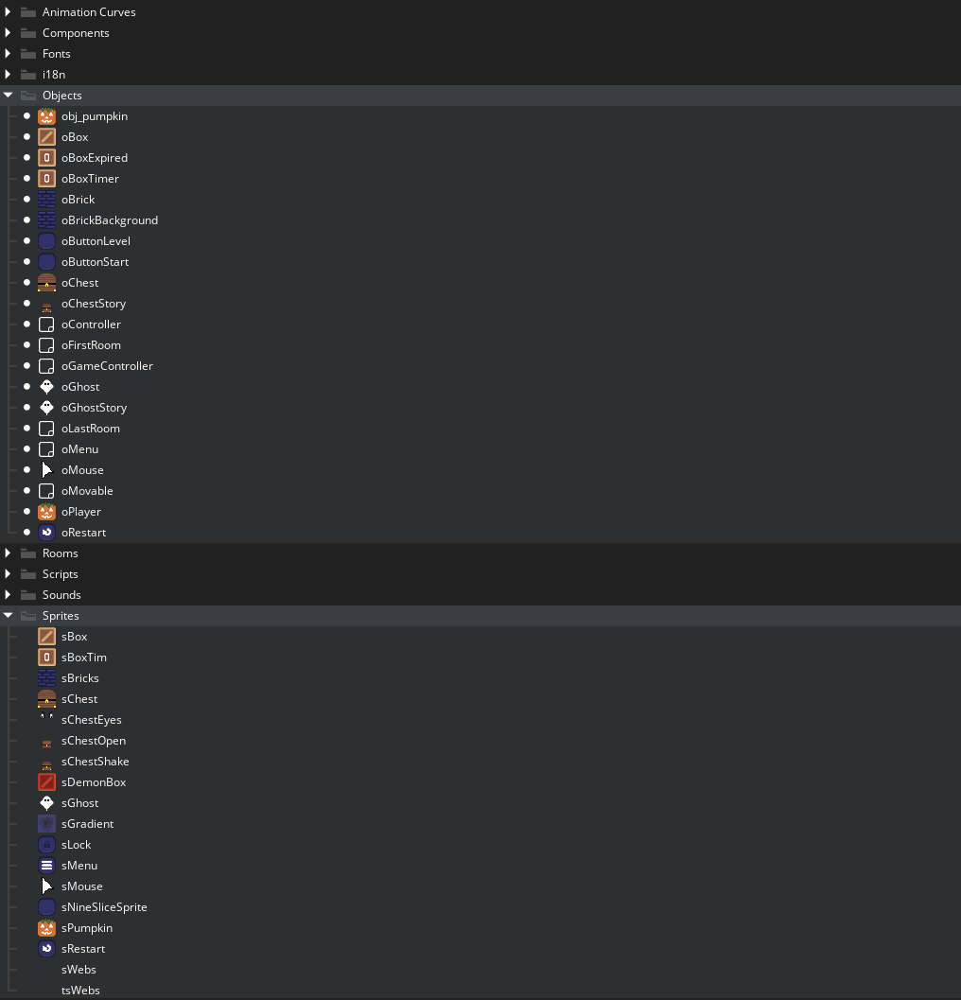
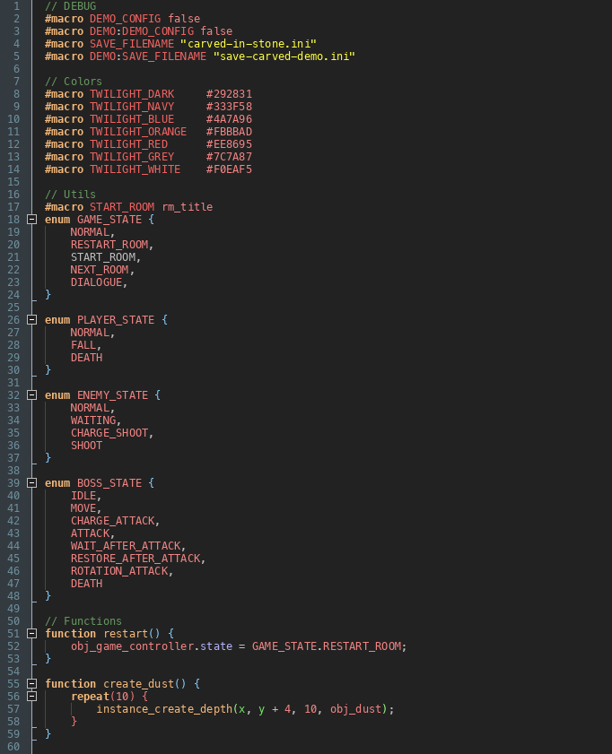
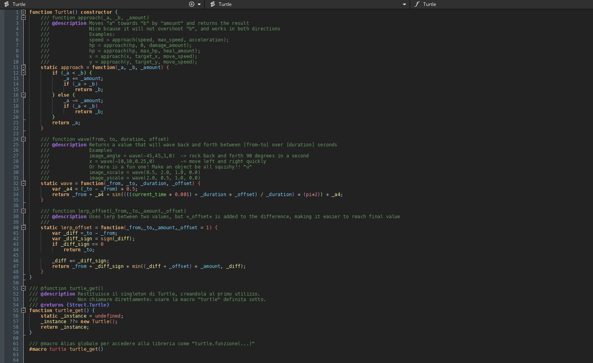

## Premessa

Come ho ancitipato più volte, il mio obiettivo di questo periodo è quello di riuscire a sistemare i progetti che ho sviluppato, rendendoli dove possibile giocabili direttamente da browser e con tutti i contenuti che avevo in mente quando ho cominciato gli sviluppi.

Aprendo però i vecchi progetti mi sono reso conto di quanto nel tempo è cambiato sia il mio modo di programmare sia quello di organizzare i progetti stessi.

Redigo quindi questo documento per condividere (e anche come mia guida per il futuro) **il mio approccio ai progetti GM**.

## Struttura e Alberatura del progetto

La prima cosa che faccio è cancellare tutte le cartelle create in automatico di GM (c'è l'opzione che impedisce la loro creazione, ma mi dimentico di attivarla ogni volta che lo reinstallo) e creo un'**alberatura di cartelle** come questa

- components
  - controllers
  - player
  - enemies
  - ...
- fonts
- music
- sounds
- scrips
- rooms

Questo perchè mi sono reso conto di come la divisione tra Sprites e Objects, ad esempio, non ha molto senso appena il progetto comincia a crescere: meglio avere una cartella player e avere sia sprites che obj lì dentro, così da trovare subito quello che ci serve.

## Abilitare feather + Naming convention

**Feather** è il linter di GM, è una relativa novità all'interno dell'editor per cui ho cominciato ad attivarlo solo negli ultimi anni. Non è perfetto, ma mi aiuta a mantenere i progetti con le stesse naming convenction e a verificare che le funzioni abbiano dei parametri e dei return coerenti.

Quindi, ad esempio, il personaggio del giocatore si chiamerà sempre obj_player in tutti i progetti. Ho aperto di recente Spooky Chest e mi sono trovato il giocatore chiamato oChest: se in ogni gioco dovessi chiamare questo oggetto con quello che rappresenta, ogni volta mettere mano al codice diventa un supplizio.

## Il file utils

Fuori dalle cartelle per averlo sempre a portata di mano (anche perchè l'IDE non permette di pinnare schede, dannazione) tengo un file script chiamato utils, e dentro lo divido in 3 parti

/// MACRO
/// Qui vengono inseriti ad esempio i colori usati del progetto e la variabile per attivare il debug

/// ENUMS
/// Solitamente li uso solo per le macchine a stati, ma mi trovo comodo averli tutti raggruppati in un unico file invece di averli sparsi per gli oggetti

/// FUNCTIONS
/// Qui raggruppo le funzioni che possono tornare utili a più di un oggetto, come ad esempio quelle per creare effetti particellari

## La room rm_init e l'oggetto obj_game_controller

In tutti i miei progetti sto creando una room **rm_init** con all'interno un solo oggetto, **obj_game_controller**, persistente, che è l'oggetto che principalmente crea tutti i controller del gioco (ad esempio obj_music_controller e obj_camera_controller).

Qui room e oggetto vanno a braccietto per un'esigenza ben specifica: riuscire a debuggare room singolarmente senza dover giocare fino al punto preciso che mi serve.
Per fare ciò mi torna utile che la room da far partire è sempre rm_init, e, in obj_game_controller, al termine della creazione degli altri controller, leggo la **#macro START_ROOM** che è definita tra le macro nel [file utils di cui sopra](#il-file-utils).

## Novità: il file turtle.src

Ci sono alcune funzioni che mi trovo spesso a usare nella maggior parte dei progetti, ad esempio **wave()** per avere i valori di un'onda sinusoidale, **draw_text_typewriter** per avere l'effetto "macchina da scrivere" ecc.

Prima aprivo singolarmente i vecchi progetti per andare a fare copia-incolla (o addirittura riscrivevo da zero le funzioni, _shame on me_), poi sono passato a tenere salvato tutto su un file .md, nell'ultimo progetto ho pensato di creare un file scr che importo **di default** in tutti i progetti (tanto sono pochi kb) così da avere sempre a disposizioni le funzioni che mi servono e scritte sempre nella stessa maniera.

Perchè l'ho chiamata **Turtle**? Beh, volevo darle un nome carino, e le mie vicende con Game Maker sono strettamente legate a Donatello, per cui... 😁

Appena arrivo ad una versione corposa penso di committarla in un repository a parte, per il momento vi potete accontentare di uno screenshot.

## Due plugin che importo sempre

Se penso a due punti fermi che sono sempre presenti nei miei progetti sono lo script [Input Manager](https://gist.github.com/adriano-t/bd8785dd8a46b641a98634e254f9c241) di [Tiz](https://tizsoft.altervista.org/) e [la gestione del multilinguismo](https://gamemakeritalia.it/posts/traduzione-e-internazionalizzazione-con-game-maker/) come ci ha insegnato [AlexoFalco](https://alexofalco.com/) in un post sul blog di GMI (per questo mi sono creato un progetto dal quale ho esportato un file .yyp così da importarlo velocemente).

## Perchè non un progetto "starter"

Nel tempo ho creato più volte dei progetti **barebone** con la struttura per velocizzare gli sviluppi, ma ad ogni progetto la trovato "stretta" e ho finito per preferire i copia-incolla.
Ora sono arrivato ad una struttura più o meno definitiva, quindi potrebbe essere una buona idea mettermi a impostarla.

## Prossimi step

**Carved in stone** utilizza già questa struttura, il gioco per la **TerrorOttobre 2026** sta venendo sviluppato in questo modo. Nel futuro aspettatevi qualche novità su qualche vecchio progetto che verrà ripreso e riordinato.
