Sicuramente è capitato anche a voi che qualcuno vi chieda cosa vogliate per Natale / Compleanno / ecc. Io sono fortunatamente nella posizione di poter dire di non aver bisogno di nulla: ho un lavoro, una casa, una compagna, una salute decente... non ho davvero niente di cui lamentarmi.

Ma effettivamente ci sono cose che desidero, delle passioni che mi piacerebbe approfondire o delle esperienze che vorrei fare. Da qui nasce questa pagina.
È una **lista dei desideri** vera e propria.

Un piccolo sommario delle categorie:

- [Caffè](#caffè)
- [Lego](#lego)
- [Domotica](#domotica)
- [VideoGames](#videogames)
- [Libri](#libri)
- [Nuove passioni](#nuove-passioni)

## Caffè

Un paio di anni fa la mia compagna mi ha regalato un [macina caffè manuale](https://www.timemore.com/) e una confezione di [caffè specialty](https://www.vinhood.com/magazine/tutorial/cosa-sono-gli-specialty-coffee-e-cosa-li-rende-cosi-speciali/) in chicchi, convinta che sarebbe potuto piacermi nonostante io non fossi nemmeno a conoscenza di questo mondo. Aveva assolutamente ragione, e ora mi trovo con una passione in più :D

Nel corso del tempo ho scoperto che apprezzo i caffè che tendono all'acido (sentori di frutta gialla in particolare), ma mi piace molto sperimentare e provare bevande con lo spettro diametralmente opposto.

Ho provato e apprezzato i caffè di [Ditta Artigianale](https://dittaartigianale.com/), [NOWHERE](https://nowherecoffeeroasters.com) e [iDruper](https://www.idrupercoffee.com/), e ogni volta che salgo a milano un salto da uno dei primi due lo faccio praticamente sempre per provare qualcosa di nuovo.

Ho fatto poi un corso su con [Mirabilia](https://www.mirabilia.coffee/) riguardo i metodi alternativi di estrazione del caffè, e lì ho conosciuto questa realtà che vende sia singolarmente del caffè accuratamente scelto sia impacchetta delle box degustazione (singole o in abbonamento). Sono un po' costose e quindi non ho mai provato ad acquistarle, ma mi piacerebbe molto provarle prima o poi.

Tra i metodi alternativi di estrazione che nominavo prima c'è il filtraggio: ho a casa un filtro a pressione con il quale ho cominciato a divertirmi, ma mi piacerebbe anche provare la [Aero Press](https://caffelab.it/aeropress-aerobie-coffee-maker/), un oggetto creato dall'[inventore del Fresbee](https://en.wikipedia.org/wiki/Alan_Adler) che amava farsi un caffè buono anche fuori casa.

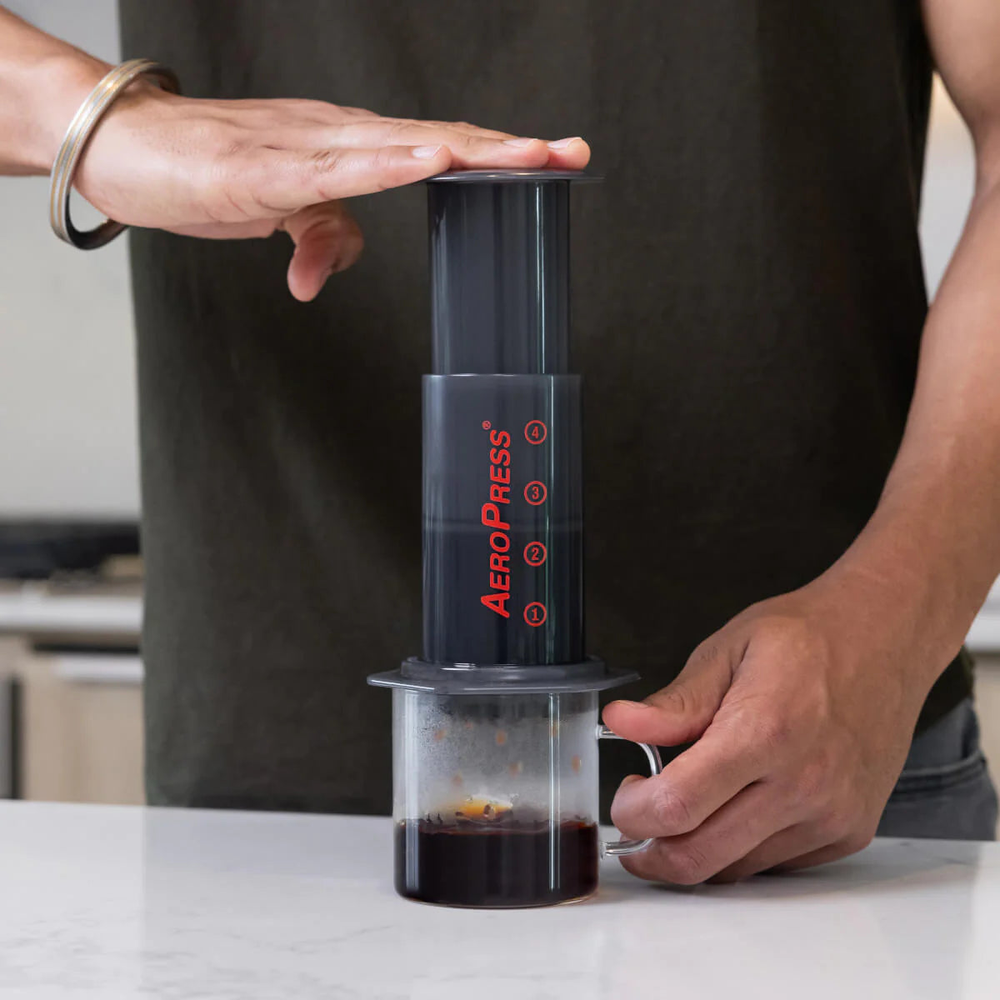

## Lego

Cosa c'è di meglio di un bel LEGO a Natale? Forse solo un dinosauro... Quindi, come non desiderare questo [fossile di T-Rex](https://www.lego.com/it-it/product/dinosaur-fossils-tyrannosaurus-rex-76968)? Inutile, enorme... e bellissimo.

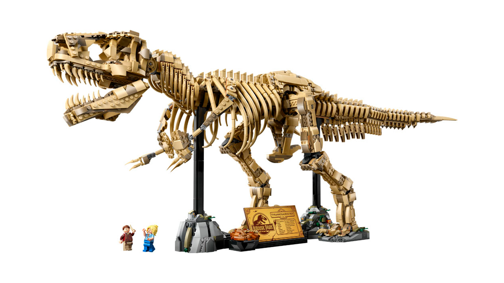

Dato però che mi piacciono molto anche i LEGO "decorativi" (come la serie Botanical, per intenderci), trovo altrettanto bella e con prezzo difficilmente giustificabile la [Via Lattea](https://www.lego.com/it-it/product/the-milky-way-galaxy-31212)...

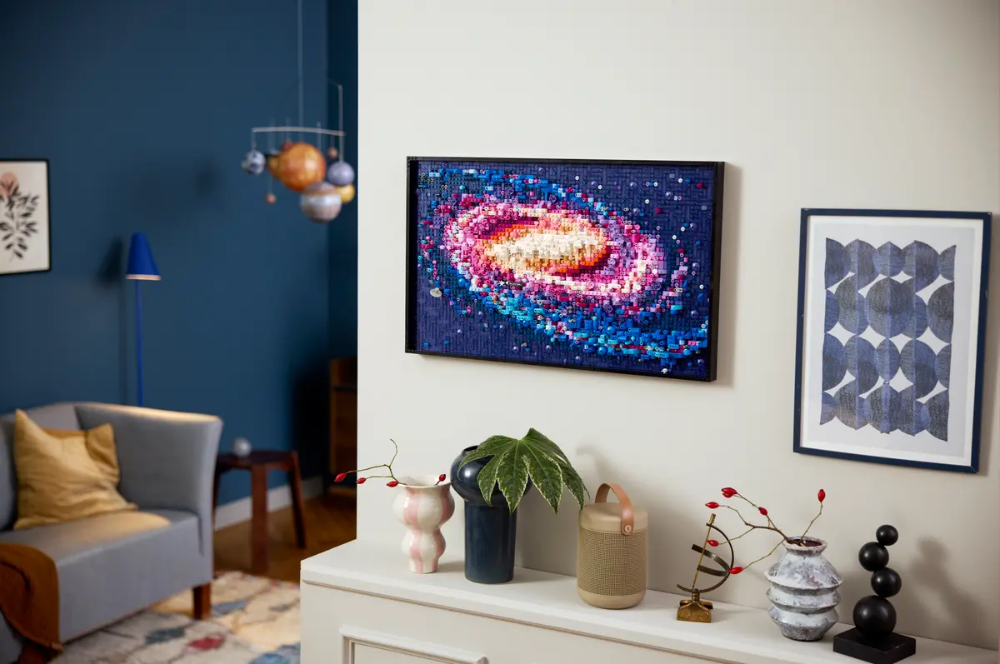

... e l'altrettanto splendida [Grande Onda di Hokusai](https://www.lego.com/it-it/product/hokusai-the-great-wave-31208)

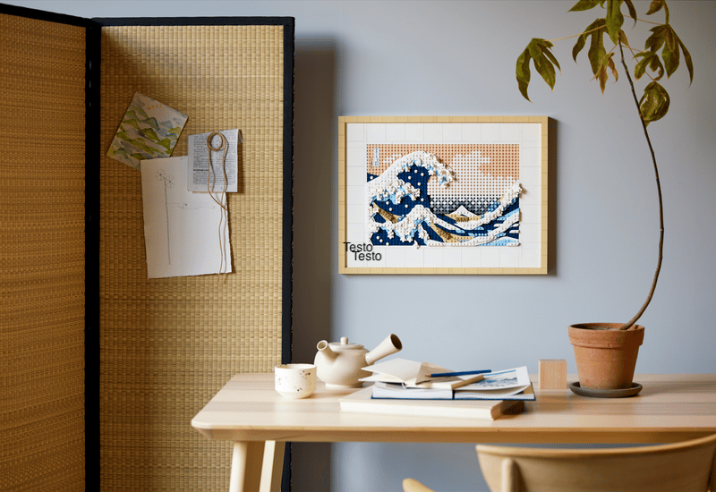

## Domotica

Ho sempre desiderato una casa domotica, una di quelle pilotate con la voce automatizzate in tutto e per tutto.
Da quando ho una casa però mi sono reso conto di quanto sia importante che tutto funzioni prima nella maniera "tradizionale", e che l'automazione dev'essere qualcosa che genera davvero un miglioramento dell'esperienza in casa, quindi basta lampadine smart che si accendono con la voce ma non si possono spegnere con gli interruttori.

L'altro giorno però ho trovato un caso in cui davvero la domotica mi potrebbe aiutare. Se avessi un [Broadlink RM4 Mini](https://www.amazon.it/RM4-mini-Monitoraggio-dellumidit%C3%A0-temperatura/dp/B0872PPSGM/r?th=1) potrei sia pilotare il condizionatore da remoto, sia, grazie ad una funzione dell'oggetto stesso, monitorare l'umidità in casa e far partire il deumidificatore al bisogno senza che io intervenga: questo sì che sarebbe davvero di grande aiuto!

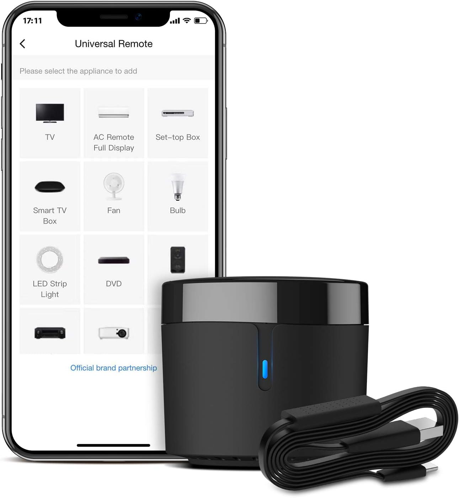

## VideoGames

Sono una delle mie principali passioni quindi sarebbe stato strano non vederne nessuno in lista.

Al momento gioco principalmente su tre console: [Nintendo Switch Lite](https://www.nintendo.com/it-it/Console-e-accessori/Famiglia-Nintendo-Switch/Nintendo-Switch-Lite/Nintendo-Switch-Lite-1595961.html), [Steam Deck](https://www.steamdeck.com/it/) e [Miyoo Mini Plus](https://www.miyoogame.com/product/miyoo-mini-plus-retro-handheld-game-console/).

Mi piace molto avere l'edizione fisica dei giochi stessi quando possibile, quindi nei casi in cui questa esista preferisco prendere i giochi su **Nintendo Switch**. In caso contrario nelle wishlist degli store di [Steam](https://store.steampowered.com/wishlist/id/scario88/?sort=discount) e di [GOG](https://www.gog.com/account/wishlist) potete vedere cosa mi interessa giocare sulla mia Steam Deck.

Il gioco che più mi piacerebbe provare in digitale (perchè ha una versione fisica a tiratura limitatissima ed è praticamente introvabile) è [Animal Well](https://store.steampowered.com/app/813230/ANIMAL_WELL/). È stato sviluppato in 7 anni dal solo sviluppatore Billy Basso, ed è un gioco di esplorazione senza combattimenti e pieno di regole non scritte. Non bastano queste premesse per aver incuriosito anche voi?

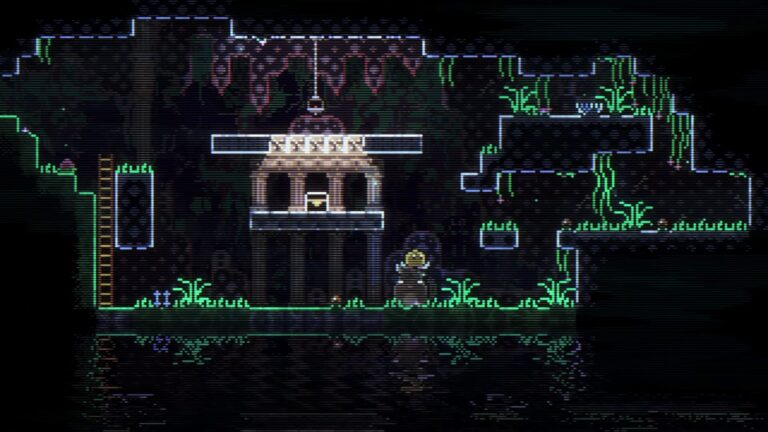

Il gioco fisico che più bramo per **Nintendo Switch** invece è [Donkey Kong Tropical Freeze](https://www.nintendo.com/it-it/games/oms/dkc-tf/index.html), un platform con protagonista lo scimmione amico / antagonista di Mario che ho provato ad una Milano Games Week e che mi ha davvero colpito

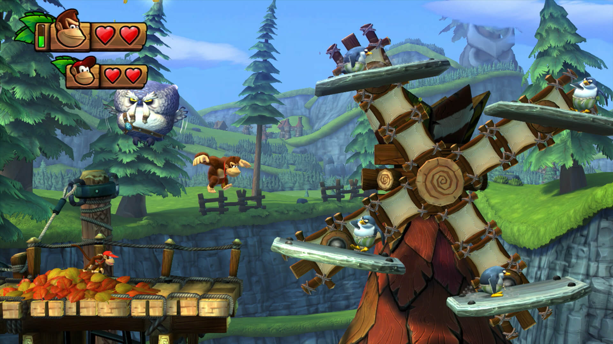

## Libri

Fare il pendolare ha tanti lati negativi, ma ammetto che il fatto di essere obbligato a restare su un autobus per 1h-1h30 al giorno mi aveva dato una bella routine di lettura.

Da quando sono tornato a lavorare vicino a casa ho guadagnato tempo ma ho smesso di investirlo in questa attività, e leggo principalmente in ferie o quando c'è qualcosa che mi incuriosisce moltissimo. Non ne vado fiero, è sicuramente una cosa su cui dovrei migliorare... Anche se non saprei da dove iniziare. Mi piacerebbe leggere un bel giallo o thriller appassionante, ma essendo fuori dal giro non saprei da dove partire. Adoro Agatha Christie e ho letto quasi tutto quanto prodotto da lei con protagonista Poirot, e mi sono piaciuti molto libri della collana de [I Bassotti](https://www.lafeltrinelli.it/libri/collane/i-bassotti-p202848), una serie dove far conoscere racconti scritti da un autori sconosciuti ma appartenente al periodo d'oro del giallo.
Dovrei davvero farmi consigliare da qualche lettore o dalla bibliotecaria da dove ripartire.

Se allarghiamo invece la categiria, ultimamente mi sto appassionando ai **bookazine**, soprattutto a tema videogiochi: sono prodotti a metà tra un magazine e un libro con un occhio di riguardo alla veste grafica e ai materiali con i quali vengono prodotti.

Tra i più interessanti che conosco e che mi piacerebbe sfogliare ci sono:

- i bookasine realizzati dagli italianissimi [RoundTwo Publishing](https://roundtwo.world/), in particolare [Void Arcana](https://roundtwo.world/pages/void-arcana), interamente dedicato ai due Hollow Knight (che sono tra i miei giochi preferiti)
- [Storie di Videogame 2 e 3](https://itomi.shop/products/sdvg3), due libri che trattano la storia produttiva dietro ad alcune delle saghe videoludiche più famose. Ho il primo volume e l'ho davvero apprezzato.
- [TUNIC - Design Works](https://www.lostincult.co.uk/tunic) di [LostInCult](https://www.lostincult.co.uk), un libro dedicato allo sviluppo del gioco TUNIC, uno dei miei preferiti di sempre.
- [The SNES Pixel Book](https://www.bitmapbooks.com/collections/all-books/products/the-snes-pixel-book?) di [Bitmap Books](https://www.bitmapbooks.com), un libro interamente dedicato al Super Nintendo

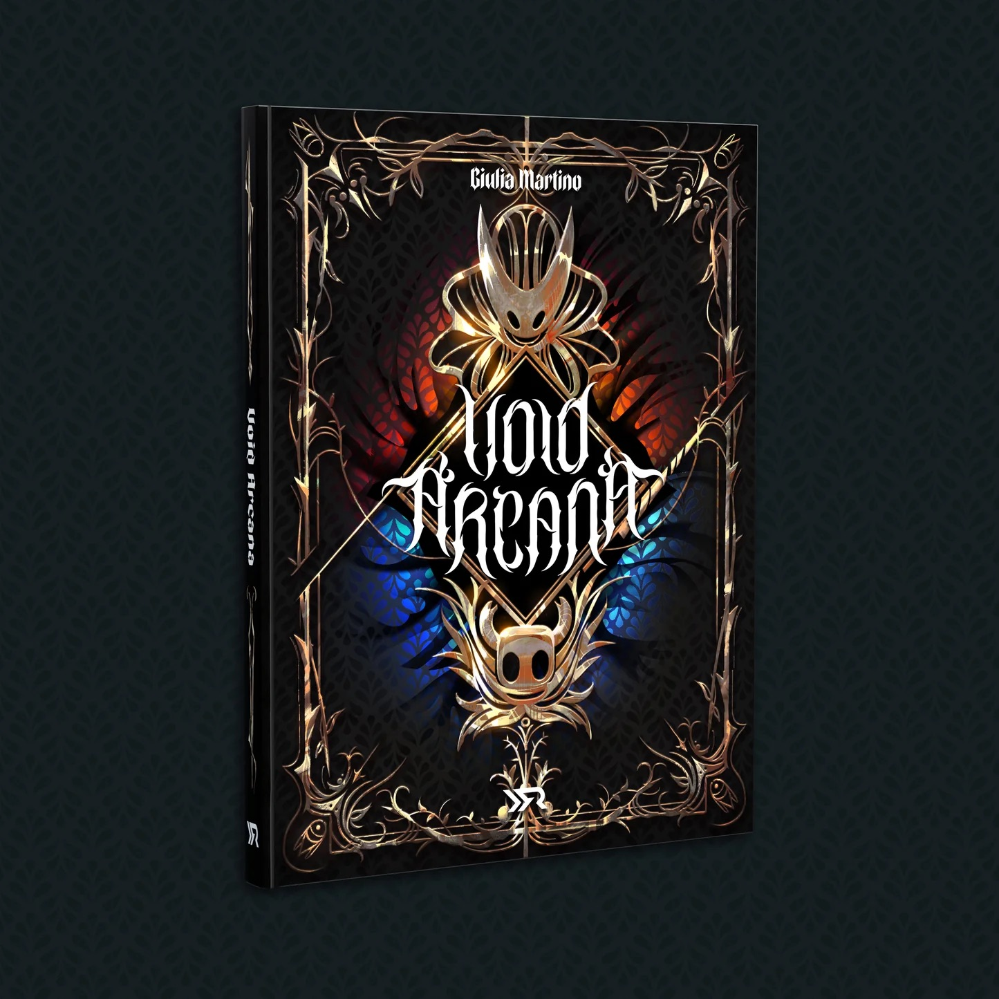
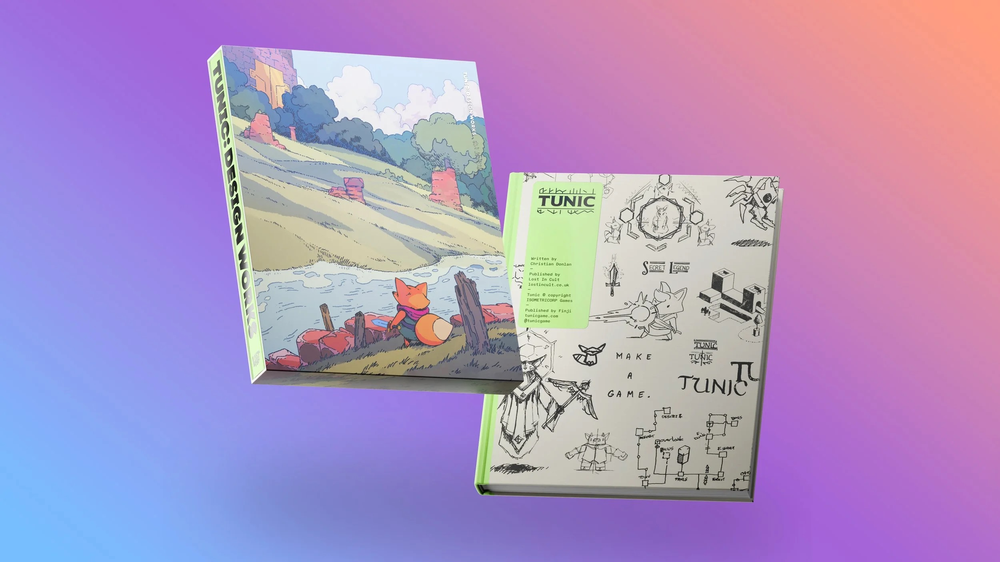
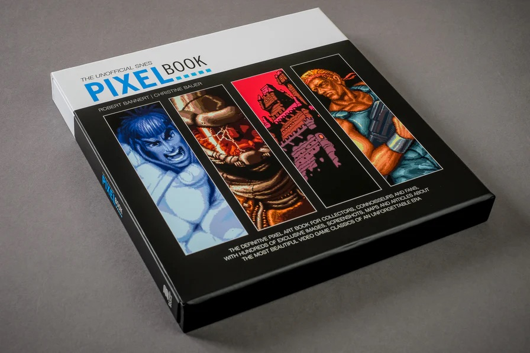

Passando invece a qualcosa di più classico, anche se più vicino alla manualistica come genere, c'è [La Scienza delle Pulizie](https://www.amazon.it/scienza-pulizie-detersivo-candeggina-bicarbonato/dp/8858043030) di Dario Bressanini: dopo aver letto i suoi libri sulle verdure e sulla pasticceria, sarei davvero curioso di conoscere l'aspetto chimico delle pulizie, e capire quali strumenti sono davvero efficaci (bicarbonato e detersivo per i piatti, ad esempio, sono davvero utili un po' per tutto?)

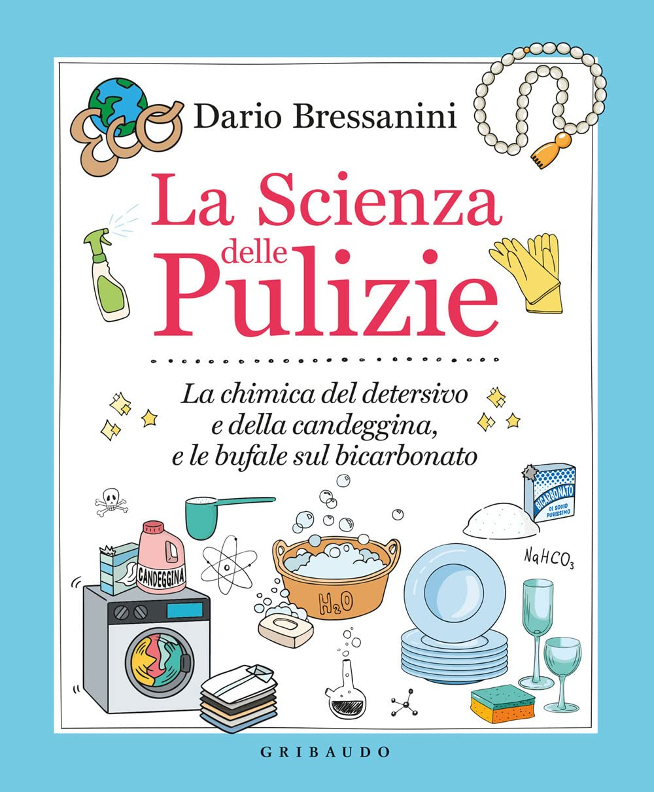

## Nuove passioni

Raggruppo in questa sezione due _cose_ che mi piacerebbe imparare a fare, entrambe accumunate dal verbo **creare**.

- Stampare in 3d
- _Fare_ gli amigurumi

**Stampare in 3d** è qualcosa che mi ispira da quando le stampanti 3d sono entrate nel mercato _consumer_: prendere un oggetto digitale e portarlo nel mondo reale è qualcosa di incredibile a mio modo di vedere. Avevo letto _da qualche parte_ che sulla Stazione Spaziale Internazionale avevano bisogno di uno strumento e, dalla Terra, gli era stato mandato il progetto digitale che loro si sono stampati per poi utilizzarlo... è la cosa pià vicina alla **magia** che io conosca :D.
Due cose mi hanno sempre fermato: il costo e il non sapere esattamente cosa farci. Ora però esistono hardware discretamente economici (come la [Bambu lab A1 mini](https://eu.store.bambulab.com/it/products/a1-mini)) e ho trovato anche un buon motivo per possederne una: [Gridfinity](https://gridfinity.xyz/), un sistema open source per organizzare principalmente oggetti nei cassetti ed avere tutto in ordine. Si si lo so cosa stai pensando, ma io lo trovo bellissimo e davvero utile :D

Passiamo invece agli [amigurumi](https://it.wikipedia.org/wiki/Amigurumi): praticamente sono dei piccoli pupazzi all'uncinetto, e trovo davvero belli quelli molto "tondi". Esistono molti kit online per iniziare a farli, ma ho paura di buttare soldi e tempo comprandone uno perchè non ho mai cucito / ricamato (o qualsiasi verbo vada in concordanza, come vedete non sono sul pezzo).
